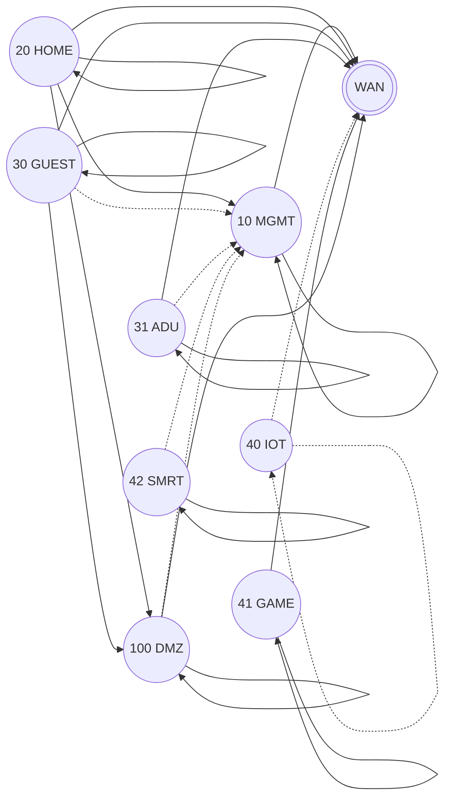

# VLAN Diagram

```mermaid
flowchart LR
  WAN(((WAN)))

  MGMT((10 MGMT)) --> MGMT
  MGMT --> WAN

  HOME((20 HOME)) --> HOME
  HOME --> WAN
  HOME --> MGMT
  HOME --> DMZ

  GUEST((30 GUEST)) --> GUEST
  GUEST --> WAN
  GUEST -.-> MGMT
  GUEST --> DMZ

  ADU((31 ADU)) --> ADU
  ADU --> WAN
  ADU -.-> MGMT
  
  IOT((40 IOT)) -.-> IOT
  IOT -.-> WAN

  GAME((41 GAME)) --> GAME
  GAME --> WAN

  SMRT((42 SMRT)) --> SMRT
  SMRT((42 SMRT)) -.-> MGMT
  
  DMZ((100 DMZ)) --> DMZ
  DMZ -.-> MGMT
  DMZ --> WAN
```
