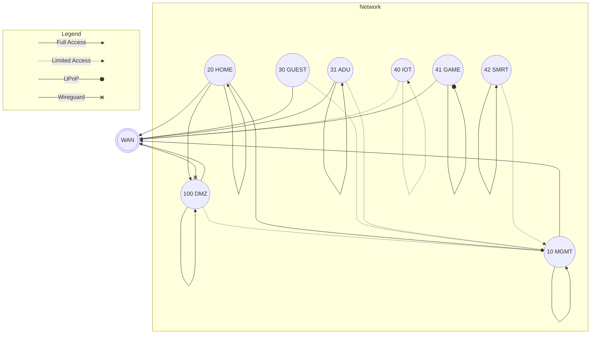

# VLAN Diagram

```mermaid
flowchart TB

  WAN(((WAN)))

  subgraph Network
    MGMT((10 MGMT))
    subgraph non-mgmt-group[ ]
	    style non-mgmt-group height:0px
        HOME((20 HOME))
        subgraph guests-group[ ]
            style guests-group height:0px
            GUEST((30 GUEST))
            ADU((31 ADU))
        end
        subgraph devices-group[ ]
            style devices-group height:0px
            IOT((40 IOT))
            GAME((41 GAME))
            SMRT((42 SMRT))
        end
        subgraph untrusted-group[ ]
            style untrusted-group height:0px
            DMZ((100 DMZ))
        end
    end
  end

  MGMT --> WAN
  MGMT --> MGMT

  HOME  --> HOME
  HOME --> WAN
  HOME --> MGMT
  HOME --> DMZ

  GUEST --> WAN
  GUEST -.-> MGMT

  ADU  --> ADU
  ADU --> WAN
  ADU -.-> MGMT

  IOT -.-> IOT
  IOT -.-> WAN

  GAME --o GAME
  GAME --> WAN

  SMRT --> SMRT
  SMRT -.-> MGMT

  DMZ --> DMZ
  DMZ --> WAN
  DMZ -.-> MGMT
  WAN --x DMZ

  subgraph Legend
    direction LR
	src1[ ] -->|Full Access| snk1[ ]
	style src1 height:0px;
	style snk1 height:0px;
	src2[ ] -.->|Limited Access| snk2[ ]
	style src2 height:0px;
	style snk2 height:0px;
	src3[ ] --o|UPnP| snk3[ ]
	style src3 height:0px;
	style snk3 height:0px;
	src4[ ] --x|Wireguard| snk4[ ]
	style src4 height:0px
	style snk4 height:0px;
  end
```
