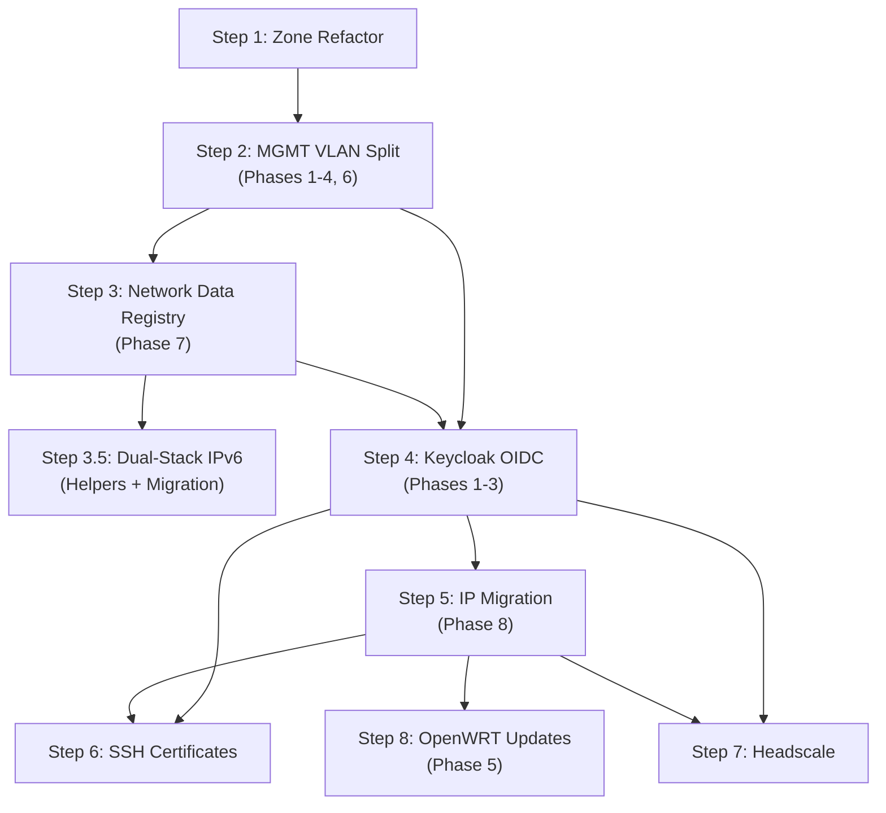

# Feature Roadmap Analysis

Cross-plan analysis of all documents in `llm-notes/`, identifying contradictions
and providing a unified implementation guide.

## Plans Analyzed

| Plan             | File                            | Summary                                                         |
| ---------------- | ------------------------------- | --------------------------------------------------------------- |
| Zone Refactor    | `zone-refactor-plan.md`         | Replace hardcoded trust enum with configurable zone system      |
| Secure MGMT VLAN | `secure-mgmt-vlan-plan.md`      | Split vMGMT into vMGMT (network gear) + vINFRA (infrastructure) |
| Keycloak OIDC    | `keycloak-oauth-oidc-plan.md`   | Centralized identity infrastructure with OAuth2/OIDC            |
| SSH Certificates | `ssh-certificates-sso-plan.md`  | SSH certificate auth via Keycloak + step-ca                     |
| Headscale        | `headscale-integration-plan.md` | Self-hosted Tailscale for friend game server access             |

## MicroVM Inventory

A complete inventory of all existing and planned microvms — names, hosts, zones, IPs,
and responsibilities — is maintained in [`microvm-inventory.md`](./microvm-inventory.md).
All future microvms are assigned to **calvard** (see `plans/vm-guest-rebalance.md`).
Existing VMs on erebonia (roer, legram, ordis, heimdallr, ymir) are being migrated to
calvard under Calvard city names. Planned VMs (Headscale control plane, subnet router,
SSH bastion) were previously assigned to erebonia in the individual plans; those plans
have been updated to reflect calvard as the correct target. Planned VMs still need
Trails/Calvard names: Headscale control plane (was ratatosk), subnet router (was
fenrir), and SSH bastion (was heimdall).

---

## Resolved Contradictions

Two contradictions were found and have been applied to the source plans.

**C1. Registry zone names mismatched router6 zone names** (`secure-mgmt-vlan-plan.md`)
Phase 7 used descriptive names (`infrastructure`, `home`, `guest`) while all other
phases and plans used functional names (`management`, `trusted`, `untrusted`). Resolved
by renaming the registry to match router6. Zone names are just strings — cheap to update.

**C2. Headscale on vINFRA is incompatible with the network architecture**
(`headscale-integration-plan.md`) — DERP relay and STUN are embedded in the headscale
binary and must be reachable from external users. No direct WAN path exists to vINFRA.
Resolved by moving headscale to vDMZ, adding a cross-zone firewall rule for
headscale → Keycloak (OIDC), and recommending standalone STUN on the cloud host.

## Security Recommendations Applied

Four security recommendations were identified through ordis compromise analysis and
have been applied to the source plans. The common thread: **defenses that live on ordis
are useless after ordis is compromised.**

| ID  | Summary                                                                | Applied to                                                                                                                       |
| --- | ---------------------------------------------------------------------- | -------------------------------------------------------------------------------------------------------------------------------- |
| R1  | `hostname-admin` restricts Keycloak admin console to internal hostname | `keycloak-oauth-oidc-plan.md` Phase 1                                                                                            |
| R2  | Native OIDC on vDMZ backends (Jellyfin) survives oauth2-proxy bypass   | `keycloak-oauth-oidc-plan.md` Phase 5 + architectural tension section                                                            |
| R3  | Host-level egress filtering for all vDMZ hosts (nftables output chain) | `secure-mgmt-vlan-plan.md` Phase 4.4, `keycloak-oauth-oidc-plan.md` Phase 3, `headscale-integration-plan.md` interaction section |
| R4  | Verify `oauth2-proxy` client has minimal Keycloak permissions          | `keycloak-oauth-oidc-plan.md` Phase 2 step 3                                                                                     |

---

## Implementation Guide

### Dependency Graph

### Parallelization

- **Steps 6 and 7** (SSH Certificates and Headscale) are independent — can be worked
  in parallel after Step 4
- **Step 3** (Network Registry) can start during Step 2 — create the registry file
  early and migrate consumers as you touch host configs
- **Step 5** (IP Migration) can start during Step 4 — dual addresses are independent
  of identity infrastructure

### Not Contradictions: Sequencing Differences

The following differences between plans are **not contradictions** — they reflect
the natural progression of the implementation order, where earlier plans work with
current infrastructure and later plans replace it.

**DNS naming (`.local` → `.mutantmell.net`):** The SSH Certificates plan uses
`*.home.local` and the Secure MGMT VLAN plan uses `*.local` because both are
written against the current DNS infrastructure. The Keycloak OIDC plan (Step 4)
performs the bulk DNS migration to `*.internal.mutantmell.net` / `*.internal` /
`*.mutantmell.net`. When the SSH Certificates plan (Step 6) is implemented, it
will use the canonical names established by the already-completed Keycloak plan.

**Keycloak realm name (`home` vs `homelab`):** The SSH Certificates plan uses
`home` as a placeholder realm name. The Keycloak OIDC plan (Step 4) defines the
authoritative realm as `homelab`. When the SSH Certificates plan (Step 6) is
implemented, it will reference the `homelab` realm that already exists.

---

## Execution Checklist

### Step 1: Zone Refactor

**Plan:** `zone-refactor-plan.md` (all phases)

Replaces the hardcoded trust enum with a configurable zone system. Pure refactor —
generated nftables output must be identical. Highest-risk step (firewall
misconfiguration can break everything) but also the most testable (snapshot tests
ensure identical output).

- [x] Phase 0: Add nftables snapshot tests for current router6 output
- [x] Phase 1: Define `zones` option type in router6 module
- [x] Phase 2: Replace hardcoded trust enum with zone-based config
- [x] Phase 3: Add `extraForwardRules` escape hatch for cross-zone rules
- [x] Phase 4: Rename `trust` → `zone` in all host configs (mechanical)
- [x] Verify: snapshot tests pass (identical nftables output)
- [x] Deploy to router with `magic_rollback` via deploy-rs

### Step 2: Secure MGMT VLAN Split (Phases 1-4, 6)

**Plan:** `secure-mgmt-vlan-plan.md` Phases 1-4, 6

Creates vINFRA VLAN, defines `network` zone, migrates infrastructure hosts,
hardens NFS, adds host firewalls (input + egress). OpenWRT updates deferred
to Step 8.

- [x] Phase 1: Add VLAN 11 (vINFRA) to router, switch trunk, define `network` zone
- [x] Phase 2: Migrate hosts to vINFRA (phantasma, remiferia, calvard, erebonia)
- [x] Phase 3: Update NFS mounts to use vINFRA addresses
- [x] Phase 4.1-4.3: Add host-level input firewalls (remiferia, calvard, erebonia)
- [x] Phase 4.4: Add egress filtering module for vDMZ hosts (nftables output chain)
- [x] Phase 6: Coordinated deployment (VM guests → VM hosts → NAS → Router)
- [x] Verify: all hosts reachable, DNS working, NFS mounts operational

### Step 3: Network Data Registry

**Plan:** `secure-mgmt-vlan-plan.md` Phase 7

Replaces `network.json` with Nix-based registry. Zone names use functional names
(`management`, `trusted`, `untrusted`) matching router6.

- [x] Create `lib/common/data/network.nix` alongside `network.json`
- [x] Add `summary` attribute and `nix run .#netinfo` app
- [x] Update `lib/common/data/default.nix` to load `.nix` instead of `.fromJSON`
- [x] Gradually replace hardcoded IPs in host configs with registry references
- [x] Remove `network.json` once no consumers remain

### Step 3.5: Dual-Stack IPv6 Support

**Scope:** Network helpers + host config migration

Adds dual-stack helper functions (`mkExtraHosts`, `mkUnboundLocalData`,
`mkEgressRules`) to the network data module, then migrates all host
configurations to use them — fixing IPv6 gaps in extraHosts, DNS records,
egress filters, forward rules, chrony, NFS exports, and step-ca policy.

- [x] Add `mkExtraHosts` — dual-stack /etc/hosts generator
- [x] Add `mkUnboundLocalData` — dual-stack DNS record generator (A + AAAA)
- [x] Add `mkEgressRules` — dual-stack egress filter rule generator (formerly `mkDualEgressRules`)
- [x] Create `tests/lib/network-helpers.nix` — pure eval tests for all helpers
- [x] Migrate microVM systemd.network configs: add IPv6 addresses, routes, DNS
- [x] Migrate egress filters to `mkEgressRules` (ordis, heimdallr, roer, legram, ardent)
- [x] Migrate extraHosts to `mkExtraHosts` (thebeyond, phantasma, ordis, roer, heimdallr)
- [x] Migrate Unbound DNS to `mkUnboundLocalData` (phantasma/dns.nix)
- [x] Add IPv6 forward rules (thebeyond extraForwardRules)
- [x] Add IPv6 chrony allow subnets (thebeyond)
- [x] Add ULA prefix to step-ca policy (legram)
- [x] Add IPv6 subnets to NFS exports (remiferia/nas.nix)
- [x] Update `common/networking.nix` extraHosts to use `mkExtraHosts`

### Step 4: Keycloak OIDC (Phases 1-3)

**Plan:** `keycloak-oauth-oidc-plan.md` Phases 1-3

Provisions Keycloak + step-ca on vINFRA, creates `homelab` realm, implements
split-horizon DNS, deploys SSH bastion, enables external access.

**Phase 1: Infrastructure migration**

- [x] Provision Keycloak microvm on vINFRA
- [x] Configure `hostname-admin` for internal-only admin console (R1)
- [x] Provision step-ca microvm on vINFRA
- [x] Deploy oauth2-proxy on phantasma (internal service auth)
- [x] Apply security fixes S1 (cookie.secure), S2 (cookie.domain), S3 (skip-jwt-bearer-tokens)
- [x] Apply S7 (passAccessToken removal)
- [x] Migrate from gridr, decommission gridr

**Phase 2: Realm restructuring**

- [x] Create `homelab` realm
- [x] Register clients: `oauth2-proxy`, `step-ca`, `cicd-deploy`
- [x] Verify client scope restrictions — minimal permissions per client (R4). Audited: all clients get openid/profile/email/groups, which is the minimal useful set. Added `allowed-group = "admin"` to phantasma oauth2-proxy.
- [x] Create groups: `admins`, `media-users`, `deploy`
- [x] Add `groups` protocol mapper
- [x] Configure conditional MFA for admins (Keycloak runtime config, no dotfiles changes needed)
- [x] Update langport + phantasma oauth2-proxy configs to `homelab` realm
- [x] Retire `external` realm — N/A, gridr was decommissioned; messeldam built fresh with only `homelab`

**Phase 3: DNS, external access, hardening**

- [x] Implement split-horizon DNS (`mutantmell.net` hierarchy)
- [x] Add langport nginx rate limiting for `/auth/` and `/oauth2/` (S11)
- [x] Tighten wg-ba firewall rules (per-service instead of blanket) — already per-service: SSH→langport:22, HTTPS bidirectional
- [x] External SSH entry point — wg-ba port forward pointed to trista (erebonia Incus VM). Trista is a lab/dev VM (future vLAB zone), not a dedicated bastion.
- [x] Configure egress filtering (R3) — langport has egress rules; trista's egress policy deferred to vLAB zone design (laptop plan)

Remaining items blocked or deferred:

- [ ] _(deferred)_ Deploy cloud host with nginx + WireGuard + Let's Encrypt
- [ ] _(blocked: cloud host)_ Enable langport external proxy (proxy.nix disabled pending HTTP-01 domain validation)
- [ ] _(blocked: thebeyond hardware)_ Enable phantasma internal oauth2-proxy
- [ ] _(deferred)_ Remove SSH daemon from langport — egress filtering already prevents lateral movement, low priority
- [ ] _(blocked: above items)_ Test end-to-end: internal + external auth flows + SSH bastion path

### Step 5: IP Migration — COMPLETE

**Plan:** `secure-mgmt-vlan-plan.md` Phase 8

Migrated all NixOS configurations from `10.0.0.0/16` to `10.97.0.0/16`. The
interim router continues to serve both ranges for DHCP compatibility with
non-NixOS clients, but all NixOS hosts and guests now use only `10.97.x.x`.

- [x] Add dual addresses to all VLANs via network registry `legacyPrefix`
- [x] Update network registry: `ipv4Prefix = "10.97"`, `legacyIpv4Prefix = "10.0"`
- [x] Add `ipv4Legacy`/`cidr4Legacy`/`subnet4Legacy`/`gateway4Legacy` to all hosts and networks
- [x] Update helpers (`mkExtraHosts`, `mkUnboundLocalData`, `mkEgressRules`) for dual records
- [x] Add dual addresses to all router VLAN topology entries (10.0 first for DHCP compat)
- [x] Add dual addresses to all infrastructure hosts (phantasma, remiferia, calvard, erebonia)
- [x] Add dual addresses to all guest VMs (ordis, heimdallr, roer, legram, ardent, denai, ymir)
- [x] Update DNS interception to exclude both legacy and new phantasma/router addresses
- [x] Update Adguard allowed_clients for dual addresses
- [x] Update Unbound local-data with dual A records (via mkUnboundLocalData + manual entries)
- [x] Update NFS exports with legacy subnet ranges
- [x] Update host firewalls with legacy address ranges
- [x] Update chrony allow directives with legacy subnets
- [x] Update extraHosts with legacy address entries
- [x] Update network-helpers tests for new expected values (40/40 pass)
- [x] Update thebeyond-firewall-snapshot golden file
- [x] Verify: all 17 flake checks pass
- [x] Update DHCP pools to `10.97.x.x`
- [x] Update WireGuard client configs (add `10.97.0.0/16` to AllowedIPs)
- [x] Verify all services work on `10.97.x.x`
- [x] Remove `10.0.x.x` addresses — **DONE** (2026-03-15). Removed `legacyIpv4Prefix`,
      `ipv4Legacy`/`cidr4Legacy`/`subnet4Legacy`/`gateway4Legacy` from network registry.
      Removed dual addresses from all host configs, firewall rules, NFS exports, DNS records,
      chrony allows, step-ca policy. Renamed `mkDualEgressRules` → `mkEgressRules`. Moved
      mesh hosts into proper zone-based addressing. Updated OpenWrt data to use 10.97 as
      primary gateway. Updated and passed all tests (network-helpers, openwrt-config,
      nftables-dsl, egress-filter).

### Step 6: SSH Certificates — COMPLETE

**Plan:** `ssh-certificates-sso-plan.md` (all phases)

Deployed SSH certificate auth via step-ca's OIDC provisioner. User certificates
via `step ssh login` → Keycloak → cert, and host certificates eliminating TOFU,
are both operational.

- [x] Add OIDC provisioner to step-ca config
- [x] Configure group → principal mapping (admins → admin, deploy → deploy)
- [x] Test interactive flow: `step ssh login` → Keycloak → cert
- [x] Test CI/CD flow: client_credentials → token → cert
- [x] Deploy host certificates to all NixOS hosts
- [x] Configure `TrustedUserCAKeys` on all hosts
- [x] Remove static SSH keys (keep as fallback initially)
- [x] Remove vMGMT MAC allowlist (replaced by cert-based auth)

### Step 7: Headscale

**Plan:** `headscale-integration-plan.md` (all phases)

Deploys Headscale on vDMZ as self-hosted Tailscale control plane with subnet
router for friend access to game servers. Uses canonical names from Step 4.

- [ ] Phase 1: Provision headscale microvm on calvard (vDMZ)
- [ ] Phase 1: Add headscale → Keycloak cross-zone firewall rule
- [ ] Phase 1: Configure egress filtering on headscale (R3)
- [ ] Phase 1: Add langport vhost for `vpn.mutantmell.net`
- [ ] Phase 1: Add DNS records for headscale + subnet router (TBD Calvard name)
- [ ] Phase 2: Provision subnet router microvm on calvard (vDMZ) — TBD Calvard name (was fenrir)
- [ ] Phase 2: Configure subnet router as Tailscale subnet router
- [ ] Phase 2: Configure egress filtering on subnet router (R3)
- [ ] Phase 3: Register `headscale` client in Keycloak, create `gamers` group
- [ ] Phase 3: Enable OIDC in headscale, test auth flow
- [ ] Phase 4: Write ACL policy, deploy test game server
- [ ] Phase 4: Verify gamers restricted to game server ports only
- [ ] Phase 5: Create friend accounts, send onboarding guide
- [ ] Phase 6: Deploy production game servers, update ACLs
- [ ] Investigate: STUN reachability (standalone STUN on cloud host)

### Step 8: OpenWRT Updates

**Plan:** `secure-mgmt-vlan-plan.md` Phase 5

Updates OpenWRT APs with NTP changes and host firewalls. Deferred to the end
because the OpenWRT configuration checked into the repo is stale — a fresh
config import from the running devices is needed before any changes can be made.

- [ ] Import current OpenWRT configuration from running devices into the repo
- [ ] Phase 5: Update NTP server to router IP
- [ ] Phase 5: Add host firewall script to APs
- [ ] Deploy to OpenWRT APs

### NixOS-WSL (kernviter) — Nearly Complete

**Plan:** `plans/nixos-wsl-plan.md`

NixOS-WSL workstation on Windows desktop. Client-only host consuming
infrastructure services (SSH certs, DNS, git).

- [x] Add `nixos-wsl` flake input
- [x] Create host configuration (`hosts/kernviter/`)
- [x] Add flake output (`nixosConfigurations.kernviter`)
- [x] Create shared `modules/common/ssh-cert-client.nix` module
- [x] Home-manager integration with WSL-specific config (`home/wsl.nix`)
- [ ] Register SSH public key in `keys.json`
- [x] DNS resolution for `.internal` domains (Windows uses OpenWrt router DNS)
- [ ] Git URL rewriting for Forgejo (creil)

### NixOS Laptop — Planning

**Plan:** `plans/nixos-laptop-plan.md`

X1 Carbon 7th Gen NixOS installation. Blocked on lab zone architecture
decision — laptop VPN client needs access to edith (Incus dev env on
trusted zone), requires either a new vLAB zone (preferred) or targeted
forward rules.

### Metrics, Logging & Alerting — Phase 1-3 Deployed

**Plan:** `wip/metrics-alerting-plan.md`

tharbad migrated to VLAN 11 (management zone). Prometheus, Loki, and
promtail-client operational. Grafana deployed but not fully configured.

- [x] VLAN migration (trusted → management)
- [x] Prometheus + Loki operational
- [x] Grafana deployed
- [ ] Grafana dashboards and full configuration
- [ ] Alertmanager + ntfy enablement (pending sops secrets)
- [ ] Phase 4: Service-specific exporters, alert rules, dashboards

### DHCPv6 Kea Integration — Ready to Implement

**Plan:** `wip/dhcpv6-kea-integration.md`

Wire the router6 module's unused `dhcp6.mode` option to RA flags and add
Kea DHCPv6 server support. Small scope (3 files), no blockers. Prerequisite
for WAN IPv6 Prefix Delegation.

### WAN IPv6 Prefix Delegation — Ready to Implement

**Plan:** `wip/wan-ipv6-prefix-delegation.md`

Add WAN DHCPv6-PD client support and LAN prefix delegation to the router6
module. Requires a Phase 1 refactor to decouple RA behavior from the `type`
field before adding PD support in Phase 2.

### Deferred: Blog/Homepage Containers

Ardent previously hosted blog and homepage containers (OCI). These were retired
during the service split (Forgejo → creil, cgit → monrain, CI runner → saint-arkh).
When a website is ready to host again, provision a dedicated microVM for it rather
than adding containers back to ardent.
