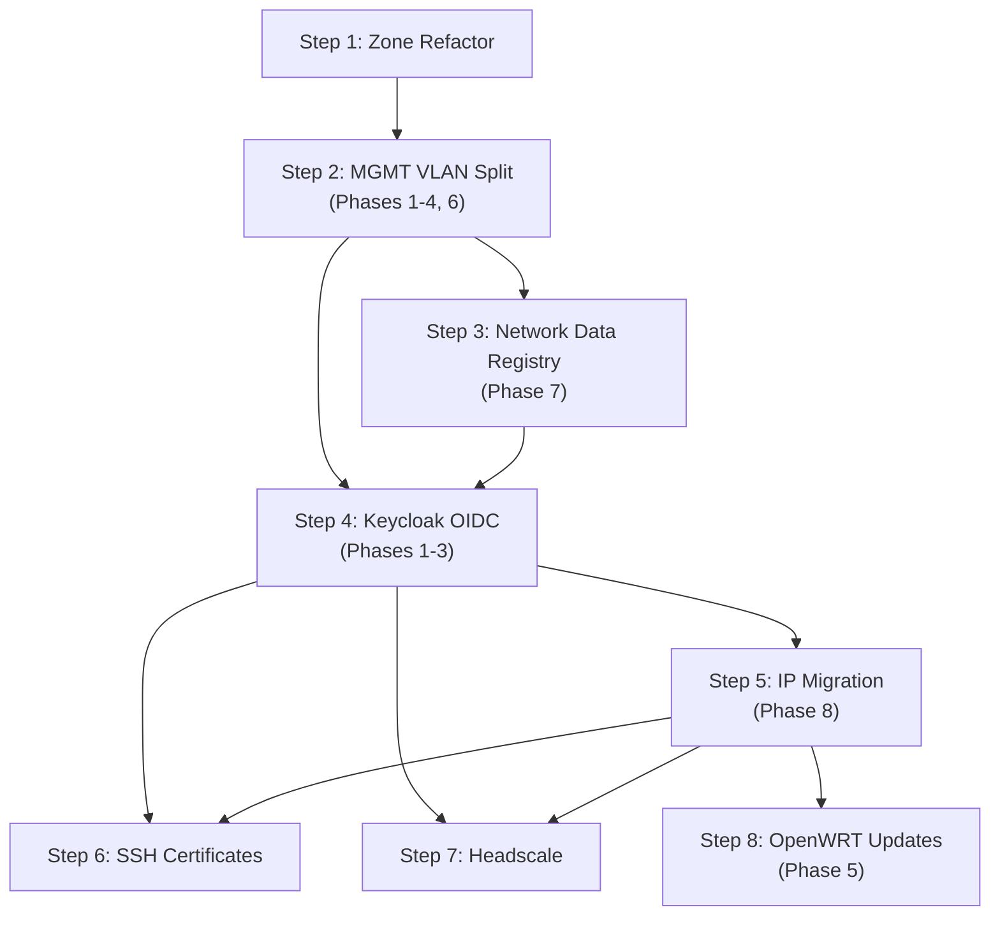

# Feature Roadmap Analysis

Cross-plan analysis of all documents in `llm-notes/`, identifying contradictions
and providing a unified implementation guide.

## Plans Analyzed

| Plan | File | Summary |
|------|------|---------|
| Zone Refactor | `zone-refactor-plan.md` | Replace hardcoded trust enum with configurable zone system |
| Secure MGMT VLAN | `secure-mgmt-vlan-plan.md` | Split vMGMT into vMGMT (network gear) + vINFRA (infrastructure) |
| Keycloak OIDC | `keycloak-oauth-oidc-plan.md` | Centralized identity infrastructure with OAuth2/OIDC |
| SSH Certificates | `ssh-certificates-sso-plan.md` | SSH certificate auth via Keycloak + step-ca |
| Headscale | `headscale-integration-plan.md` | Self-hosted Tailscale for friend game server access |

## MicroVM Inventory

A complete inventory of all existing and planned microvms — names, hosts, zones, IPs,
and responsibilities — is maintained in [`microvm-inventory.md`](./microvm-inventory.md).
All planned microvms are assigned to muspelheim and follow the Norse naming convention:
mimir (Keycloak), tyr (step-ca), ratatosk (Headscale), fenrir (subnet router), and
heimdall (SSH bastion).

---

## Resolved Contradictions

Two contradictions were found and have been applied to the source plans.

**C1. Registry zone names mismatched router6 zone names** (`secure-mgmt-vlan-plan.md`)
Phase 7 used descriptive names (`infrastructure`, `home`, `guest`) while all other
phases and plans used functional names (`management`, `trusted`, `untrusted`). Resolved
by renaming the registry to match router6. Zone names are just strings — cheap to update.

**C2. Headscale on vINFRA is incompatible with the network architecture**
(`headscale-integration-plan.md`) — DERP relay and STUN are embedded in the headscale
binary and must be reachable from external users. No direct WAN path exists to vINFRA.
Resolved by moving headscale to vDMZ, adding a cross-zone firewall rule for
headscale → Keycloak (OIDC), and recommending standalone STUN on the cloud host.

## Security Recommendations Applied

Four security recommendations were identified through surtr compromise analysis and
have been applied to the source plans. The common thread: **defenses that live on surtr
are useless after surtr is compromised.**

| ID | Summary | Applied to |
|----|---------|------------|
| R1 | `hostname-admin` restricts Keycloak admin console to internal hostname | `keycloak-oauth-oidc-plan.md` Phase 1 |
| R2 | Native OIDC on vDMZ backends (Jellyfin) survives oauth2-proxy bypass | `keycloak-oauth-oidc-plan.md` Phase 5 + architectural tension section |
| R3 | Host-level egress filtering for all vDMZ hosts (nftables output chain) | `secure-mgmt-vlan-plan.md` Phase 4.4, `keycloak-oauth-oidc-plan.md` Phase 3, `headscale-integration-plan.md` interaction section |
| R4 | Verify `oauth2-proxy` client has minimal Keycloak permissions | `keycloak-oauth-oidc-plan.md` Phase 2 step 3 |

---

## Implementation Guide

### Dependency Graph

### Parallelization

- **Steps 6 and 7** (SSH Certificates and Headscale) are independent — can be worked
  in parallel after Step 4
- **Step 3** (Network Registry) can start during Step 2 — create the registry file
  early and migrate consumers as you touch host configs
- **Step 5** (IP Migration) can start during Step 4 — dual addresses are independent
  of identity infrastructure

### Not Contradictions: Sequencing Differences

The following differences between plans are **not contradictions** — they reflect
the natural progression of the implementation order, where earlier plans work with
current infrastructure and later plans replace it.

**DNS naming (`.local` → `.mutantmell.net`):** The SSH Certificates plan uses
`*.home.local` and the Secure MGMT VLAN plan uses `*.local` because both are
written against the current DNS infrastructure. The Keycloak OIDC plan (Step 4)
performs the bulk DNS migration to `*.internal.mutantmell.net` / `*.internal` /
`*.mutantmell.net`. When the SSH Certificates plan (Step 6) is implemented, it
will use the canonical names established by the already-completed Keycloak plan.

**Keycloak realm name (`home` vs `homelab`):** The SSH Certificates plan uses
`home` as a placeholder realm name. The Keycloak OIDC plan (Step 4) defines the
authoritative realm as `homelab`. When the SSH Certificates plan (Step 6) is
implemented, it will reference the `homelab` realm that already exists.

---

## Execution Checklist

### Step 1: Zone Refactor

**Plan:** `zone-refactor-plan.md` (all phases)

Replaces the hardcoded trust enum with a configurable zone system. Pure refactor —
generated nftables output must be identical. Highest-risk step (firewall
misconfiguration can break everything) but also the most testable (snapshot tests
ensure identical output).

- [x] Phase 0: Add nftables snapshot tests for current router6 output
- [x] Phase 1: Define `zones` option type in router6 module
- [x] Phase 2: Replace hardcoded trust enum with zone-based config
- [x] Phase 3: Add `extraForwardRules` escape hatch for cross-zone rules
- [x] Phase 4: Rename `trust` → `zone` in all host configs (mechanical)
- [x] Verify: snapshot tests pass (identical nftables output)
- [x] Deploy to router with `magic_rollback` via deploy-rs

### Step 2: Secure MGMT VLAN Split (Phases 1-4, 6)

**Plan:** `secure-mgmt-vlan-plan.md` Phases 1-4, 6

Creates vINFRA VLAN, defines `network` zone, migrates infrastructure hosts,
hardens NFS, adds host firewalls (input + egress). OpenWRT updates deferred
to Step 8.

- [x] Phase 1: Add VLAN 11 (vINFRA) to router, switch trunk, define `network` zone
- [x] Phase 2: Migrate hosts to vINFRA (alfheim, jotunheimr, vanaheim, muspelheim)
- [x] Phase 3: Update NFS mounts to use vINFRA addresses
- [x] Phase 4.1-4.3: Add host-level input firewalls (jotunheimr, vanaheim, muspelheim)
- [x] Phase 4.4: Add egress filtering module for vDMZ hosts (nftables output chain)
- [ ] Phase 6: Coordinated deployment (VM guests → VM hosts → NAS → Router)
- [ ] Verify: all hosts reachable, DNS working, NFS mounts operational

### Step 3: Network Data Registry

**Plan:** `secure-mgmt-vlan-plan.md` Phase 7

Replaces `network.json` with Nix-based registry. Zone names use functional names
(`management`, `trusted`, `untrusted`) matching router6.

- [x] Create `lib/common/data/network.nix` alongside `network.json`
- [x] Add `summary` attribute and `nix run .#netinfo` app
- [x] Update `lib/common/data/default.nix` to load `.nix` instead of `.fromJSON`
- [x] Gradually replace hardcoded IPs in host configs with registry references
- [x] Remove `network.json` once no consumers remain

### Step 4: Keycloak OIDC (Phases 1-3)

**Plan:** `keycloak-oauth-oidc-plan.md` Phases 1-3

Provisions Keycloak + step-ca on vINFRA, creates `homelab` realm, implements
split-horizon DNS, deploys SSH bastion, enables external access.

**Phase 1: Infrastructure migration**
- [x] Provision Keycloak microvm on vINFRA
- [x] Configure `hostname-admin` for internal-only admin console (R1)
- [x] Provision step-ca microvm on vINFRA
- [x] Deploy oauth2-proxy on alfheim (internal service auth)
- [x] Apply security fixes S1 (cookie.secure), S2 (cookie.domain), S3 (skip-jwt-bearer-tokens)
- [x] Apply S7 (passAccessToken removal)
- [ ] Migrate from gridr, decommission gridr

**Phase 2: Realm restructuring**
- [ ] Create `homelab` realm
- [ ] Register clients: `oauth2-proxy`, `step-ca`, `cicd-deploy`
- [ ] Verify client scope restrictions — minimal permissions per client (R4)
- [ ] Create groups: `admins`, `media-users`, `deploy`
- [ ] Add `groups` protocol mapper
- [ ] Configure conditional MFA for admins
- [ ] Update surtr + alfheim oauth2-proxy configs to `homelab` realm
- [ ] Retire `external` realm

**Phase 3: DNS, external access, hardening**
- [ ] Implement split-horizon DNS (`mutantmell.net` hierarchy)
- [ ] Add surtr nginx rate limiting for `/auth/` and `/oauth2/` (S11)
- [ ] Provision SSH bastion VM on vDMZ (Incus VM — new capability)
- [ ] Tighten wg-ba firewall rules (per-service instead of blanket)
- [ ] Remove SSH daemon from surtr
- [ ] Configure egress filtering on surtr and bastion (R3)
- [ ] Deploy cloud host with nginx + WireGuard + Let's Encrypt
- [ ] Test end-to-end: internal + external auth flows + SSH bastion path

### Step 5: IP Migration

**Plan:** `secure-mgmt-vlan-plan.md` Phase 8

Adds `10.97.x.x` dual addresses alongside `10.0.x.x`, preparing for eventual
removal of the legacy range.

- [ ] Add dual addresses to all VLANs via network registry `legacyPrefix`
- [ ] Update DHCP pools to `10.97.x.x`
- [ ] Update WireGuard client configs (add `10.97.0.0/16` to AllowedIPs)
- [ ] Verify all services work on `10.97.x.x`
- [ ] Remove `10.0.x.x` addresses (use MGMT VLAN plan appendix checklist)

### Step 6: SSH Certificates

**Plan:** `ssh-certificates-sso-plan.md` (all phases)

Deploys SSH certificate auth via step-ca's OIDC provisioner. Uses canonical names
from Step 4 (`*.mutantmell.net`, `homelab` realm).

- [ ] Add OIDC provisioner to step-ca config
- [ ] Configure group → principal mapping (admins → admin, deploy → deploy)
- [ ] Test interactive flow: `step ssh login` → Keycloak → cert
- [ ] Test CI/CD flow: client_credentials → token → cert
- [ ] Deploy host certificates to all NixOS hosts
- [ ] Configure `TrustedUserCAKeys` on all hosts
- [ ] Remove static SSH keys (keep as fallback initially)
- [ ] Remove vMGMT MAC allowlist (replaced by cert-based auth)

### Step 7: Headscale

**Plan:** `headscale-integration-plan.md` (all phases)

Deploys Headscale on vDMZ as self-hosted Tailscale control plane with subnet
router for friend access to game servers. Uses canonical names from Step 4.

- [ ] Phase 1: Provision headscale microvm on muspelheim (vDMZ)
- [ ] Phase 1: Add headscale → Keycloak cross-zone firewall rule
- [ ] Phase 1: Configure egress filtering on headscale (R3)
- [ ] Phase 1: Add surtr vhost for `vpn.mutantmell.net`
- [ ] Phase 1: Add DNS records for headscale + fenrir
- [ ] Phase 2: Provision fenrir microvm on muspelheim (vDMZ)
- [ ] Phase 2: Configure fenrir as Tailscale subnet router
- [ ] Phase 2: Configure egress filtering on fenrir (R3)
- [ ] Phase 3: Register `headscale` client in Keycloak, create `gamers` group
- [ ] Phase 3: Enable OIDC in headscale, test auth flow
- [ ] Phase 4: Write ACL policy, deploy test game server
- [ ] Phase 4: Verify gamers restricted to game server ports only
- [ ] Phase 5: Create friend accounts, send onboarding guide
- [ ] Phase 6: Deploy production game servers, update ACLs
- [ ] Investigate: STUN reachability (standalone STUN on cloud host)

### Step 8: OpenWRT Updates

**Plan:** `secure-mgmt-vlan-plan.md` Phase 5

Updates OpenWRT APs with NTP changes and host firewalls. Deferred to the end
because the OpenWRT configuration checked into the repo is stale — a fresh
config import from the running devices is needed before any changes can be made.

- [ ] Import current OpenWRT configuration from running devices into the repo
- [ ] Phase 5: Update NTP server to router IP
- [ ] Phase 5: Add host firewall script to APs
- [ ] Deploy to OpenWRT APs
