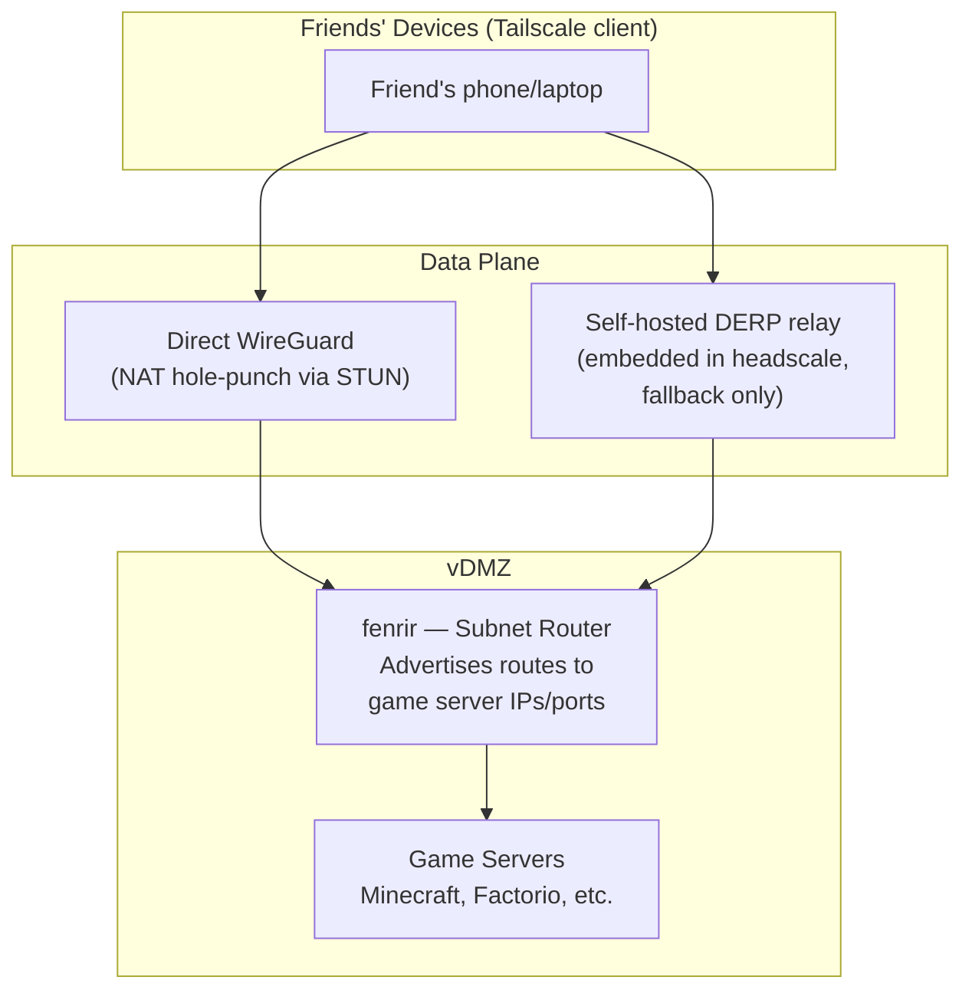
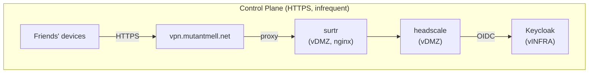
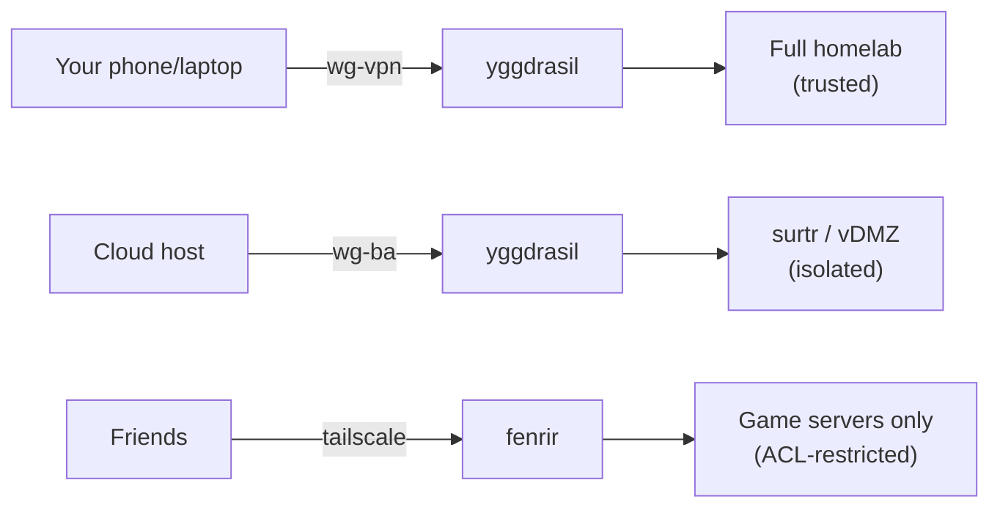

# Headscale Integration Plan — Game Server Access for Friends

> **Status:** Planning. Depends on the [Keycloak OIDC plan](./keycloak-oauth-oidc-plan.md) for
> authentication infrastructure. Can be implemented incrementally alongside other plans.

## Motivation

The homelab will host game servers for friends. These friends need network access to reach
those servers. The options considered:

| Approach | Pros | Cons |
|----------|------|------|
| Direct internet exposure | Simple | Large attack surface, DDoS risk, exposes homelab IP |
| WireGuard (manual) | Secure, fast | Non-technical friends can't set it up; key distribution is painful; no identity-based access control |
| WireGuard dynamic | Would solve the UX problem | Project is not pursuing this use case |
| Tailscale (hosted) | Excellent UX, easy onboarding | Depends on a commercial company's continued support and survival |
| **Headscale + Tailscale clients** | **Same UX as Tailscale; self-hosted control plane; OIDC auth via Keycloak; ACL-based access control** | **Must maintain the control server; DERP relay adds latency if direct connections fail** |

Headscale is the right fit: it provides the same frictionless onboarding experience as
Tailscale (install app, click login, done) while keeping the control plane self-hosted
and integrated with the existing Keycloak identity infrastructure.

### What headscale actually is

Headscale is an open-source implementation of the Tailscale **control server** (coordination
plane). It does **not** handle data plane traffic — that flows directly between nodes via
WireGuard, with DERP relay servers as fallback when direct connections aren't possible.

Headscale's responsibilities:
- Node registration and authentication (supports OIDC)
- WireGuard public key exchange between nodes
- ACL policy distribution
- DERP map distribution (and optionally, an embedded DERP server)
- DNS configuration distribution (MagicDNS)

Clients use the standard **Tailscale client apps** (available on Windows, macOS, Linux, iOS,
Android). Friends install the Tailscale app, point it at your headscale server, authenticate
via Keycloak in their browser, and they're connected. No key files, no config files, no
terminal commands beyond the initial `tailscale login --login-server <url>`.

---

## Architecture Overview





### Data plane vs control plane separation

- **Control plane** (infrequent, HTTPS): node registration, key exchange, ACL updates,
  OIDC authentication. Proxied through surtr, same path as Keycloak for external users.
  Latency-insensitive.

- **Data plane** (continuous, WireGuard/UDP): actual game traffic flows directly between
  friends' devices and the subnet router via encrypted WireGuard tunnels. Tailscale
  clients use STUN-based NAT traversal to establish direct connections whenever possible.
  The self-hosted DERP relay (embedded in headscale) is only used as fallback when direct
  connections fail. Latency-sensitive — direct connections are critical for gaming.

---

## VLAN Placement

### Headscale control server: vDMZ

Headscale is conceptually infrastructure (it coordinates the overlay network, manages
node identities, and distributes security policy), which would suggest vINFRA placement.
However, headscale embeds a DERP relay server and STUN listener that must be reachable
from external users. DERP and STUN are built into the headscale binary — they cannot be
split into a separate service on a different VLAN. This makes vINFRA placement impractical:

1. **No direct WAN path to vINFRA.** The network architecture routes all external traffic
   through a cloud host via the wg-ba WireGuard tunnel to surtr on vDMZ. STUN served
   through a WireGuard tunnel would report the tunnel endpoint IP rather than the friend's
   actual public IP, breaking NAT traversal entirely.

2. **DERP is embedded, not separable.** You cannot run just DERP/STUN on vDMZ while
   keeping headscale's control plane on vINFRA — they're the same process.

| Consideration | vDMZ (chosen) | vINFRA |
|---------------|---------------|--------|
| DERP/STUN reachability | Reachable via surtr proxy / wg-ba | Broken — no direct WAN path, STUN fails through WireGuard |
| Keycloak integration (OIDC) | Cross-zone rule (vDMZ → vINFRA), same as surtr | Intra-zone |
| Fenrir → headscale | Intra-zone (no firewall rule needed) | Cross-zone rule needed |
| Compromise impact | Attacker on vDMZ (same as any DMZ service) | Attacker on vINFRA (alongside Keycloak, step-ca, DNS — worse) |
| Precedent | surtr (web proxy), game servers | Keycloak, step-ca, alfheim |

Headscale on vDMZ needs an explicit cross-zone firewall rule to reach Keycloak on
vINFRA for OIDC validation — the same pattern as surtr → Keycloak. External access is
proxied through surtr (a new nginx vhost at `vpn.mutantmell.net`). The fenrir subnet
router is also on vDMZ, so fenrir → headscale is intra-zone (no firewall rule needed).

### Subnet router: vDMZ

The subnet router bridges Tailscale overlay traffic into the homelab network. It runs the
Tailscale client daemon, which maintains WireGuard tunnels to friends' devices and forwards
their traffic to game servers.

The subnet router belongs on vDMZ because:
- It handles traffic from untrusted external users (friends)
- Game servers are on vDMZ — keeping the subnet router on the same zone avoids cross-zone
  forwarding for game traffic
- It's analogous to surtr: an ingress point for external traffic into the DMZ
- A compromise of the subnet router gives access to vDMZ (game servers) but not to
  vINFRA or vHOME

With headscale also on vDMZ, fenrir → headscale is intra-zone — no firewall rule needed.

### Game servers: vDMZ

Game servers are services exposed to external untrusted users. This matches vDMZ's purpose
exactly. They sit alongside bragi (Jellyfin), surtr (reverse proxy), and hrungnir (Attic
cache).

Note: vGAME (VLAN 41) is for gaming **consoles** — user-owned devices on the LAN that
need UPnP/NAT-PMP for online multiplayer. It is not for hosting game servers. Game servers
are services, not client devices.

### Why not a new VLAN?

A dedicated "game server" VLAN would provide marginally finer isolation (game servers
can't talk to Jellyfin) but adds complexity:
- Another VLAN to configure on the switch trunk
- Another firewall zone to define and test
- Another bridge interface on the VM host
- The subnet router would still need cross-zone access to it

vDMZ already has the right trust level (untrusted, internet-reachable services) and the
firewall model already handles it. Game servers are just more services on vDMZ. If the
number of DMZ services grows significantly, splitting vDMZ into purpose-specific sub-zones
can be revisited, but it's premature now.

---

## Headscale Control Server Configuration

### Microvm specification

| Property | Value |
|----------|-------|
| Host | muspelheim (vDMZ bridge already exists, alongside surtr/fenrir) |
| vCPU | 1 |
| RAM | 512MB |
| Persistent storage | Small (SQLite database, private keys, ACL policy file) |
| Network | vDMZ (VLAN 100) |
| IP | Next available vDMZ address |
| Services | headscale, nginx (TLS termination + reverse proxy) |
| DNS name | `headscale.internal.mutantmell.net` / `headscale.internal` (internal) |
| External name | `vpn.mutantmell.net` (proxied through surtr for friends) |

Headscale is a single Go binary with a SQLite database. 512MB RAM is more than sufficient.

### NixOS configuration sketch

Headscale has a native NixOS module (`services.headscale`) available in nixpkgs:

```nix
{ config, pkgs, ... }:
{
  services.headscale = {
    enable = true;
    address = "127.0.0.1";
    port = 8080;

    settings = {
      server_url = "https://vpn.mutantmell.net";
      # Tailscale IP allocation prefixes (within 100.64.0.0/10 CGNAT range)
      prefixes = {
        v4 = "100.64.0.0/10";
        v6 = "fd7a:115c:a1e0::/48";
      };

      derp = {
        server = {
          # Self-hosted DERP — no dependency on Tailscale Inc.
          enabled = true;
          region_id = 900;
          region_code = "home";
          region_name = "Homelab";
          # STUN listener for NAT traversal (UDP, must be reachable from internet)
          stun_listen_addr = "0.0.0.0:3478";
          # Automatically determine public IP, or set explicitly:
          # ipv4 = "<public-ip>";
        };
        # No Tailscale public DERP servers — fully self-hosted
        urls = [];
      };

      dns = {
        magic_dns = true;
        base_domain = "tail.internal";
        nameservers.global = [
          # Point tailnet DNS at the homelab's DNS server (alfheim)
          # so .internal and .internal.mutantmell.net resolve correctly
          "<alfheim-ip>"
        ];
        nameservers.split = {
          # Friends' devices use homelab DNS for internal names only
          "internal" = [ "<alfheim-ip>" ];
          "internal.mutantmell.net" = [ "<alfheim-ip>" ];
        };
      };

      oidc = {
        issuer = "https://auth.mutantmell.net/auth/realms/homelab";
        client_id = "headscale";
        client_secret_path = config.sops.secrets."headscale-oidc-client-secret".path;
        # Restrict registration to users in the 'gamers' or 'admins' group
        allowed_groups = [ "/gamers" "/admins" ];
        # PKCE for additional security
        pkce.enabled = true;
      };

      policy = {
        mode = "file";
        path = "/etc/headscale/acl.json";
      };

      logtail.enabled = false;  # No telemetry to Tailscale
    };
  };

  # nginx reverse proxy for headscale (TLS termination)
  services.nginx = {
    enable = true;
    virtualHosts."${config.networking.hostName}.internal.mutantmell.net" = {
      forceSSL = true;
      enableACME = true;
      locations."/" = {
        proxyPass = "http://127.0.0.1:${toString config.services.headscale.port}";
        proxyWebsockets = true;
        extraConfig = ''
          proxy_set_header Host $host;
          proxy_set_header X-Real-IP $remote_addr;
          proxy_set_header X-Forwarded-For $remote_addr;
          proxy_set_header X-Forwarded-Proto $scheme;
          proxy_buffering off;
        '';
      };
    };
  };
}
```

### Secrets (SOPS)

Add to the headscale microvm's `sops.nix`:
- `headscale-oidc-client-secret` — Keycloak client secret for headscale
- `headscale-private-key` — headscale's noise private key (auto-generated on first run,
  but should be persisted and backed up)

### Persistence

The headscale microvm needs persistent storage for:
- `/var/lib/headscale/db.sqlite` — node registrations, users, key state
- `/var/lib/headscale/noise_private.key` — server identity key
- `/etc/headscale/acl.json` — ACL policy (could also be deployed via Nix)

Loss of the database means all nodes must re-register. Back up alongside other
infrastructure state (Keycloak PostgreSQL, step-ca CA keys).

---

## Subnet Router Configuration

The subnet router is a lightweight node on vDMZ that runs the Tailscale client daemon.
It advertises routes to game server IPs, allowing friends on the tailnet to reach them.

### Microvm specification

| Property | Value |
|----------|-------|
| Host | muspelheim (vDMZ bridge already exists) |
| vCPU | 1 |
| RAM | 256MB |
| Persistent storage | Minimal (Tailscale state) |
| Network | vDMZ (VLAN 100) |
| IP | Next available vDMZ address (e.g., 10.0.100.60) |
| Services | tailscale daemon only |
| Norse name | **fenrir** (the wolf that guards — fitting for a network gateway) |

### NixOS configuration sketch

```nix
{ config, pkgs, ... }:
{
  # Enable IP forwarding (required for subnet routing)
  boot.kernel.sysctl = {
    "net.ipv4.ip_forward" = 1;
    "net.ipv6.conf.all.forwarding" = 1;
  };

  services.tailscale = {
    enable = true;
    useRoutingFeatures = "server";  # Enable subnet routing
    authKeyFile = config.sops.secrets."tailscale-auth-key".path;
    extraUpFlags = [
      "--login-server" "https://vpn.mutantmell.net"
      "--advertise-routes=10.0.100.0/24"  # Advertise vDMZ subnet
      "--advertise-tags=tag:subnet-router"
      "--hostname=fenrir"
    ];
  };
}
```

The `--advertise-routes=10.0.100.0/24` makes the entire vDMZ subnet reachable from the
tailnet. ACLs on headscale then restrict which specific IPs and ports friends can actually
reach (see [ACL Configuration](#acl-configuration)).

After the subnet router registers, approve its routes on headscale:
```bash
headscale nodes approve-routes --identifier <node-id> --routes 10.0.100.0/24
```

Or use `autoApprovers` in the ACL policy to automate this (see ACL section).

### Why advertise the whole subnet?

Advertising `10.0.100.0/24` (the entire vDMZ) rather than individual game server IPs
avoids reconfiguring the subnet router every time a game server is added or moved. **ACLs
are the access control layer**, not route advertisements. The subnet router says "I can
reach these IPs"; the ACLs say "you're allowed to talk to these specific IPs on these
specific ports."

---

## Keycloak OIDC Integration

Headscale becomes another OIDC client of Keycloak, following the same pattern as
oauth2-proxy and step-ca in the [Keycloak OIDC plan](./keycloak-oauth-oidc-plan.md).

### Keycloak client registration

| Property | Value |
|----------|-------|
| Client ID | `headscale` |
| Type | Confidential |
| Grant Types | Authorization Code |
| Redirect URIs | `https://vpn.mutantmell.net/oidc/callback` |
| Default Client Scopes | `openid`, `profile`, `email`, `groups` |

The `groups` client scope (with the Group Membership mapper) is already planned in the
Keycloak OIDC plan. Headscale uses the `groups` claim to enforce `allowed_groups`.

### Keycloak groups

Extend the group structure from the Keycloak OIDC plan:

| Group | Purpose | Headscale Access |
|-------|---------|-----------------|
| `admins` | Full homelab access | Full tailnet access (admin ACL) |
| `gamers` | Friends who play games | Game server ports only (restricted ACL) |
| `media-users` | Jellyfin / media access | No tailnet access (web-only via oauth2-proxy) |

Friends get Keycloak accounts in the `gamers` group. Admins are in both `admins` and
optionally `gamers`. The `media-users` group doesn't need tailnet access — Jellyfin is
accessed via the web through surtr's oauth2-proxy.

### Authentication flow (friend onboarding)

```
Friend installs Tailscale app
        │
        ▼
tailscale login --login-server https://vpn.mutantmell.net
        │
        ▼
Browser opens → vpn.mutantmell.net/oidc/...
  → surtr proxies to headscale microvm
  → headscale redirects to auth.mutantmell.net (Keycloak)
        │
        ▼
Friend logs in with Keycloak credentials
  (username + password, optionally MFA)
        │
        ▼
Keycloak returns OIDC token with groups claim
  → headscale validates token
  → checks groups ∩ allowed_groups ≠ ∅
  → creates/updates user, registers node
        │
        ▼
Tailscale client receives WireGuard config
  → establishes tunnel to subnet router
  → friend can reach game servers
```

For non-technical friends, the experience is:
1. Install Tailscale from their app store
2. Run one command (or click a link you send them)
3. Log in with credentials you gave them
4. Play games

No key files, no config files, no port numbers, no understanding of networking required.

### MFA policy

- **admins:** Required (WebAuthn or TOTP) — consistent with the Keycloak OIDC plan
- **gamers:** Optional — requiring MFA for friends who just want to play games adds
  friction that defeats the purpose of choosing headscale over raw WireGuard. The OIDC
  token provides identity binding, and ACLs limit blast radius.

---

## ACL Configuration

Headscale implements the same ACL policy format as Tailscale. The ACL file controls which
nodes can talk to which destinations.

### `/etc/headscale/acl.json`

```json
{
  "groups": {
    "group:admins": ["admin-user@auth.mutantmell.net"],
    "group:gamers": ["friend1@auth.mutantmell.net", "friend2@auth.mutantmell.net"]
  },

  "tagOwners": {
    "tag:subnet-router": ["group:admins"]
  },

  "autoApprovers": {
    "routes": {
      "10.0.100.0/24": ["tag:subnet-router"]
    }
  },

  "acls": [
    {
      "action": "accept",
      "src": ["group:admins"],
      "dst": ["*:*"],
      "comment": "Admins have full tailnet access"
    },
    {
      "action": "accept",
      "src": ["group:gamers"],
      "dst": [
        "10.0.100.70:25565",
        "10.0.100.70:25575",
        "10.0.100.71:34197",
        "10.0.100.71:27015"
      ],
      "comment": "Gamers can reach game server ports only"
    }
  ]
}
```

**Key design decisions:**

1. **No `*:*` for gamers.** Friends can only reach explicitly listed game server IPs and
   ports. They cannot reach surtr, bragi, hrungnir, or any other vDMZ service. They cannot
   reach vINFRA, vHOME, or any other VLAN (the subnet router only advertises vDMZ routes,
   and ACLs further restrict within that).

2. **Auto-approvers for the subnet router.** The `tag:subnet-router` tag auto-approves
   route advertisements, so the subnet router's routes are approved without manual
   intervention after restarts or re-registrations.

3. **User identifiers follow Keycloak OIDC format.** Headscale constructs user identifiers
   as `{preferred_username}@{issuer}` from the OIDC claims. The exact format depends on
   Keycloak's username policy — adjust group membership in the ACL accordingly. Since
   Keycloak groups are checked at OIDC validation time (via `allowed_groups`), the ACL
   group membership could alternatively use headscale's user management CLI to assign users
   to ACL groups after registration.

4. **ACL is a file, not in Nix config.** The ACL changes when game servers or friends are
   added/removed. Keeping it as a separate JSON file (watched by headscale or reloaded on
   change) avoids full NixOS rebuilds for access control changes. Headscale reloads the
   policy file without restart when `policy.mode = "file"`.

### Adding a new game server

When a new game server is deployed on vDMZ:
1. Deploy the game server microvm/container with a vDMZ IP
2. Add the IP:port to the ACL's `group:gamers` destination list
3. Headscale picks up the policy change — friends can now connect

No subnet router reconfiguration needed (it already advertises `10.0.100.0/24`).

### Adding a new friend

1. Create a Keycloak account for the friend (admin console)
2. Add them to the `gamers` group in Keycloak
3. Add their username to `group:gamers` in the ACL file (or use Keycloak group mapping)
4. Send them: install instructions + the login command
5. They log in, headscale validates their `gamers` group membership, node is registered

---

## DNS Integration

### MagicDNS

Headscale's MagicDNS gives each tailnet node a hostname under a configurable base domain.
With `base_domain = "tail.internal"`:
- The subnet router: `fenrir.tail.internal`
- A friend's laptop: `friendname-laptop.tail.internal`

This is purely for tailnet-internal name resolution. Friends don't need to know or use
these names — they connect to game servers by IP (which the game client handles) or by
DNS names if configured.

### Split DNS for homelab name resolution

The headscale DNS config includes split DNS entries that route `.internal` and
`.internal.mutantmell.net` queries to alfheim (the homelab's DNS server). This means
friends' devices can optionally resolve internal hostnames — but ACLs still control
whether they can actually reach those IPs.

For game servers specifically, DNS names aren't typically needed. Game clients connect
by IP:port. But if desired, game-specific DNS records can be added to headscale's
`extra_records` config:

```yaml
dns:
  extra_records:
    - name: "minecraft.game"
      type: "A"
      value: "10.0.100.70"
    - name: "factorio.game"
      type: "A"
      value: "10.0.100.71"
```

These records are pushed to all tailnet clients automatically.

### No changes to existing DNS infrastructure

Headscale's DNS is distributed to Tailscale clients only — it doesn't affect alfheim,
Unbound, or Adguard Home. The existing DNS infrastructure remains unchanged. The only
integration point is that headscale's split DNS can point to alfheim for internal name
resolution, which is optional.

---

## Relationship with Existing WireGuard Connections

### wg-vpn (trusted, user's own devices) — KEEP

wg-vpn provides full trusted access to the homelab for your own phone and laptop. This
is a fundamentally different trust level than what friends need. wg-vpn grants access
equivalent to being on vHOME — all internal services, NFS shares, admin UIs, everything.

Headscale does **not** replace wg-vpn. The trust models are different:

| Aspect | wg-vpn | Headscale (friends) |
|--------|--------|-------------------|
| Trust level | Trusted (full homelab access) | Untrusted (game server ports only) |
| Users | You only | Friends |
| Network zone | Trusted (like vHOME) | Restricted via ACLs to vDMZ game ports |
| Authentication | Static WireGuard keys | OIDC (Keycloak) |
| Revocation | Remove peer from config, rebuild | Disable Keycloak account (instant) |

Migrating personal devices to headscale was considered and rejected: it would require
replacing the native WireGuard app with the Tailscale app on every personal device. The
WireGuard app is lightweight, does exactly what's needed, and is already configured. There
is no operational benefit to consolidating since the two systems serve different trust
levels and don't interact.

### wg-ba (isolated, cloud host tunnel) — KEEP

wg-ba is the tunnel between the cloud host and the homelab for proxying web traffic
(surtr → services). It serves a completely different purpose: it's the ingress path for
the public-facing web presence (Jellyfin via oauth2-proxy, Keycloak for external auth).

Headscale does **not** replace wg-ba. The cloud host still needs its dedicated tunnel for
web traffic proxying. Game traffic from friends flows through Tailscale's overlay network
(direct WireGuard connections), not through wg-ba.

However, headscale's control plane traffic (OIDC registration, key exchange) is proxied
through surtr, which is reached via wg-ba from external users. So wg-ba indirectly
supports headscale's control plane for external access.

### Summary: headscale supplements, does not replace



Three independent access paths, three different trust levels, three different purposes.

---

## Firewall Rules

### Router-level rules (yggdrasil)

After the zone refactor, these are expressed as `extraForwardRules`:

```nix
firewall.extraForwardRules = [
  # Existing rules...

  # Headscale needs OIDC access to Keycloak (cross-zone: vDMZ → vINFRA)
  {
    iifname = "vDMZ.br0";
    oifname = "vINFRA.br0";
    ip.saddr = "<headscale-microvm-ip>";
    ip.daddr = "<keycloak-microvm-ip>";
    tcp.dport = 443;
    verdict = "accept";
    comment = "headscale -> Keycloak (OIDC)";
  }
];
```

This follows the same pattern as the surtr → Keycloak rule in the
[Keycloak OIDC plan](./keycloak-oauth-oidc-plan.md).

**Note:** fenrir → headscale is now intra-zone on vDMZ, so no router-level
forwarding rule is needed for that path.

### STUN reachability (required for self-hosted DERP)

The embedded DERP server's STUN listener (UDP 3478) must be reachable from the internet
for NAT traversal. With headscale on vDMZ, STUN traffic must arrive via the cloud host
and wg-ba tunnel (since there is no direct WAN exposure of the homelab's public IP).

STUN over a WireGuard tunnel is problematic: STUN helps clients discover their public
IP, but traffic arriving through wg-ba has the tunnel endpoint as its source, not the
friend's real IP. Options to investigate:

1. **Run a standalone STUN service on the cloud host.** The cloud host sees friends'
   real public IPs. A lightweight STUN server there (e.g., coturn in STUN-only mode)
   would provide correct NAT traversal information. Headscale's DERP map can point
   STUN at the cloud host's IP while DERP relay points at `vpn.mutantmell.net`.

2. **Forward STUN UDP through wg-ba.** May partially work — the cloud host can relay
   the UDP packets, but the STUN response would reflect the wg-ba tunnel IP rather
   than the friend's real public IP. This likely breaks NAT traversal.

3. **Accept DERP-only relay.** If STUN doesn't work, all connections fall back to DERP
   relay (higher latency but functional). For gaming with friends in the same metro
   area, relay latency through the homelab may be acceptable.

Option 1 is the most correct solution. STUN on the cloud host, DERP relay through
surtr's proxy to headscale on vDMZ.

### Surtr nginx vhost for headscale (external access + DERP relay)

Add a virtual host on surtr to proxy headscale's control plane and DERP relay for
external users. DERP relay traffic uses the same HTTPS connection as the control plane,
so a single proxy handles both:

```nix
# On surtr — new vhost for headscale
virtualHosts."vpn.mutantmell.net" = {
  forceSSL = true;
  enableACME = true;

  locations."/" = {
    proxyPass = "https://headscale.internal";
    proxyWebsockets = true;  # headscale uses websockets for some control traffic
    extraConfig = ''
      proxy_set_header Host $host;
      proxy_set_header X-Real-IP $remote_addr;
      proxy_set_header X-Forwarded-For $remote_addr;
      proxy_set_header X-Forwarded-Proto $scheme;
      proxy_buffering off;
      proxy_read_timeout 600s;
      proxy_send_timeout 600s;
    '';
  };
};
```

DERP relay traffic is multiplexed over the same HTTPS connection as the control plane
(using HTTP upgrades), so this single vhost handles both control plane and relay. This
is analogous to surtr's `auth.mutantmell.net` vhost that proxies Keycloak.

### DNS entries

Add to alfheim's Unbound config (split-horizon):

```nix
# In the mutantmell.net transparent zone (split-horizon override)
''"vpn.mutantmell.net. A <headscale-microvm-ip>"''

# In the internal.mutantmell.net static zone
''"headscale.internal.mutantmell.net. A <headscale-microvm-ip>"''

# In the internal static zone (short alias)
''"headscale.internal. A <headscale-microvm-ip>"''

# Subnet router
''"fenrir.internal.mutantmell.net. A 10.0.100.60"''
''"fenrir.internal. A 10.0.100.60"''
```

---

## DERP Strategy — Self-Hosted

DERP (Designated Encrypted Relay for Packets) relays encrypted WireGuard traffic when
direct connections can't be established. Every Tailscale connection first goes through
DERP, then upgrades to direct once NAT traversal succeeds. Self-hosting DERP eliminates
the dependency on Tailscale Inc.'s infrastructure entirely.

### Embedded DERP server in headscale

Headscale includes a built-in DERP server that runs in the same process. This is the
simplest self-hosted option — no separate service to deploy.

The embedded DERP server provides:
- **DERP relay** (TCP/HTTPS) — relays encrypted WireGuard packets when direct connections
  fail
- **STUN** (UDP 3478) — helps clients discover their public IP and perform NAT traversal
  for direct connections

### Network requirements

For DERP and STUN to work, the headscale server must be reachable from the internet on:
- **TCP 443** — DERP relay traffic (piggybacks on the HTTPS port)
- **UDP 3478** — STUN for NAT traversal

Two options for exposing these:

**Option A: Via surtr proxy (TCP 443, STUN on cloud host) — recommended**

The HTTPS control plane is already proxied through surtr at `vpn.mutantmell.net`. DERP
relay traffic uses the same HTTPS connection, so it works through the proxy automatically.
STUN (UDP) cannot be proxied through nginx and cannot reliably traverse the wg-ba tunnel
(see "STUN reachability" in the firewall section). The recommended approach:

- **DERP relay:** friend → cloud host → wg-ba → surtr → headscale (vDMZ). Works via
  the existing HTTPS proxy path.
- **STUN:** Run a lightweight STUN service on the cloud host itself, where it can see
  friends' real public IPs. Configure headscale's DERP map to point STUN at the cloud
  host's public IP.

This keeps headscale on vDMZ with no direct internet exposure. DERP relay goes through
surtr, and STUN is handled at the network edge (cloud host).

**Option B: Via the cloud host (if deployed)**

If the cloud host from the Keycloak OIDC plan is deployed, both DERP and STUN can be
forwarded through the wg-ba tunnel to headscale. This adds latency to the DERP relay
path but keeps everything behind the cloud host. Not recommended for gaming latency
unless the cloud host is geographically close.

### Client verification

The embedded DERP server can verify connecting clients against headscale's node database,
preventing unauthorized use of the relay:

```yaml
derp:
  server:
    enabled: true
    automatically_add_embedded_derp_region: true
    # Client verification is automatic with the embedded server —
    # headscale checks connecting nodes against its own database
```

This means only registered tailnet nodes can use the DERP relay. Random internet users
cannot abuse it as a proxy.

### No Tailscale public DERP servers

The configuration explicitly sets `urls = []` to disable loading Tailscale's public DERP
map. All DERP relay traffic stays on self-hosted infrastructure. If the embedded DERP
server goes down, connections fall back to direct-only (which works for most NAT
configurations). There is no Tailscale Inc. dependency.

### Tradeoffs vs Tailscale's public DERP

| Aspect | Self-hosted (embedded) | Tailscale public DERP |
|--------|----------------------|----------------------|
| Dependency on Tailscale Inc. | None | Full |
| Maintenance | Runs with headscale (minimal) | Zero |
| Geographic distribution | Single location (your ISP) | Global |
| Relay latency | Depends on friend-to-homelab distance | Low (nearest POP) |
| Metadata visibility | You control the server | Tailscale sees connection metadata |
| Availability | Single point of failure | Redundant global fleet |

For a homelab serving friends in roughly the same geographic area, single-location DERP
is fine. DERP is only a relay fallback — most connections will be direct via STUN NAT
traversal. For friends in distant regions, relay latency through the homelab may be
noticeable, but game traffic will typically use direct connections anyway.

---

## Interaction with Other Plans

### Zone refactor plan — no conflict

Headscale adds two services to vDMZ (headscale + fenrir). The zone refactor's
configurable zones handle this naturally. No changes to the zone refactor plan needed.

The headscale → Keycloak firewall rule is expressed as `extraForwardRules` (same
escape hatch used for surtr → Keycloak). Fenrir → headscale is intra-zone on vDMZ.

### Secure MGMT VLAN plan (vINFRA split) — egress filtering

Both headscale and fenrir are on vDMZ (hosted by muspelheim, which already has vDMZ
bridge infrastructure). The vINFRA split is relevant only for the cross-zone firewall
rule (headscale → Keycloak on vINFRA for OIDC).

Both hosts should have egress filtering per Phase 4.4 of the MGMT VLAN plan. Egress
policies:

**headscale:**

| Destination | Protocol | Port | Purpose |
|-------------|----------|------|---------|
| Keycloak microvm (vINFRA) | TCP | 443 | OIDC authentication |
| alfheim (vINFRA) | UDP/TCP | 53 | DNS resolution |

Headscale has minimal egress needs — DERP/STUN are inbound, control plane API is
also inbound. No internet access needed.

**fenrir:**

| Destination | Protocol | Port | Purpose |
|-------------|----------|------|---------|
| headscale (vDMZ) | TCP | control port | Tailscale control plane |
| Game servers (vDMZ) | TCP/UDP | game ports | Subnet routing target |
| alfheim (vINFRA) | UDP/TCP | 53 | DNS resolution |

Fenrir only needs to reach services it routes to. No internet access — all
Tailscale traffic arrives through the WireGuard mesh.

### Keycloak OIDC plan — natural extension

Headscale becomes another OIDC client. The changes to the Keycloak plan are additive:

| Addition | Location |
|----------|----------|
| `headscale` client in Keycloak | Phase 2 (realm restructuring) |
| `gamers` group in Keycloak | Phase 2 (realm restructuring) |
| `vpn.mutantmell.net` split-horizon DNS | Phase 3 (DNS strategy) |
| surtr vhost for `vpn.mutantmell.net` | Phase 3 (external access) |
| Client secret in headscale microvm sops | Phase 1 |

### SSH certificates plan — no direct interaction

SSH certificates and headscale serve different purposes (admin SSH vs friend game access).
They share Keycloak as the identity provider but don't interact otherwise.

### IP address migration (10.0.x → 10.97.x) — update when it happens

The plan uses current addresses. When the dual-address migration happens, the subnet
router's advertised routes and the ACL destination IPs need updating. Since the ACL is a
separate file (not compiled into NixOS config), this is a quick edit.

---

## Security Considerations

### Threat model

| Threat | Mitigation |
|--------|-----------|
| Friend's device compromised | ACLs restrict to game server ports only; no lateral movement to other vDMZ services, vINFRA, or vHOME |
| Friend's Keycloak credentials stolen | Disable account in Keycloak → headscale rejects re-auth; existing sessions expire per `UseExpiryFromToken` |
| Headscale control server compromised | Attacker can manipulate overlay network; contained to vDMZ microvm with egress filtering; cannot reach vINFRA/vHOME except Keycloak:443 |
| Subnet router compromised | Attacker gains vDMZ network position; same as compromising any vDMZ service; no access to vINFRA/vHOME |
| DERP relay operator (Tailscale Inc.) | Traffic is WireGuard-encrypted end-to-end; relay sees encrypted packets only; metadata (source/dest IPs, timing) visible |

### Defense in depth layers

1. **OIDC authentication** — friends must authenticate via Keycloak to register nodes
2. **Group-based enrollment** — only users in `gamers` or `admins` groups can register
3. **ACL policy** — even after registration, gamers can only reach specific IPs and ports
4. **Subnet routing** — only vDMZ routes are advertised; other VLANs are unreachable
5. **Router firewall** — even if Tailscale ACLs are bypassed, the router's nftables rules
   enforce zone boundaries (untrusted vDMZ cannot reach trusted/management zones)
6. **Game server host firewalls** — individual game server microvms can have their own
   nftables rules restricting source IPs

### Revocation

Revoking a friend's access:
1. Disable their Keycloak account (immediate: new auth fails)
2. Delete their node in headscale (`headscale nodes delete`)
3. Remove from ACL groups (optional if account is disabled)

Existing WireGuard sessions may persist until the Tailscale client attempts re-auth
(controlled by key expiry). For immediate cutoff, deleting the node in headscale
invalidates their WireGuard keys.

---

## Friend Onboarding Guide

What you'd send a friend:

> 1. Install Tailscale:
>    - **Windows/Mac:** Download from https://tailscale.com/download
>    - **Linux:** `curl -fsSL https://tailscale.com/install.sh | sh`
>    - **iOS/Android:** Search "Tailscale" in your app store
>
> 2. Connect to my game server:
>    - Open a terminal/command prompt and run:
>      ```
>      tailscale login --login-server https://vpn.mutantmell.net
>      ```
>    - A browser window will open — log in with the username and password I gave you
>
> 3. Connect to the game:
>    - Server address: `10.0.100.70`
>    - Port: `25565` (or whatever the game uses)
>
> That's it! Tailscale runs in the background. If you restart your computer,
> it reconnects automatically.

On mobile, the `--login-server` flag is set in the Tailscale app settings (iOS: Settings
gear → "Use a custom server" toggle; Android: three-dot menu → "Use a custom server").

---

## Implementation Phases

### Phase 0: Prerequisites

- [ ] Keycloak operational with `homelab` realm (from Keycloak OIDC plan Phase 1-2)
- [ ] Split-horizon DNS working (from Keycloak OIDC plan Phase 3)
- [ ] surtr proxying `auth.mutantmell.net` for external users

Headscale can be deployed before all prerequisites are complete by using pre-auth keys
instead of OIDC for initial testing. OIDC integration can be enabled once Keycloak is
ready.

### Phase 1: Deploy headscale control server

1. Provision headscale microvm on muspelheim (vDMZ)
2. Configure `services.headscale` with basic settings (no OIDC initially)
3. Add nginx TLS termination on the headscale microvm
4. Add DNS records for `headscale.internal` / `headscale.internal.mutantmell.net`
5. Test: `headscale` CLI works, can create users and pre-auth keys
6. Add `vpn.mutantmell.net` split-horizon DNS record
7. Add surtr vhost for `vpn.mutantmell.net` → headscale
8. Test: external access to `vpn.mutantmell.net` works

### Phase 2: Deploy subnet router

1. Provision fenrir microvm on muspelheim (vDMZ)
2. Install Tailscale, configure as subnet router
3. Add firewall rule: headscale → Keycloak (vDMZ → vINFRA, TCP 443)
4. Register fenrir with headscale, approve routes
5. Test: a Tailscale client on vHOME can reach vDMZ IPs through the tailnet

### Phase 3: OIDC integration

1. Register `headscale` client in Keycloak
2. Create `gamers` group, configure Group Membership mapper
3. Enable OIDC in headscale config
4. Test: a new node can register via OIDC → Keycloak login → headscale
5. Test: a user not in `gamers` or `admins` is rejected

### Phase 4: ACL policy

1. Write initial ACL policy with `group:admins` and `group:gamers`
2. Deploy a test game server on vDMZ
3. Test: admin can reach all tailnet destinations
4. Test: gamer can reach game server ports only
5. Test: gamer cannot reach surtr, bragi, or any non-game vDMZ service
6. Test: gamer cannot reach vINFRA or vHOME IPs

### Phase 5: Friend onboarding

1. Create Keycloak accounts for friends
2. Add friends to `gamers` group
3. Send them the onboarding guide
4. Help with any setup issues
5. Verify ACLs work correctly for each friend

### Phase 6: Production game servers

1. Deploy actual game server microvms on vDMZ
2. Update ACL with real game server IPs and ports
3. Update DNS extra records if desired
4. Monitor and adjust

---

## Complete File Change List

| File | Phase | Changes |
|------|-------|---------|
| New: headscale microvm config (muspelheim, vDMZ) | 1 | New microvm: headscale, nginx, sops secrets, egress filtering |
| New: fenrir microvm config (muspelheim) | 2 | New microvm: tailscale daemon, subnet router |
| New: `/etc/headscale/acl.json` (on headscale microvm) | 4 | ACL policy file |
| `hosts/yggdrasil/default.nix` | 1 | Firewall rule: headscale → Keycloak (vDMZ → vINFRA) |
| `hosts/muspelheim/guests/surtr/proxy.nix` | 1 | Add `vpn.mutantmell.net` vhost |
| `hosts/yggdrasil/guests/alfheim/modules/dns.nix` | 1 | DNS records for headscale + fenrir |
| `hosts/muspelheim/default.nix` | 2 | Bridge config for fenrir tap interface (if not already covered by vDMZ bridge) |
| Keycloak config (admin console or keycloak-config-cli) | 3 | `headscale` client, `gamers` group |
| `flake.nix` | 1-2 | Add headscale + fenrir to nixosConfigurations |

### Relationship to other plan file changes

The [Keycloak OIDC plan](./keycloak-oauth-oidc-plan.md) should be updated to include:
- `headscale` in the client registration table
- `gamers` in the groups table
- `vpn.mutantmell.net` in the DNS naming scheme table
- surtr vhost for `vpn.mutantmell.net` in Phase 3

---

## Resolved Questions

1. **Game server selection:** Deferred. The architecture supports any game server — specific
   games don't affect the plan. ACL port entries are updated when game servers are deployed.
   Common homelab game servers for reference: Minecraft (TCP 25565), Factorio (UDP 34197),
   Valheim (UDP 2456-2458), Terraria (TCP 7777), Satisfactory (UDP 7777, 15000, 15777).

2. **Admin device migration:** Decided against. Migrating personal devices from wg-vpn to
   headscale would require replacing the native WireGuard app with the Tailscale app. The
   WireGuard app is lightweight, already configured, and preferred for personal use.
   wg-vpn and headscale serve different trust levels and coexist without interaction.

3. **Key expiry policy:** 90 days. Friends re-authenticate roughly quarterly — reasonable
   balance between convenience and security.

4. **DERP self-hosting:** Yes — use headscale's embedded DERP server. Tailscale's public
   DERP servers are disabled (`urls = []`). This eliminates all runtime dependencies on
   Tailscale Inc. DERP relay (TCP 443) is proxied through surtr alongside the control
   plane. STUN (UDP 3478) needs investigation — the recommended approach is a standalone
   STUN service on the cloud host (see "STUN reachability" in the firewall section).
