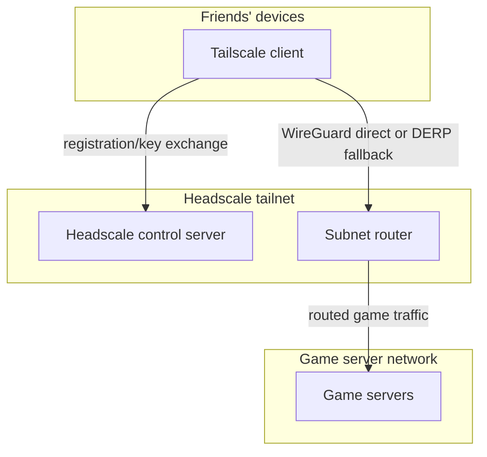

# Headscale Integration Plan - Game Server Access for Friends

> **Status:** Planning. This is a future Headscale plan for friend access to
> game servers. It is intentionally not an external-ingress/cloud-host plan. No
> Headscale service, subnet-router guest, or ACL policy has landed in the flake;
> Phase 0 placement decisions are still the next step.
>
> **Current assumptions (updated 2026-06-13):**
>
> - The current IdP is **Authelia** on `messeldam`, backed by lldap users and
>   groups. Keycloak is removed. See
>   [authelia-migration-plan](../done/authelia-migration-plan.md).
> - Friend enrollment should default to **Headscale pre-auth keys**. OIDC is
>   useful for admin/operator login to Headscale, and can be revisited for
>   friend self-service later if the extra account-management work is worth it.
> - `langport` oauth2-proxy external ingress is removed. Do not treat langport
>   as the current external proxy path for `vpn.mutantmell.net`; cloud-host and
>   external-ingress work is deferred.
> - Current relevant networks from `lib/common/data/network.nix`:
>   - `dmz`: VLAN 100, thebeyond-owned, `10.91.100.0/24`
>   - `app`: VLAN 50, BT8-gateway-owned, `10.97.50.0/24`
>   - `management`: VLAN 11, BT8-gateway-owned; `messeldam`/Authelia lives here
> - `hosts/thebeyond/router.nix` currently has DMZ as a local routed zone and APP
>   as a member-only bridge on thebeyond; APP terminates on BT8-gateway.

## Goal

Provide a low-friction way for friends to reach selected homelab game servers
without exposing those game servers directly to the internet.

The intended access path is:

1. Friends install the standard Tailscale client.
2. The operator creates Headscale pre-auth keys and sends a login command or
   setup link.
3. Friends join a restricted tailnet.
4. A subnet router advertises only the game-server network route(s).
5. Headscale ACLs allow friends to reach only explicit game server IP:port
   destinations.

This supplements existing WireGuard access; it does not replace operator VPNs.

## Why Headscale

| Approach | Pros | Cons |
| --- | --- | --- |
| Direct internet exposure | Simple | Larger attack surface, DDoS risk, exposes homelab IP |
| Manual WireGuard | Secure, fast | Poor friend UX, manual key distribution, hard revocation |
| Hosted Tailscale | Excellent UX | Depends on hosted control-plane service |
| **Headscale + Tailscale clients** | Self-hosted control plane, good client UX, ACLs, easy revocation | Must operate control server and DERP/STUN path |

Headscale is the Tailscale-compatible control server. Data-plane traffic remains
WireGuard between clients and nodes, with DERP relay only as fallback when direct
connections cannot be established.

## Proposed Architecture



### Control Plane

The control plane handles node registration, key exchange, route approval, ACL
policy, and optional operator OIDC login. It is latency-insensitive.

Current plan:

- Start with internal-only Headscale access for operator setup and testing.
- Use pre-auth keys for friend enrollment.
- Add Authelia OIDC only for admin/operator login unless a later decision makes
  friend self-service worth the added lldap account workflow.
- Revisit public `vpn.mutantmell.net` exposure only as part of the deferred
  cloud-host/external-ingress workstream.

### Data Plane

Game traffic is continuous and latency-sensitive. Tailscale clients should use
direct WireGuard paths whenever NAT traversal succeeds. DERP is a fallback, not
the target steady state.

## Network Placement

### Headscale Control Server

Place Headscale where its exposure model is explicit and where it can be reached
by the subnet router and operators. The prior plan assumed vDMZ plus a langport
external proxy. That assumption is stale.

Open placement decision:

| Option | Pros | Cons |
| --- | --- | --- |
| `dmz` VLAN 100 (`10.91.100.0/24`) | Fits an eventually externally reachable control/DERP service; local on thebeyond today | DMZ compromise model; cross-gateway access needed for Authelia on management if OIDC is enabled |
| `app` VLAN 50 (`10.97.50.0/24`) | Fits ordinary application services and current service migrations | APP terminates on BT8-gateway; public DERP/STUN exposure still needs deferred ingress design |
| `management` VLAN 11 | Close to Authelia/lldap | Not appropriate for friend-facing or internet-reachable components |

Recommendation for the first implementation: deploy Headscale without public
friend ingress, then choose `dmz` if embedded DERP/public control-plane exposure
is still desired; otherwise consider `app` for an internal service posture.

### Subnet Router

The subnet router runs the Tailscale client daemon with routing enabled. It
should sit on the same network as the game servers when practical, because it
bridges untrusted friend traffic into those services.

If game servers live in `dmz`, the subnet router should live in `dmz` and
advertise `10.91.100.0/24` or a narrower route. If game servers later move to
APP or a dedicated low-trust workload network, update the route advertisements
and router/firewall model accordingly.

### Game Servers

Game servers are low-trust services reachable by friends. Do not place them in
`management`, `trusted`, or operator-only networks.

Current candidates:

- `dmz` VLAN 100 (`10.91.100.0/24`) for externally oriented services.
- A future dedicated game/workload network if the number of servers or isolation
  needs justify it.
- Avoid APP by default if the game server is friend-facing and APP is being used
  for ordinary internal services, unless firewall policy is tightened around the
  specific workload.

`game` VLAN 41 is for gaming client devices/consoles, not hosted game servers.

## Headscale Configuration Sketch

The details may need adjustment against the nixpkgs Headscale module version at
implementation time.

```nix
{ config, ... }: {
  services.headscale = {
    enable = true;
    address = "127.0.0.1";
    port = 8080;

    settings = {
      server_url = "https://headscale.internal.mutantmell.net";

      prefixes = {
        v4 = "100.64.0.0/10";
        v6 = "fd7a:115c:a1e0::/48";
      };

      dns = {
        magic_dns = true;
        base_domain = "tail.internal";
        nameservers.split = {
          "internal" = [ "<phantasma-ip>" ];
          "internal.mutantmell.net" = [ "<phantasma-ip>" ];
        };
      };

      policy = {
        mode = "file";
        path = "/etc/headscale/acl.json";
      };

      logtail.enabled = false;
    };
  };
}
```

### Optional Authelia OIDC

Authelia OIDC should be added as an operator/admin convenience, not as the
baseline friend enrollment mechanism.

Expected shape:

- Add a declarative `headscale` OIDC client to the Authelia module.
- Store the client secret with sops, using the same secret-management pattern as
  other Authelia clients.
- Use Authelia issuer `https://authelia.internal.mutantmell.net` for internal
  access unless external auth naming is deliberately reintroduced later.
- Use lldap groups such as `admins` for operator access. A `gamers` group is only
  needed if the plan later switches friend enrollment from pre-auth keys to OIDC.

## Friend Enrollment With Pre-Auth Keys

Pre-auth keys are the recommended friend path because they avoid creating and
maintaining lldap accounts for every friend.

Operational flow:

1. Operator creates a reusable or one-time pre-auth key scoped to the expected
   user/group/tag policy.
2. Operator sends the friend a Tailscale install link and login command.
3. Friend runs:

   ```bash
   tailscale login --login-server https://headscale.internal.mutantmell.net --authkey <key>
   ```

4. Operator verifies the node, applies the intended ACL identity/tag if needed,
   and expires or deletes the key.

If public Headscale ingress is later implemented, replace the internal login
server URL with the public `vpn.mutantmell.net` name from that ingress design.

## Subnet Router Configuration Sketch

Example for game servers in current DMZ (`10.91.100.0/24`):

```nix
{ config, ... }: {
  boot.kernel.sysctl = {
    "net.ipv4.ip_forward" = 1;
    "net.ipv6.conf.all.forwarding" = 1;
  };

  services.tailscale = {
    enable = true;
    useRoutingFeatures = "server";
    authKeyFile = config.sops.secrets."tailscale-auth-key".path;
    extraUpFlags = [
      "--login-server" "https://headscale.internal.mutantmell.net"
      "--advertise-routes=10.91.100.0/24"
      "--advertise-tags=tag:subnet-router"
      "--hostname=<subnet-router-name>"
    ];
  };
}
```

After registration:

```bash
headscale nodes approve-routes --identifier <node-id> --routes 10.91.100.0/24
```

Advertising the whole server subnet is operationally simpler than updating the
subnet router for every game server. ACLs remain the access-control layer.

## ACL Policy

Headscale ACLs should restrict friends to exact game server destinations.

Example:

```json
{
  "groups": {
    "group:admins": ["admin"],
    "group:gamers": ["friend1", "friend2"]
  },

  "tagOwners": {
    "tag:subnet-router": ["group:admins"]
  },

  "autoApprovers": {
    "routes": {
      "10.91.100.0/24": ["tag:subnet-router"]
    }
  },

  "acls": [
    {
      "action": "accept",
      "src": ["group:admins"],
      "dst": ["*:*"]
    },
    {
      "action": "accept",
      "src": ["group:gamers"],
      "dst": [
        "10.91.100.70:25565",
        "10.91.100.71:34197"
      ]
    }
  ]
}
```

Design rules:

1. No `*:*` for friends.
2. Friends get only explicit game IP:port destinations.
3. The subnet router should advertise only the game-server network, not
   management/trusted/lab networks.
4. Router and host firewalls should still deny lateral movement if an ACL is
   wrong or a node is compromised.

## DNS

Headscale MagicDNS can use a tailnet-only domain such as `tail.internal`.

Split DNS for `.internal` and `.internal.mutantmell.net` can point clients at
phantasma if needed. Prefer game-specific names or Tailscale MagicDNS names over
making broad internal DNS part of the friend experience.

Examples:

```yaml
dns:
  extra_records:
    - name: "minecraft.game"
      type: "A"
      value: "10.91.100.70"
    - name: "factorio.game"
      type: "A"
      value: "10.91.100.71"
```

## DERP And STUN

Headscale can run an embedded DERP server, but public DERP/STUN exposure is tied
to the deferred external-ingress/cloud-host design.

For now:

- Do not assume nginx/langport can proxy the full DERP/STUN story.
- Do not assume UDP STUN through a WireGuard tunnel gives useful client public
  address discovery.
- Internal testing can proceed without solving public DERP/STUN.

When external ingress is revisited:

1. Decide where `vpn.mutantmell.net` terminates.
2. Decide whether DERP is embedded in Headscale or separate.
3. Put STUN somewhere that sees the friend's real public source address.
4. Measure relay latency before relying on it for games.

## Firewall Notes

Do not copy the old `vDMZ -> vINFRA Keycloak` rule. Current IdP access, if OIDC
is enabled, is Headscale to Authelia on `messeldam` in the `management` network.
Because management/APP are BT8-gateway-owned and DMZ is thebeyond-owned, the
exact rule location depends on the final Headscale placement and current
cross-gateway firewall ownership at implementation time.

Expected policy intent:

- Headscale may need TCP 443 to Authelia on `messeldam` for OIDC.
- Headscale and subnet router need DNS to phantasma if they resolve internal
  names.
- Subnet router may reach only approved game server destinations.
- Friend-routed traffic must not reach management, trusted, lab, network, or
  unrelated APP/DMZ services.

## Relationship To Existing Access Paths

### wg-vpn

Keep wg-vpn for operator devices. It provides trusted homelab access and has a
different trust model from friend game access.

| Aspect | wg-vpn | Headscale friend access |
| --- | --- | --- |
| Users | Operator devices | Friends |
| Trust level | Trusted | Low-trust, ACL-limited |
| Access | Broad internal access | Game server ports only |
| Enrollment | Static WireGuard peers | Headscale pre-auth keys |
| Revocation | Remove peer config | Delete node/key and update ACL |

### wg-ba / cloud host

wg-ba and any future cloud-host path remain separate external-ingress concerns.
Headscale should not be documented as already depending on langport or a current
oauth2-proxy path. If a public `vpn.mutantmell.net` endpoint is added later, that
belongs to the external-ingress design.

## Security Considerations

| Threat | Mitigation |
| --- | --- |
| Friend device compromised | ACLs restrict to game server IP:port destinations only |
| Friend key leaked | Expire/delete pre-auth key; delete registered node |
| Headscale compromised | Keep it isolated from management/trusted networks; restrict egress |
| Subnet router compromised | Place it only with low-trust game services; host/router firewalls limit reach |
| DERP relay abuse | Require registered Headscale nodes; expose relay only after ingress design is explicit |

Revocation flow:

1. Delete the friend's node in Headscale.
2. Expire/delete any pre-auth key they received.
3. Remove them from ACL groups or identity mappings.
4. Rotate a reusable key if it may have been shared beyond the intended friend.

## Friend Onboarding Draft

What to send after the server URL and key strategy are finalized:

> 1. Install Tailscale from https://tailscale.com/download or your app store.
> 2. Run the login command I send you.
> 3. Keep Tailscale running while playing.
> 4. Connect to the game server address I send separately.

Avoid promising `vpn.mutantmell.net` until the external-ingress work exists.

## Implementation Phases

### Phase 0: Confirm Placement

1. Choose Headscale network placement: DMZ for eventual public DERP/control, or
   APP/internal for control-plane-only posture.
2. Choose initial game server network.
3. Confirm route advertisements match current subnets, for example
   `10.91.100.0/24` for DMZ.

### Phase 1: Internal Headscale

1. Provision Headscale guest.
2. Persist `/var/lib/headscale` and policy state.
3. Add internal DNS for `headscale.internal`.
4. Verify CLI access and pre-auth key creation.

### Phase 2: Subnet Router

1. Provision subnet router guest in the game-server network.
2. Register it with a pre-auth key.
3. Advertise the selected game-server subnet.
4. Approve routes or configure ACL auto-approvers.

### Phase 3: ACLs And Test Game Server

1. Write initial ACL policy.
2. Deploy or select a test game server.
3. Verify friend node can reach only allowed game ports.
4. Verify friend node cannot reach management/trusted/lab/network services or
   unrelated DMZ/APP services.

### Phase 4: Optional Authelia OIDC

1. Add an Authelia `headscale` OIDC client.
2. Store client secret with sops.
3. Restrict OIDC login to operator/admin lldap groups.
4. Test operator login.

### Phase 5: External Ingress Revisit

Only after the cloud-host/external-ingress design resumes:

1. Decide public control-plane name and termination point.
2. Decide DERP/STUN placement.
3. Update friend onboarding URL.
4. Re-test direct and relayed game latency from outside the homelab.

## Expected File Changes

This is intentionally high-level until placement is confirmed.

| Area | Expected change |
| --- | --- |
| Headscale guest | New NixOS guest with `services.headscale`, persistence, sops secrets |
| Subnet router guest | New NixOS guest with `services.tailscale` and routing enabled |
| DNS | Internal records for Headscale and subnet router |
| ACL policy | `/etc/headscale/acl.json` or equivalent deployed policy file |
| Authelia (optional) | Declarative Headscale OIDC client for operator/admin login |
| Firewall | Narrow rules matching final placement, Authelia/DNS needs, and game-server reachability |
| External ingress (deferred) | Public `vpn.mutantmell.net`, DERP, and STUN only when that workstream resumes |

## Open Questions

1. Should Headscale live in DMZ for future public DERP/control, or APP/internal
   until external ingress is real?
2. Should game servers stay in DMZ or move to a dedicated low-trust workload
   network?
3. Should friend identity remain entirely pre-auth-key based, or is lldap account
   management for friends worth revisiting later?
4. What DERP/STUN topology gives acceptable latency for the expected friends?
