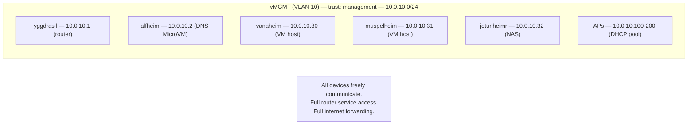
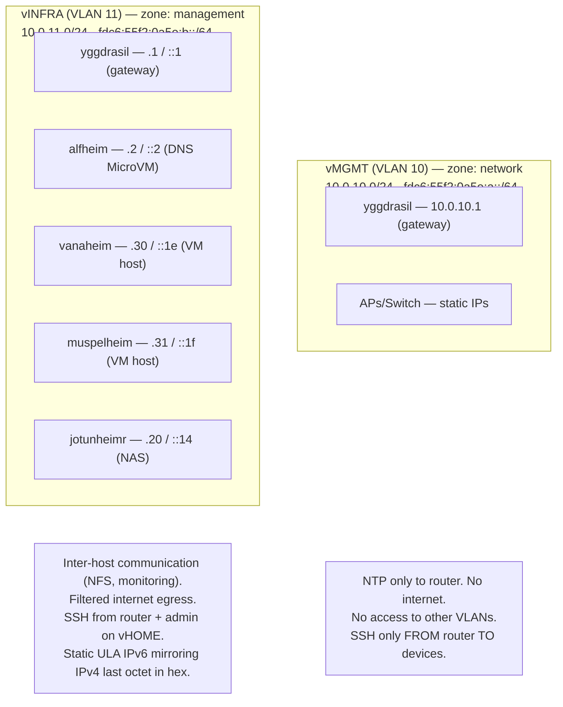
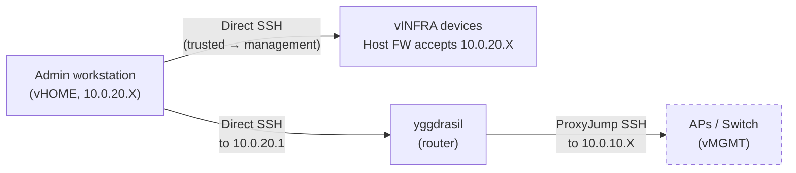

# Secure Management VLAN Split Plan

## Overview

Split the current `vMGMT` (VLAN 10) into two VLANs with distinct security profiles:

- **vMGMT (VLAN 10)** — Networking gear (APs, managed switch). Heavily locked down: no internet, no inter-VLAN access, management SSH only from the router.
- **vINFRA (VLAN 11)** — Infrastructure (NAS, VM hosts, DNS). Moderately locked down: inter-host communication for NFS, internet for self-updating, SSH from router and admin workstation.

**Prerequisite:** This plan assumes the [zone-based firewall refactor](./zone-refactor-plan.md)
has been completed. That refactor replaces the hardcoded trust enum with a configurable `zones`
attrset, enabling the `network` zone used here. The zone refactor is a pure refactor (identical
nftables output) and is tracked separately because of its distinct risk profile.

### Threat Model

| Device Class | Compromise Risk | Compromise Impact | Lockdown Level |
|---|---|---|---|
| APs / Switch | Higher (exposed to wireless attacks, firmware vulnerabilities) | L2 eavesdropping, MitM on bridged traffic | Maximum: no internet, no lateral movement |
| NAS | Medium (network-exposed services: NFS, SMB) | Data exfiltration, ransomware on shared storage | High: restrict NFS to specific IPs, host firewall |
| VM Hosts | Lower (no exposed services beyond SSH) | Guest VM compromise, pivot to NAS via NFS | High: host firewall, restricted SSH |
| DNS (alfheim) | Lower (MicroVM on router, minimal attack surface) | DNS poisoning, traffic redirection | High: moves to vINFRA, no direct external exposure |

### Architecture: Before and After

**Before:**



**After:**



---

## Phase 1: New `network` Zone and vINFRA VLAN

With the zone system in place, adding the `network` zone is just a configuration change.

### 1.1 Define `network` zone

**File:** `hosts/yggdrasil/default.nix` (alongside the other zone definitions)

```nix
router6.zones.network = {
  # Networking gear: NTP only, no internet, no lateral movement
  # APs and switches have static IPs — no DHCP needed
  icmpEcho = "enable";
  accessTo = [];
  inputRules = [
    { udp.dport = 123; verdict = "accept"; comment = "NTP"; }
  ];
};
```

This automatically generates:
- Input: `iifname { "vMGMT.br0" } icmp type { echo-request, echo-reply } accept` (from icmpEcho)
- Input: `iifname { "vMGMT.br0" } icmpv6 type { echo-request, echo-reply } accept` (from icmpEcho)
- Input: `iifname { "vMGMT.br0" } udp dport 123 accept` (from inputRules)
- Forward: nothing (empty `accessTo`, no `forwardRules`)
- No hardcoded `networkInterfaces` selector needed

### 1.2 Management egress filtering via `forwardRules`

With the zone system, the vINFRA egress filtering that was previously planned as `extraForwardRules` with hardcoded interface names becomes a clean zone-level config:

```nix
router6.zones.management = {
  # Full router access, can reach all internal zones
  icmpEcho = "enable";
  accessTo = [ "management" "trusted" "untrusted" ];
  # Filtered internet access (not in accessTo — uses forwardRules instead)
  forwardRules = {
    external = [
      { udp.dport = 53; verdict = "accept";
        comment = "DNS recursive queries (Unbound on alfheim)"; }
      { tcp.dport = 53; verdict = "accept";
        comment = "DNS recursive queries (TCP fallback)"; }
      { tcp.dport = 80; verdict = "accept";
        comment = "HTTP for package mirrors"; }
      { tcp.dport = 443; verdict = "accept";
        comment = "HTTPS for updates (cache.nixos.org, github)"; }
      { udp.dport = 123; verdict = "accept";
        comment = "NTP to internet pools"; }
    ];
  };
  inputRules = [
    { verdict = "accept"; comment = "Full router service access"; }
  ];
};
```

Note: `"external"` is NOT in `accessTo` — instead, `forwardRules.external` provides filtered
access. The zone refactor's assertion enforces this mutual exclusion. There is no trailing
`{ verdict = "drop"; }` — the forward chain's `policy drop` handles unmatched traffic, keeping
the rules declarative (only what's allowed, not what's denied).

### 1.3 Add vINFRA VLAN

**File:** `hosts/yggdrasil/default.nix` — inside `router6.topology.br0.vlans`

```nix
# Infrastructure network - NAS, VM hosts, DNS
"vINFRA.br0" = {
  tag = 11;  # -> fdc6:55f2:0a5e:b::1/64
  network = {
    type = "static";
    addresses = [ "10.0.11.1/24" ];
    subnetId = 11;
    zone = "management";
    dhcp.enable = true;
    dhcp6.enable = true;
  };
};
```

### 1.4 Change vMGMT zone

**File:** `hosts/yggdrasil/default.nix` — existing vMGMT definition

```nix
"vMGMT.br0" = {
  tag = 10;
  network = {
    type = "static";
    addresses = [ "10.0.10.1/24" ];
    subnetId = 10;
    zone = "network";  # Changed from "management"
    # No DHCP — APs and switches have static IPs
  };
};
```

Update the comment from "Management network - trusted devices and infrastructure" to "Network gear - APs and managed switch". Also disable DHCP on vMGMT since APs/switches have static IPs.

### 1.5 Update alfheim MicroVM bridge

**File:** `hosts/yggdrasil/default.nix` — systemd.network for MicroVM tap

Rename alfheim's tap to `vm-11-alfheim` and add a new bridge rule:
```nix
systemd.network.networks."10-vm-infra" = {
  matchConfig.Name = "vm-11-*";
  networkConfig = {
    Bridge = "vINFRA.br0";
    DHCP = "no";
    LinkLocalAddressing = "no";
  };
  linkConfig.RequiredForOnline = "no";
};
```

And in alfheim's microvm.nix:
```nix
microvm.interfaces = [{
  type = "tap";
  id = "vm-11-alfheim";
  mac = "5E:11:AD:01:00:02";
}];
```

Remove the old `vm-10-*` bridge rule since no MicroVMs remain on vMGMT.

### 1.6 Update DNS configuration

**File:** `hosts/yggdrasil/default.nix`

```nix
dns = {
  upstream = [ "10.0.11.2" ];  # Changed from 10.0.10.2
  useDHCPFallback = true;
  localDomain = "local";
};
```

### 1.7 Update DNS interception rules

**File:** `hosts/yggdrasil/default.nix` — `firewall.extraNatRules`

Update alfheim's IP in DNS interception exclusions (IPv4):
```nix
# IPv4 DNS interception (in table ip nat)
{
  ip.saddr = { not = "10.0.11.2"; };
  ip.daddr = { not = [ "10.0.11.1" "10.0.11.2" ]; };
  udp.dport = 53;
  verdict = { dnat = "10.0.11.1:53"; };
  comment = "Intercept DNS bypass (UDP)";
}
{
  ip.saddr = { not = "10.0.11.2"; };
  ip.daddr = { not = [ "10.0.11.1" "10.0.11.2" ]; };
  tcp.dport = 53;
  verdict = { dnat = "10.0.11.1:53"; };
  comment = "Intercept DNS bypass (TCP)";
}
```

**IPv6 DNS interception** — add parallel rules to the `table ip6 nat` prerouting chain
(currently empty). These catch IPv6 DNS bypass attempts:
```nix
# IPv6 DNS interception (in table ip6 nat — currently empty, needs populating)
{
  ip6.saddr = { not = "fdc6:55f2:0a5e:b::2"; };
  ip6.daddr = { not = [ "fdc6:55f2:0a5e:b::1" "fdc6:55f2:0a5e:b::2" ]; };
  udp.dport = 53;
  verdict = { dnat = "[fdc6:55f2:0a5e:b::1]:53"; };
  comment = "Intercept IPv6 DNS bypass (UDP)";
}
{
  ip6.saddr = { not = "fdc6:55f2:0a5e:b::2"; };
  ip6.daddr = { not = [ "fdc6:55f2:0a5e:b::1" "fdc6:55f2:0a5e:b::2" ]; };
  tcp.dport = 53;
  verdict = { dnat = "[fdc6:55f2:0a5e:b::1]:53"; };
  comment = "Intercept IPv6 DNS bypass (TCP)";
}
```

Note: The router6 module's `table ip6 nat` prerouting chain is currently empty. Either add
a new `firewall.extraNat6Rules` option or populate the chain directly. The nft DSL may need
a small extension to support `ip6.saddr`/`ip6.daddr` if not already present.

kresd binds to all internal interfaces, so any of the router's IPs works as the DNAT target.
The main thing is updating the exclusion IPs so alfheim's traffic isn't redirected.

### 1.8 Update `/etc/hosts`

**File:** `hosts/yggdrasil/default.nix`

```nix
networking.extraHosts = ''
  10.0.11.1 yggdrasil
  10.0.11.1 yggdrasil.local
  fdc6:55f2:0a5e:b::1 yggdrasil yggdrasil.local
  10.0.11.2 alfheim
  10.0.11.2 alfheim.local
  fdc6:55f2:0a5e:b::2 alfheim alfheim.local
  10.0.20.30 gridr.local
  10.0.100.40 surtr.local
  10.0.100.50 bragi.local
  10.0.100.51 njord.local
'';
```

### 1.9 Add tests for `network` zone

Add test cases to `router6-firewall-zones.nix`:
- **network → router: NTP only** — can reach UDP 123, cannot reach DNS (53), cannot reach SSH (22), cannot reach DHCP (67)
- **network → any: no forwarding** — cannot reach any other zone
- **network → internet: blocked** — no NAT/forwarding to external

---

## Phase 2: Infrastructure Host Changes

### 2.1 alfheim (DNS MicroVM on yggdrasil)

**File:** `hosts/yggdrasil/guests/alfheim/microvm.nix`

Change tap interface name and MAC:
```nix
microvm.interfaces = [{
  type = "tap";
  id = "vm-11-alfheim";
  mac = "5E:11:AD:01:00:02";
}];
```

**File:** `hosts/yggdrasil/guests/alfheim/default.nix`

Update network configuration — assign static IPv6 alongside IPv4:
```nix
systemd.network.networks."20-tap" = {
  matchConfig.Type = "ether";
  matchConfig.MACAddress = "5E:11:AD:01:00:02";
  networkConfig = {
    Address = [ "10.0.11.2/24" "fdc6:55f2:0a5e:b::2/64" ];
    Gateway = "10.0.11.1";
    DNS = [ "127.0.0.1" "::1" ];
    IPv6AcceptRA = false;  # Static IPv6 now, disable SLAAC
    DHCP = "no";
  };
  routes = [{ Gateway = "fdc6:55f2:0a5e:b::1"; }];
};
```

Update `/etc/hosts`:
```nix
networking.extraHosts = ''
  10.0.11.1 yggdrasil.local
  fdc6:55f2:0a5e:b::1 yggdrasil.local
  10.0.20.30 gridr.local
  10.0.100.40 surtr.local
'';
```

**File:** `hosts/yggdrasil/guests/alfheim/modules/dns.nix` — **critical, DNS breaks if missed**

Update Adguard Home `allowed_clients` (add IPv6 addresses):
```nix
allowed_clients = [
  "127.0.0.1"
  "::1"
  "10.0.11.1"              # Yggdrasil (router) — changed from 10.0.10.1
  "fdc6:55f2:0a5e:b::1"   # Yggdrasil (router) IPv6
  "10.0.11.2"              # Self — changed from 10.0.10.2
  "fdc6:55f2:0a5e:b::2"   # Self IPv6
  "10.97.10.1"             # Router migration network
  "10.97.10.2"             # Self migration network
];
```

Update Unbound `local-data` records — add AAAA records for IPv6-first resolution,
update all infra hosts to 10.0.11.x:
```nix
local-data = [
  # Router
  ''"local. A 10.0.11.1"''
  ''"local. AAAA fdc6:55f2:0a5e:b::1"''
  ''"yggdrasil.local. A 10.0.11.1"''
  ''"yggdrasil.local. AAAA fdc6:55f2:0a5e:b::1"''

  # This microVM (DNS)
  ''"alfheim.local. A 10.0.11.2"''
  ''"alfheim.local. AAAA fdc6:55f2:0a5e:b::2"''

  # Auth server (Gridr on jotunheimr)
  ''"gridr.local. A 10.0.20.30"''

  # NAS
  ''"jotunheimr.local. A 10.0.11.20"''
  ''"jotunheimr.local. AAAA fdc6:55f2:0a5e:b::14"''

  # Media host
  ''"muspelheim.local. A 10.0.11.31"''
  ''"muspelheim.local. AAAA fdc6:55f2:0a5e:b::1f"''

  # Services in DMZ
  ''"surtr.local. A 10.0.100.40"''
  ''"bragi.local. A 10.0.100.50"''
  ''"njord.local. A 10.0.100.51"''
  ''"hrungnir.local. A 10.0.100.31"''

  # Home automation
  ''"nidavellir.local. A 10.1.20.50"''

  # MicroVMs on HOME network
  ''"skadi.local. A 10.0.20.40"''
  ''"ymir.local. A 10.0.20.41"''

  # VM host
  ''"vanaheim.local. A 10.0.11.30"''
  ''"vanaheim.local. AAAA fdc6:55f2:0a5e:b::1e"''
];
```

Note: AAAA records are only added for vINFRA hosts with known static IPv6. Other hosts
(DMZ, HOME, etc.) use SLAAC with privacy extensions — their IPv6 is unstable and not
suitable for static DNS records. AAAA records for those can be added later when they
get static assignments.

### 2.2 vanaheim (VM host)

**File:** `hosts/vanaheim/default.nix` — initrd network (for ZFS remote unlock)

Change VLAN 10 to VLAN 11, add static IPv6:
```nix
boot.initrd.systemd.network = {
  netdevs."20-enp88s0.11" = {
    netdevConfig.Kind = "vlan";
    netdevConfig.Name = "enp88s0.11";
    vlanConfig.Id = 11;
  };
  networks."20-enp88s0.11" = {
    matchConfig.Name = "enp88s0.11";
    networkConfig.DHCP = "no";
    networkConfig.IPv6AcceptRA = false;
    networkConfig.Address = [ "10.0.11.30/24" "fdc6:55f2:0a5e:b::1e/64" ];
    networkConfig.MulticastDNS = true;
    networkConfig.DNS = [ "10.0.11.1" "fdc6:55f2:0a5e:b::1" ];
    routes = [
      { Gateway = "10.0.11.1"; }
      { Gateway = "fdc6:55f2:0a5e:b::1"; }
    ];
  };
};
```

**File:** `hosts/vanaheim/microvm.nix` — runtime network

Same pattern: change `.10` to `.11`, add static IPv6 `fdc6:55f2:0a5e:b::1e/64`,
disable SLAAC (`IPv6AcceptRA = false`), add IPv6 gateway.

### 2.3 muspelheim (VM host)

**File:** `hosts/muspelheim/default.nix`

Same pattern as vanaheim: `eno1.10` → `eno1.11`, address `10.0.10.31/24` → `10.0.11.31/24`,
add static IPv6 `fdc6:55f2:0a5e:b::1f/64`, gateway/DNS `10.0.10.1` → `10.0.11.1` +
`fdc6:55f2:0a5e:b::1`, NFS mounts `10.0.10.32` → `10.0.11.20`, disable SLAAC.

### 2.4 jotunheimr (NAS)

**File:** `hosts/jotunheimr/default.nix`

Change VLAN 10 to VLAN 11, update IP from `.32` to `.20` (reflects boot order — NAS
available before VM hosts at `.30`/`.31`), add static IPv6 `fdc6:55f2:0a5e:b::14/64`,
update addresses/gateway/DNS to 10.0.11.x + `fdc6:55f2:0a5e:b::1`, disable SLAAC.

---

## Phase 3: NFS/Storage Hardening

### 3.1 Tighten NFS exports

**File:** `hosts/jotunheimr/nas.nix`

Change subnet-wide exports to per-IP exports for VM hosts. Include both IPv4 and IPv6
addresses so NFS works over either protocol:

```nix
services.nfs.server = {
  enable = true;
  exports = ''
    /data/media 10.0.11.30(rw,sync,no_subtree_check,no_root_squash) fdc6:55f2:0a5e:b::1e(rw,sync,no_subtree_check,no_root_squash) 10.0.11.31(rw,sync,no_subtree_check,no_root_squash) fdc6:55f2:0a5e:b::1f(rw,sync,no_subtree_check,no_root_squash) 10.0.20.0/24(rw,sync,no_subtree_check)
    /data/data 10.0.11.30(rw,sync,no_subtree_check,no_root_squash) fdc6:55f2:0a5e:b::1e(rw,sync,no_subtree_check,no_root_squash) 10.0.11.31(rw,sync,no_subtree_check,no_root_squash) fdc6:55f2:0a5e:b::1f(rw,sync,no_subtree_check,no_root_squash) 10.0.20.0/24(rw,sync,no_subtree_check)
    /export/ro/media 10.0.11.0/24(ro) fdc6:55f2:0a5e:b::/64(ro) 10.0.20.0/24(ro)
    /export/rw/media 10.0.11.30(rw,sync,no_subtree_check,no_root_squash) fdc6:55f2:0a5e:b::1e(rw,sync,no_subtree_check,no_root_squash) 10.0.11.31(rw,sync,no_subtree_check,no_root_squash) fdc6:55f2:0a5e:b::1f(rw,sync,no_subtree_check,no_root_squash) 10.0.20.0/24(rw,sync,no_subtree_check)
    /export/ro/data 10.0.11.0/24(ro) fdc6:55f2:0a5e:b::/64(ro) 10.0.20.0/24(ro)
    /export/rw/data 10.0.11.30(rw,sync,no_subtree_check,no_root_squash) fdc6:55f2:0a5e:b::1e(rw,sync,no_subtree_check,no_root_squash) 10.0.11.31(rw,sync,no_subtree_check,no_root_squash) fdc6:55f2:0a5e:b::1f(rw,sync,no_subtree_check,no_root_squash) 10.0.20.0/24(rw,sync,no_subtree_check)
    /export/rw/backup 10.0.11.0/24(rw,sync,no_subtree_check,no_root_squash) fdc6:55f2:0a5e:b::/64(rw,sync,no_subtree_check,no_root_squash) 10.0.20.0/24(rw,sync,no_subtree_check) 10.1.10.0/24(rw,sync,no_subtree_check,no_root_squash) 10.1.20.0/24(rw,sync,no_subtree_check,no_root_squash)
  '';
};
```

### 3.2 Update NFS mount targets

**File:** `hosts/muspelheim/default.nix`

Use IPv6 addresses for NFS mounts (IPv6-first), with IPv4 as fallback:
```nix
fileSystems."/mnt/data".device = "[fdc6:55f2:0a5e:b::14]:/data/data";
fileSystems."/mnt/media".device = "[fdc6:55f2:0a5e:b::14]:/data/media/";
```

---

## Phase 4: Host-Based Firewalls

### 4.1 jotunheimr (NAS)

Replace blanket open ports with source-restricted nftables rules. NixOS 23.11+ defaults to
nftables, so we use `networking.firewall.extraInputRules` (nftables syntax). All rules
specify both IPv4 and IPv6 sources:

```nix
networking.firewall = {
  enable = true;
  # Remove blanket allowedTCPPorts/allowedUDPPorts — replaced by source-restricted rules
  extraInputRules = ''
    # NFS from VM hosts only (IPv4 + IPv6)
    ip saddr { 10.0.11.30, 10.0.11.31 } tcp dport 2049 accept
    ip6 saddr { fdc6:55f2:0a5e:b::1e, fdc6:55f2:0a5e:b::1f } tcp dport 2049 accept
    ip saddr 10.0.20.0/24 tcp dport 2049 accept

    # SMB from vHOME only (IPv4 — SMB over IPv6 can be added later)
    ip saddr 10.0.20.0/24 tcp dport { 139, 445 } accept
    ip saddr 10.0.20.0/24 udp dport { 137, 138 } accept

    # WSDD from vHOME only
    ip saddr 10.0.20.0/24 tcp dport 5357 accept
    ip saddr 10.0.20.0/24 udp dport 3702 accept

    # SSH from router and admin workstation (IPv4 + IPv6)
    ip saddr { 10.0.11.1, 10.0.20.0/24 } tcp dport 22 accept
    ip6 saddr { fdc6:55f2:0a5e:b::1, fdc6:55f2:0a5e:14::/64 } tcp dport 22 accept
    tcp dport 22 drop
  '';
};
```

### 4.2 vanaheim / muspelheim (VM hosts)

SSH only from router and admin workstation (dual-stack):
```nix
networking.firewall = {
  enable = true;
  extraInputRules = ''
    ip saddr { 10.0.11.1, 10.0.20.0/24 } tcp dport 22 accept
    ip6 saddr { fdc6:55f2:0a5e:b::1, fdc6:55f2:0a5e:14::/64 } tcp dport 22 accept
    tcp dport 22 drop
  '';
};
```

### 4.3 Admin workstation IP

The above rules use `10.0.20.0/24` as a placeholder. Tighten to a specific IP once a DHCP reservation is configured.

---

## Phase 5: OpenWRT AP Changes

### 5.1 No VLAN changes needed

APs stay on VLAN 10. The trust level change happens on the router side.

### 5.2 NTP server change

**File:** `lib/openwrt/default.nix`

APs need to use the router for NTP since they won't have internet:
```nix
ntp = {
  _type = "timeserver";
  enabled = true;
  enable_server = false;
  server = [ "10.0.10.1" ];
};
```

Add chrony/NTP server to yggdrasil:
```nix
services.chrony = {
  enable = true;
  extraConfig = ''
    allow 10.0.10.0/24
    allow 10.0.11.0/24
  '';
};
```

### 5.3 Host-level input protection

Add nftables rules to AP images restricting SSH to router only (dual-stack):
```sh
nft add table inet filter
nft add chain inet filter input '{ type filter hook input priority 0; policy drop; }'
nft add rule inet filter input ct state established,related accept
nft add rule inet filter input iifname "lo" accept
nft add rule inet filter input icmp type echo-request accept
nft add rule inet filter input icmpv6 type '{ echo-request, echo-reply }' accept
nft add rule inet filter input icmpv6 type '{ nd-neighbor-solicit, nd-neighbor-advert, nd-router-solicit, nd-router-advert }' accept
nft add rule inet filter input ip saddr 10.0.10.1 tcp dport 22 accept
nft add rule inet filter input ip6 saddr fdc6:55f2:0a5e:a::1 tcp dport 22 accept
```

Keep `nftables` package on APs (remove `firewall4` framework only, not `nftables`).

### 5.4 Managed switch

Same treatment as APs: stays on VLAN 10, host firewall, NTP from router. Must trunk VLAN 11 on ports connected to infra devices.

---

## Phase 6: Deployment

### 6.1 SSH access model



> Networking gear requires ProxyJump through the router because the `network` zone has no forwarding.

### 6.2 Deployment order

1. VM guests first (lowest risk)
2. VM hosts
3. NAS (ensure NFS exports come back up)
4. Router LAST — use `magic_rollback` with deploy-rs

### 6.3 OpenWRT deployment

Deploy from the router (SSH to APs on 10.0.10.x) or via ProxyJump.

---

## Phase 7: Network Data Registry

### Problem: scattered IP addresses

Currently, IP addresses are scattered as raw strings across host configs, the router
topology, DNS config, NFS exports, and firewall rules. `network.json` was meant to be
the canonical source, but there was a mismatch between what the router wanted (hosts
associated with zones + a unique byte to construct addresses from) and what
`network.json` provided (a flat hostname → IP lookup).

With three address families now (IPv4, IPv6, plus legacy IPv4 during migration), raw
strings become increasingly error-prone. A host's addresses should be derived from
two facts: **which zone it's in** and **its host ID within that zone**.

### 7.1 Replace network.json with a Nix network registry

**File:** `lib/common/data/network.nix` (replaces `network.json`)

Move from a JSON lookup table to a Nix file that stores the *generative data* and
derives all addresses:

```nix
# lib/common/data/network.nix
{ lib }:
let
  ipv4Prefix = "10.97";
  ulaPrefix = "fdc6:55f2:0a5e";

  zones = {
    network        = { vlanId = 10; };
    infrastructure = { vlanId = 11; };
    home           = { vlanId = 20; };
    guest          = { vlanId = 30; };
    adu            = { vlanId = 31; };
    iot            = { vlanId = 40; };
    game           = { vlanId = 41; };
    dmz            = { vlanId = 100; };
  };

  vlanHex = vlanId: lib.toLower (lib.toHexString vlanId);
  hostHex = hostId: lib.toLower (lib.toHexString hostId);

  mkHost = zoneName: hostId: let
    zone = zones.${zoneName};
  in {
    inherit zoneName hostId;
    ipv4 = "${ipv4Prefix}.${toString zone.vlanId}.${toString hostId}";
    ipv6 = "${ulaPrefix}:${vlanHex zone.vlanId}::${hostHex hostId}";
    subnet4 = "${ipv4Prefix}.${toString zone.vlanId}.0/24";
    subnet6 = "${ulaPrefix}:${vlanHex zone.vlanId}::/64";
    cidr4 = "${ipv4Prefix}.${toString zone.vlanId}.${toString hostId}/24";
    cidr6 = "${ulaPrefix}:${vlanHex zone.vlanId}::${hostHex hostId}/64";
  };

in {
  inherit zones ipv4Prefix ulaPrefix mkHost;

  hosts = {
    # Infrastructure (VLAN 11) — ordered by boot dependency
    yggdrasil  = mkHost "infrastructure" 1;
    alfheim    = mkHost "infrastructure" 2;
    jotunheimr = mkHost "infrastructure" 20;   # NAS — before VM hosts
    vanaheim   = mkHost "infrastructure" 30;   # VM host
    muspelheim = mkHost "infrastructure" 31;   # VM host

    # Home (VLAN 20)
    gridr = mkHost "home" 30;
    skadi = mkHost "home" 40;
    ymir  = mkHost "home" 41;

    # DMZ (VLAN 100)
    hrungnir = mkHost "dmz" 31;
    surtr    = mkHost "dmz" 40;
    bragi    = mkHost "dmz" 50;
    njord    = mkHost "dmz" 51;

    # ADU (VLAN 31)
    gumba = mkHost "adu" 20;

    # Mesh hosts (10.1.x.x — separate prefix, not yet migrated)
    # gumby, pokey, prickle, goo, gumbo, nidavellir — keep in JSON or add later
  };
}
```

This gives every consumer exactly what it needs:
- **Programmatic lookup:** `network.hosts.alfheim.ipv4` → `"10.97.11.2"`
- **Router zone data:** `network.hosts.alfheim.zoneName` → `"infrastructure"`,
  `.hostId` → `2` — the router can use these to construct topology
- **Dual-stack:** `.ipv4`, `.ipv6`, `.cidr4`, `.cidr6` all derived automatically
- **Subnets:** `.subnet4`, `.subnet6` for NFS exports and firewall rules
- **Zone metadata:** `network.zones.infrastructure.vlanId` → `11`
- **Human-readable lookup:** see 8.2 below

### 7.2 Human-readable IP lookup

The registry replaces `network.json` as the source of truth, but you still need to be
able to quickly look up an IP address without mentally evaluating Nix. Two mechanisms
make this easy: a **flake app** for terminal use and a **generated markdown file** for
browsing in an editor or on GitHub.

#### 7.2a `summary` attribute in the registry

Add a `summary` attribute to `network.nix` that renders a formatted table grouped by
zone:

```nix
# At the end of network.nix, inside the returned attrset:
summary = let
  pad = s: n: s + lib.fixedWidthString (n - lib.stringLength s) " " "";
  header = "Host              Zone              IPv4              IPv6";
  row = name: h: "${pad name 18}${pad h.zoneName 18}${pad h.ipv4 18}${h.ipv6}";
  hostsByZone = lib.groupBy (e: e.value.zoneName)
    (lib.mapAttrsToList lib.nameValuePair hosts);
  renderZone = zoneName: entries: lib.concatMapStringsSep "\n"
    (e: row e.name e.value) entries;
in lib.concatStringsSep "\n\n" (
  [ header ]
  ++ lib.mapAttrsToList renderZone hostsByZone
) + "\n";
```

This can be evaluated directly:
```bash
nix eval .#lib.common.data.network.summary --raw
```

Single-host lookups also work:
```bash
nix eval .#lib.common.data.network.hosts.alfheim.ipv4 --raw
# 10.97.11.2
```

#### 7.2b Flake app: `nix run .#netinfo`

**File:** `apps/netinfo.nix`

A small flake app wrapping the above into an ergonomic command. Following the existing
pattern in `apps/openwrt/default.nix`:

```nix
# apps/netinfo.nix
{ pkgs }:
let
  script = pkgs.writeShellScript "netinfo" ''
    set -euo pipefail
    FLAKE_ROOT="$(${pkgs.git}/bin/git rev-parse --show-toplevel 2>/dev/null || echo ".")"
    if [ $# -eq 0 ]; then
      nix eval "$FLAKE_ROOT#lib.common.data.network.summary" --raw
    else
      # Look up a specific host: nix run .#netinfo -- alfheim
      HOST="$1"
      echo "IPv4: $(nix eval "$FLAKE_ROOT#lib.common.data.network.hosts.$HOST.ipv4" --raw)"
      echo "IPv6: $(nix eval "$FLAKE_ROOT#lib.common.data.network.hosts.$HOST.ipv6" --raw)"
      echo "Zone: $(nix eval "$FLAKE_ROOT#lib.common.data.network.hosts.$HOST.zoneName" --raw)"
    fi
  '';
in {
  netinfo = {
    type = "app";
    program = "${script}";
  };
}
```

Wire it into `flake.nix` alongside the existing OpenWrt apps:

```nix
# In flake.nix, update the apps output:
apps = nixpkgs.lib.genAttrs [ "x86_64-linux" ] (system: let
  pkgs = pkgsFor nixpkgs system;
in (import ./apps/openwrt { inherit pkgs; })
   // (import ./apps/netinfo.nix { inherit pkgs; }));
```

Usage:
```bash
# Full table
nix run .#netinfo

# Single host
nix run .#netinfo -- alfheim
#   IPv4: 10.97.11.2
#   IPv6: fdc6:55f2:0a5e:b::2
#   Zone: infrastructure
```

#### 7.2c Generated markdown: `docs/network-hosts.md`

Add a `markdown` attribute to the registry that renders a markdown table, and a
`netinfo --generate-docs` option to write it out:

```nix
# In network.nix, alongside summary:
markdown = let
  header = ''
    # Network Host Registry

    > **Auto-generated from `lib/common/data/network.nix`.** Do not edit manually.
    > Regenerate with: `nix run .#netinfo -- --generate-docs`

    | Host | Zone | IPv4 | IPv6 |
    |------|------|------|------|
  '';
  row = name: h: "| ${name} | ${h.zoneName} | `${h.ipv4}` | `${h.ipv6}` |";
in header + lib.concatStringsSep "\n" (lib.mapAttrsToList row hosts) + "\n";
```

Add `--generate-docs` to the netinfo script:

```bash
if [ "$1" = "--generate-docs" ]; then
  DOCS_PATH="$FLAKE_ROOT/docs/network-hosts.md"
  nix eval "$FLAKE_ROOT#lib.common.data.network.markdown" --raw > "$DOCS_PATH"
  echo "Generated $DOCS_PATH"
  exit 0
fi
```

The resulting `docs/network-hosts.md` is committed to the repo and viewable on GitHub.
It's essentially the human-readable equivalent of the old `network.json` — a file you
can open and scan for addresses — but it can't drift out of sync because regenerating
it is a one-liner. A CI check or pre-commit hook could verify it stays up to date:

```bash
# .github/ci or pre-commit: verify docs are current
nix run .#netinfo -- --generate-docs
git diff --exit-code docs/network-hosts.md || \
  echo "docs/network-hosts.md is out of date — run: nix run .#netinfo -- --generate-docs"
```

### 7.3 Consuming the registry programmatically

**In host configs** (e.g. `hosts/jotunheimr/default.nix`):
```nix
let
  net = pkgs.mmell.lib.data.network;
  self = net.hosts.jotunheimr;
  router = net.hosts.yggdrasil;
in {
  # systemd-networkd
  networkConfig.Address = [ self.cidr4 self.cidr6 ];
  networkConfig.Gateway = router.ipv4;
  networkConfig.DNS = [ router.ipv4 router.ipv6 ];
}
```

**In NFS exports** (`hosts/jotunheimr/nas.nix`):
```nix
let
  net = pkgs.mmell.lib.data.network;
  vanaheim = net.hosts.vanaheim;
  muspelheim = net.hosts.muspelheim;
  nfsOpts = "(rw,sync,no_subtree_check,no_root_squash)";
in {
  exports = ''
    /data/media ${vanaheim.ipv4}${nfsOpts} ${vanaheim.ipv6}${nfsOpts} ${muspelheim.ipv4}${nfsOpts} ${muspelheim.ipv6}${nfsOpts}
  '';
}
```

**In DNS records** (`alfheim/modules/dns.nix`):
```nix
let
  net = pkgs.mmell.lib.data.network;
  mkRecords = name: host:
    [ ''"${name}.local. A ${host.ipv4}"'' ]
    ++ lib.optional (host ? ipv6) ''"${name}.local. AAAA ${host.ipv6}"'';
in {
  local-data = lib.concatLists (lib.mapAttrsToList mkRecords net.hosts);
}
```

**In firewall rules** (`extraInputRules`):
```nix
let
  net = pkgs.mmell.lib.data.network;
  vmHosts = with net.hosts; [ vanaheim muspelheim ];
  vmIpv4 = lib.concatMapStringsSep ", " (h: h.ipv4) vmHosts;
  vmIpv6 = lib.concatMapStringsSep ", " (h: h.ipv6) vmHosts;
in ''
  ip saddr { ${vmIpv4} } tcp dport 2049 accept
  ip6 saddr { ${vmIpv6} } tcp dport 2049 accept
''
```

### 7.4 Relationship to router6 zones

The registry's `zones` attrset defines the network topology (zone names → VLAN IDs).
The router6 module's `zones` option defines the *firewall policy* (zone names → access
rules, icmpEcho, forwardRules). They share zone names deliberately — the router6 module
could optionally consume `network.zones` to auto-populate its zone list, but this
coupling is optional. At minimum, an assertion can verify they stay in sync:

```nix
assert builtins.attrNames network.zones == builtins.attrNames cfg.zones
  || throw "network.nix zones and router6 zones are out of sync";
```

### 7.5 Migration path from network.json

1. Create `lib/common/data/network.nix` alongside `network.json`
2. Update `lib/common/data/default.nix` to load the `.nix` file instead of `.fromJSON`
3. Update `modules/common/networking.nix` — the interface is the same (`.hosts.X.ipv4`)
4. Gradually replace hardcoded IP strings in host configs with registry references
5. Delete `network.json` once no consumers remain

The migration is mechanical: each hardcoded IP string becomes a reference to the
registry. This can be done file-by-file alongside the other changes in this plan.

### 7.6 Search for remaining `10.0.10.` references

Grep the codebase for `10.0.10.` to find remaining references:
- MicroVM guest configs referencing jotunheimr's NAS IP
- DNS configuration in alfheim's modules
- Prometheus/monitoring targets
- Any scripts or deployment tools

---

## IPv6 Considerations

### Addressing

- **VLAN 10 (vMGMT):** `fdc6:55f2:0a5e:a::/64` — unchanged, now for networking gear
- **VLAN 11 (vINFRA):** `fdc6:55f2:0a5e:b::/64` — new, auto-generated from `subnetId = 11`

### Static IPv6 for infra hosts

All vINFRA hosts get **static ULA addresses** (not SLAAC) so they can be referenced in
firewall rules, NFS exports, DNS records, and service configs. The addressing scheme mirrors
the IPv4 last octet in hex:

| Host | IPv4 | IPv6 |
|------|------|------|
| yggdrasil | 10.0.11.1 | `fdc6:55f2:0a5e:b::1` |
| alfheim | 10.0.11.2 | `fdc6:55f2:0a5e:b::2` |
| vanaheim | 10.0.11.30 | `fdc6:55f2:0a5e:b::1e` |
| muspelheim | 10.0.11.31 | `fdc6:55f2:0a5e:b::1f` |
| jotunheimr | 10.0.11.20 | `fdc6:55f2:0a5e:b::14` |

Previously these hosts used SLAAC with privacy extensions (`IPv6PrivacyExtensions = "kernel"`),
producing unstable addresses. Switching to static IPv6 with `IPv6AcceptRA = false` gives
predictable addresses suitable for ACLs, DNS AAAA records, and NFS exports.

### Dual-stack coverage

IPv6 addresses are included in:
- **DNS** (AAAA records in Unbound for all infra hosts)
- **DNS interception** (IPv6 DNAT rules in `table ip6 nat`)
- **NFS exports** (IPv6 per-host ACLs alongside IPv4)
- **NFS mounts** (IPv6-first mount targets)
- **Host firewalls** (dual-stack `ip saddr` + `ip6 saddr` rules)
- **AP firewalls** (IPv6 SSH allow from router)
- **Adguard Home** (IPv6 `allowed_clients`)
- **extraHosts** (IPv6 entries on router and alfheim)
- **network.json** (IPv6 field added)

### Zone-level firewall

The zone system uses nftables `inet` family, so zone rules (`accessTo`, `forwardRules`,
`inputRules`, `icmpEcho`) apply to both IPv4 and IPv6 automatically. No per-zone IPv6
duplication is needed — `iifname`/`oifname` matching is protocol-agnostic.

### Router Advertisements

The router still sends RAs on vINFRA for link-layer discovery, but infra hosts ignore them
for address configuration (`IPv6AcceptRA = false`). Non-infra VLANs (vHOME, vGUEST, etc.)
continue to use SLAAC as before.

---

## Complete File Change List

| File | Phase | Changes |
|------|-------|---------|
| `hosts/yggdrasil/default.nix` | 1 | Add vINFRA VLAN, define `network` zone, override `management` zone with `forwardRules`, change vMGMT zone to "network", update DNS config, update DNS interception, update extraHosts, update MicroVM bridge rules, add NTP server |
| `tests/modules/router6-firewall-zones.nix` | 1 | New `network` zone test cases |
| `hosts/yggdrasil/guests/alfheim/microvm.nix` | 2 | Change tap interface name and MAC |
| `hosts/yggdrasil/guests/alfheim/default.nix` | 2 | Update IP, gateway, MAC, extraHosts |
| `hosts/yggdrasil/guests/alfheim/modules/dns.nix` | 2 | Update allowed_clients IPs, Unbound local-data records (7 IPs) |
| `hosts/vanaheim/default.nix` | 2 | Change VLAN 10→11 in initrd network, update IP/gateway/DNS |
| `hosts/vanaheim/microvm.nix` | 2 | Change VLAN 10→11 in runtime network, update IP/gateway, add host firewall |
| `hosts/muspelheim/default.nix` | 2, 3 | Change VLAN 10→11, update IP/gateway/DNS, update NFS mount targets, add host firewall |
| `hosts/jotunheimr/default.nix` | 2 | Change VLAN 10→11, renumber `.32`→`.20` (boot-order), update IP/gateway/DNS, add host firewall |
| `hosts/jotunheimr/nas.nix` | 3 | Tighten NFS exports to per-IP, update subnet references |
| `lib/common/data/network.nix` | 7 | Replace `network.json` with Nix registry (zone+hostId → derived addresses) |
| `lib/common/data/default.nix` | 7 | Load `network.nix` instead of `network.json` |
| `modules/common/networking.nix` | 7 | Consume new registry format (interface unchanged) |
| `lib/openwrt/default.nix` | 5 | Keep nftables package, change NTP servers to router IP, add host firewall script |

---

## Phase 8: Dual-Address Migration (10.0.x.x → 10.97.x.x)

### Background

The `10.0.0.0/16` range frequently overlaps with other private networks (home routers,
corporate LANs, VPN providers). This causes routing conflicts when accessing internal
services via WireGuard from networks that also use `10.0.x.x`. The target range
`10.97.0.0/16` is far less common and avoids these collisions.

The migration has already partially started:
- alfheim already has `10.97.10.2/24` as a secondary address
- Adguard's `allowed_clients` includes `10.97.10.1` and `10.97.10.2`
- gridr's auth config already includes `10.97.0.0/16` in its allowed IP list

### Address mapping

The mapping is `10.0.X.Y` → `10.97.X.Y` — identical third and fourth octets. This applies
to all VLANs on the router and all host addresses:

| VLAN | Current | Migration |
|------|---------|-----------|
| vMGMT | 10.0.10.0/24 | 10.97.10.0/24 |
| vINFRA (new) | 10.0.11.0/24 | 10.97.11.0/24 |
| vHOME | 10.0.20.0/24 | 10.97.20.0/24 |
| vGUEST | 10.0.30.0/24 | 10.97.30.0/24 |
| vADU | 10.0.31.0/24 | 10.97.31.0/24 |
| vIOT | 10.0.40.0/24 | 10.97.40.0/24 |
| vGAME | 10.0.41.0/24 | 10.97.41.0/24 |
| vDMZ | 10.0.100.0/24 | 10.97.100.0/24 |

WireGuard tunnels (`10.100.x.x`) are a separate /16 and don't conflict with typical
home networks. They can be migrated later if needed.

### 8.1 Dual addresses on router VLANs

**File:** `hosts/yggdrasil/default.nix` — every VLAN in topology gets a secondary address

For each VLAN, add the `10.97.x.x` address alongside the `10.0.x.x` address:
```nix
# Example: vINFRA
"vINFRA.br0" = {
  tag = 11;
  network = {
    type = "static";
    addresses = [ "10.0.11.1/24" "10.97.11.1/24" ];  # Dual addresses
    subnetId = 11;
    zone = "management";
    dhcp.enable = true;
    dhcp6.enable = true;
  };
};

# Same pattern for vMGMT, vHOME, vGUEST, vADU, vIOT, vGAME, vDMZ
```

The router6 module should handle multiple addresses per interface already (systemd-networkd
supports it natively). DHCP pools for the `10.97.x.x` range need to be configured — either
via a second Kea subnet or by migrating the pool range.

### 8.2 Dual addresses on infra hosts

Each infra host's systemd-networkd config gets a secondary address. Example for vanaheim:
```nix
networkConfig.Address = [
  "10.0.11.30/24" "10.97.11.30/24"
  "fdc6:55f2:0a5e:b::1e/64"
];
```

All infra hosts:

| Host | Primary | Secondary | IPv6 |
|------|---------|-----------|------|
| alfheim | 10.0.11.2/24 | 10.97.11.2/24 | fdc6:55f2:0a5e:b::2/64 |
| vanaheim | 10.0.11.30/24 | 10.97.11.30/24 | fdc6:55f2:0a5e:b::1e/64 |
| muspelheim | 10.0.11.31/24 | 10.97.11.31/24 | fdc6:55f2:0a5e:b::1f/64 |
| jotunheimr | 10.0.11.20/24 | 10.97.11.20/24 | fdc6:55f2:0a5e:b::14/64 |

Alfheim already has dual addresses (`10.0.10.2/24` + `10.97.10.2/24`), so just update
the octets for the VLAN 11 move.

### 8.3 Dual addresses on guest VMs (non-infra)

Guest VMs on other VLANs also need dual addresses if they have static IPs:

| Guest | VLAN | Primary | Secondary |
|-------|------|---------|-----------|
| gridr | vHOME (20) | 10.0.20.30/24 | 10.97.20.30/24 |
| skadi | vHOME (20) | 10.0.20.40/24 | 10.97.20.40/24 |
| ymir | vHOME (20) | 10.0.20.41/24 | 10.97.20.41/24 |
| surtr | vDMZ (100) | 10.0.100.40/24 | 10.97.100.40/24 |
| bragi | vDMZ (100) | 10.0.100.50/24 | 10.97.100.50/24 |
| njord | vDMZ (100) | 10.0.100.51/24 | 10.97.100.51/24 |
| hrungnir | vDMZ (100) | 10.0.100.31/24 | 10.97.100.31/24 |

### 8.4 DNS dual records

**File:** `hosts/yggdrasil/guests/alfheim/modules/dns.nix`

Add A records for both ranges in Unbound's `local-data`. Clients resolving `.local`
names will get both IPs and prefer whichever route works:
```nix
# Each host gets two A records
''"yggdrasil.local. A 10.0.11.1"''
''"yggdrasil.local. A 10.97.11.1"''
''"yggdrasil.local. AAAA fdc6:55f2:0a5e:b::1"''
# ... same pattern for all hosts
```

Adguard `allowed_clients` needs both ranges for the router and self:
```nix
allowed_clients = [
  "127.0.0.1" "::1"
  "10.0.11.1" "10.97.11.1" "fdc6:55f2:0a5e:b::1"    # Router
  "10.0.11.2" "10.97.11.2" "fdc6:55f2:0a5e:b::2"    # Self
  "10.97.10.1" "10.97.10.2"                            # Migration network (keep)
];
```

### 8.5 DNS interception dual rules

**File:** `hosts/yggdrasil/default.nix` — `firewall.extraNatRules`

DNS interception exclusions need to cover both alfheim addresses:
```nix
{
  ip.saddr = { not = [ "10.0.11.2" "10.97.11.2" ]; };
  ip.daddr = { not = [ "10.0.11.1" "10.0.11.2" "10.97.11.1" "10.97.11.2" ]; };
  udp.dport = 53;
  verdict = { dnat = "10.97.11.1:53"; };  # DNAT target can use new range
  comment = "Intercept DNS bypass (UDP)";
}
```

### 8.6 NFS exports dual ranges

**File:** `hosts/jotunheimr/nas.nix`

NFS exports need both subnets (NFS matches source IP, so both ranges must be listed):
```nix
/data/media 10.0.11.30(...) 10.97.11.30(...) fdc6:55f2:0a5e:b::1e(...) 10.0.11.31(...) 10.97.11.31(...) fdc6:55f2:0a5e:b::1f(...) 10.0.20.0/24(...) 10.97.20.0/24(...)
```

### 8.7 Host firewalls dual ranges

**Files:** Phase 4 host configs

All `ip saddr` rules need both ranges:
```nix
extraInputRules = ''
  # NFS from VM hosts (10.0.x + 10.97.x + IPv6)
  ip saddr { 10.0.11.30, 10.0.11.31, 10.97.11.30, 10.97.11.31 } tcp dport 2049 accept
  ip6 saddr { fdc6:55f2:0a5e:b::1e, fdc6:55f2:0a5e:b::1f } tcp dport 2049 accept

  # SSH from router + admin (10.0.x + 10.97.x + IPv6)
  ip saddr { 10.0.11.1, 10.97.11.1, 10.0.20.0/24, 10.97.20.0/24 } tcp dport 22 accept
  ip6 saddr { fdc6:55f2:0a5e:b::1, fdc6:55f2:0a5e:14::/64 } tcp dport 22 accept
  tcp dport 22 drop
'';
```

### 8.8 extraHosts dual entries

**File:** `hosts/yggdrasil/default.nix`
```nix
networking.extraHosts = ''
  10.0.11.1 yggdrasil yggdrasil.local
  10.97.11.1 yggdrasil yggdrasil.local
  fdc6:55f2:0a5e:b::1 yggdrasil yggdrasil.local
  10.0.11.2 alfheim alfheim.local
  10.97.11.2 alfheim alfheim.local
  fdc6:55f2:0a5e:b::2 alfheim alfheim.local
  ...
'';
```

### 8.9 WireGuard peer AllowedIPs

**File:** `hosts/yggdrasil/default.nix` — wg-vpn peers

The WireGuard VPN peers need to route both ranges to the tunnel. Update the
WireGuard peer configs on client devices to include `10.97.0.0/16` in AllowedIPs
(alongside the existing `10.0.0.0/16`). The server-side `allowedIPs` for each peer
doesn't change (it specifies the peer's tunnel IP, not routed subnets).

### 8.10 DHCP pools

The Kea DHCP4 server needs dual pools — one for each range — on every VLAN with DHCP
enabled. DHCP clients will get addresses from whichever pool responds first, but in
practice we want clients on the new range. This can be done by:
- Adding a second Kea subnet for each VLAN's `10.97.x.x` range
- Setting a shorter lease time on the `10.0.x.x` pools to encourage migration
- Or simply switching the DHCP pool to `10.97.x.x` only (clients on the old range
  keep their static/existing leases until renewal)

### 8.11 Network registry

If the network registry (Phase 7) has been adopted by this point, dual-addressing is
handled by the `ipv4Prefix` constant — changing it from `"10.97"` to `"10.0"` would
regenerate all legacy addresses. During migration, a `legacyPrefix` can be added:

```nix
# In lib/common/data/network.nix — temporary during migration
ipv4Prefix = "10.97";
legacyPrefix = "10.0";  # Remove after migration complete

mkHost = zoneName: hostId: let zone = zones.${zoneName}; in {
  # ... existing fields ...
  ipv4Legacy = "${legacyPrefix}.${toString zone.vlanId}.${toString hostId}";
  cidr4Legacy = "${legacyPrefix}.${toString zone.vlanId}.${toString hostId}/24";
};
```

If still using `network.json` at this point, add both addresses manually:
```json
{
  "hosts": {
    "alfheim": { "ipv4": "10.97.11.2", "ipv4_legacy": "10.0.11.2", "ipv6": "fdc6:55f2:0a5e:b::2" },
    ...
  }
}
```

---

## Appendix: 10.0.x.x Removal Checklist

Once all clients and services are confirmed working on `10.97.x.x`, remove the legacy
`10.0.x.x` addresses. This is a mechanical cleanup:

### Router (yggdrasil)
- [ ] Remove `10.0.x.1/24` secondary addresses from all VLAN topology entries
- [ ] Remove `10.0.x.x` entries from `networking.extraHosts`
- [ ] Remove `10.0.x.x` exclusions from DNS interception rules (`extraNatRules`)
- [ ] Update DNAT targets to use only `10.97.x.x`
- [ ] Update `dns.upstream` to `10.97.11.2` only
- [ ] Remove `10.0.x.x` from chrony `allow` directives

### DNS (alfheim)
- [ ] Remove `10.0.x.x` A records from Unbound `local-data` (keep only `10.97.x.x` + AAAA)
- [ ] Remove `10.0.x.x` entries from Adguard `allowed_clients`
- [ ] Remove `10.0.x.x` from `networking.extraHosts`
- [ ] Remove `10.0.11.2/24` from alfheim's interface `Address` list
- [ ] Remove legacy migration entries (`10.97.10.1`, `10.97.10.2`) once VLAN 10→11 move is done

### Infra hosts (vanaheim, muspelheim, jotunheimr)
- [ ] Remove `10.0.x.x/24` from each host's `Address` list
- [ ] Update `Gateway` to `10.97.x.1` only
- [ ] Update `DNS` to `10.97.x.1` only
- [ ] Update NFS mount targets to `10.97.x.x` only (muspelheim)

### NAS (jotunheimr)
- [ ] Remove `10.0.x.x` entries from NFS exports (keep `10.97.x.x` + IPv6)
- [ ] Remove `10.0.x.x` from host firewall `ip saddr` rules

### Guest VMs
- [ ] Remove `10.0.x.x/24` from each guest's `Address` list
- [ ] Update `Gateway` and `DNS` to `10.97.x.x`
- [ ] Update `networking.extraHosts` entries

### Auth (gridr)
- [ ] Remove `10.0.0.0/16` from Keycloak allowed IP list (keep `10.97.0.0/16`)
- [ ] Remove `10.1.0.0/16` if mesh network also migrated

### OpenWRT APs
- [ ] Update static IPs from `10.0.10.x` to `10.97.10.x`
- [ ] Update NTP server to `10.97.10.1`
- [ ] Update AP firewall SSH allow from `10.0.10.1` → `10.97.10.1`

### Network registry / network.json
- [ ] Remove `legacyPrefix` and `ipv4Legacy`/`cidr4Legacy` from `network.nix`
  (or remove `ipv4_legacy` field from `network.json` if still using JSON)

### WireGuard
- [ ] Remove `10.0.0.0/16` from client AllowedIPs (keep `10.97.0.0/16`)
- [ ] Consider migrating tunnel addresses (`10.100.x.x`) if needed

### Tests
- [ ] Update test IP addresses in `tests/modules/router6-*.nix` files
  (these use `10.0.x.x` as test values — can be updated independently)

### Verification
- [ ] Confirm all services respond on `10.97.x.x`
- [ ] Confirm WireGuard VPN works from external networks without conflicts
- [ ] Confirm DNS resolution returns only `10.97.x.x` A records
- [ ] Confirm NFS mounts use `10.97.x.x` or IPv6
- [ ] Run `grep -r '10\.0\.' hosts/ modules/ lib/` and verify no stale references remain

---

## Future Improvements (Out of Scope)

1. **Samba authentication hardening:** Uncomment `valid users` / `force user` on shares
3. **wg-vpn trust level:** Consider a "vpn" zone with different forwarding rules
4. **Monitoring/alerting:** Prometheus exporters on infra devices
5. **DoT/DoH blocking:** Block port 853 outbound from untrusted/IoT
6. **deploy-rs integration:** Full deploy-rs flake configuration with magic rollback
7. **Nix store signing:** Build host signs closures, infra devices verify signatures
