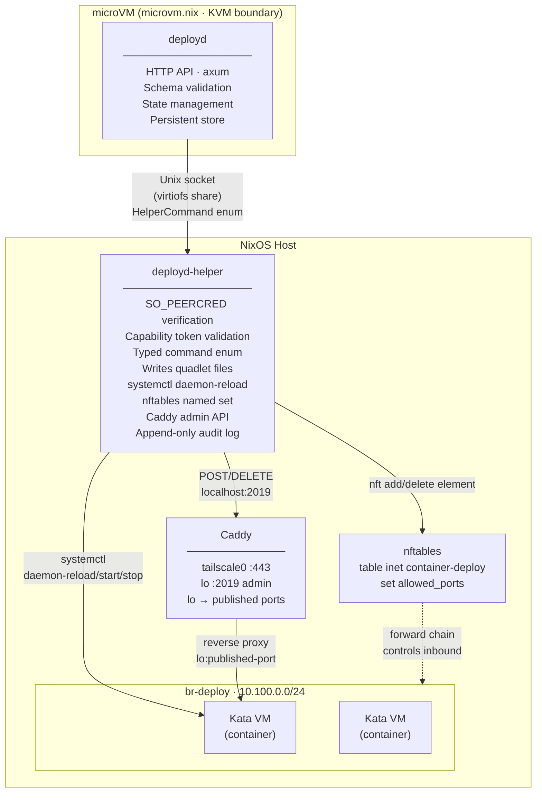
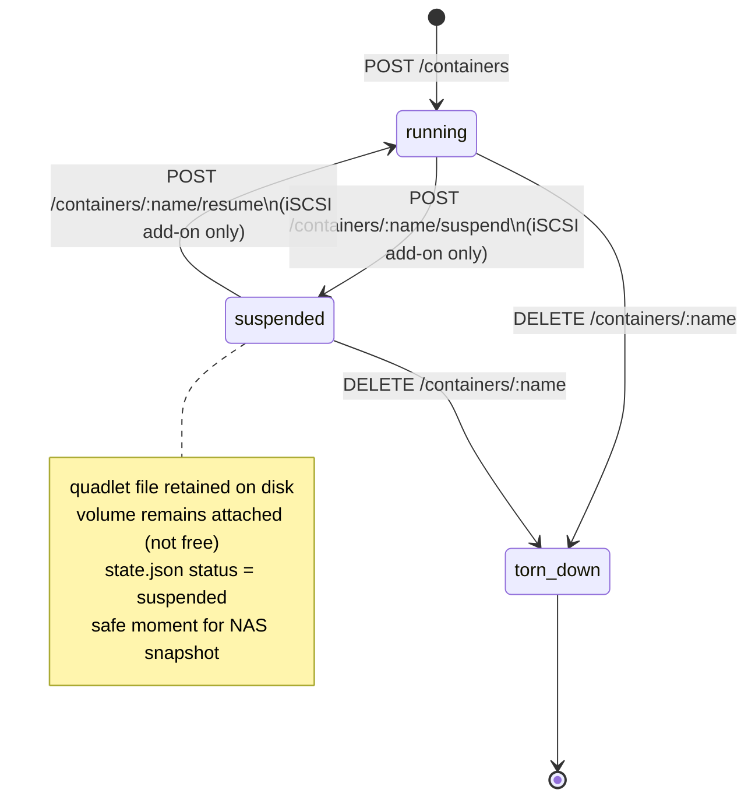

# Dynamic Container Deployment Service

> **Superseded (2026-06-01).** The dynamic-container use case is now served
> by a k3s cluster, not deployd. The k3s rejection in the alternatives
> table below (~line 47) was reversed — see
> `llm-notes/reports/k8s-migration-evaluation.md` for the reasoning, and
> the `llm-notes/plans/k3s-*-plan.md` set for the implementation. deployd
> itself is shelved (`llm-notes/shelved/deployd-integration.md`) and its
> removal is planned in `llm-notes/plans/k3s-deployd-migration-plan.md`.
> This spec is kept for the deployd design record (static bridge
> isolation, the nerdctl→containerd analysis, the iSCSI add-on concept now
> replaced by CSI VolumeSnapshot).

## Design Specification and Implementation Plan

---

## Table of Contents

1. [Overview](#overview)
2. [Problem Statement](#problem-statement)
3. [High-Level Specification](#high-level-specification)
4. [Architecture](#architecture)
5. [Component Design](#component-design)
6. [Security Model](#security-model)
7. [Persistence and State](#persistence-and-state)
8. [Ingress Model](#ingress-model)
9. [iSCSI Block Storage Add-on](#iscsi-block-storage-add-on)
10. [Prototype Validation Plan](#prototype-validation-plan)
11. [Implementation Plan](#implementation-plan)
12. [NixOS Integration](#nixos-integration)
13. [Stretch Goals](#stretch-goals)
14. [Non-Goals](#non-goals)

---

## Overview

This document specifies a lightweight Rust service — provisionally named **`deployd`** — that fills a specific gap in the NixOS homelab ecosystem: accepting OCI container definitions at runtime, deploying them as systemd-native units with hardware VM-level isolation, and managing private-network ingress — all without requiring a NixOS rebuild.

The service is explicitly scoped to private-network workloads reachable within a Headscale tailnet. External exposure remains a deliberate, separate concern handled through static NixOS declarations. This two-tier model — dynamic and private via `deployd`, static and deliberate for anything public — reflects a principled security posture rather than a technical limitation.

---

## Problem Statement

NixOS couples the update cadence of infrastructure and applications by design. A broken package in nixpkgs can block a critical system update; a new service definition requires a full `nixos-rebuild switch`. This is the right tradeoff for stable, known services. It is the wrong tradeoff for:

- **CI/CD-driven containers** whose image content changes continuously and independently of the host configuration.
- **Ephemeral workloads** whose existence is not known at system build time — game servers, temporary development environments, ad-hoc tools.

Existing approaches fail in specific ways:

| Approach                        | Failure mode                                                             |
| ------------------------------- | ------------------------------------------------------------------------ |
| `quadlet-nix`                   | Static only — every new container requires a rebuild                     |
| `virtualisation.oci-containers` | Static only — same constraint                                            |
| k3s                             | Fights NixOS for ownership of networking, storage, and service lifecycle |
| Nomad                           | BSL license, significant operational overhead, not NixOS-native          |
| Imperative `podman run`         | No ingress management, no persistence, no audit trail                    |

`deployd` is the missing layer: a declarative platform configured once in NixOS, operated dynamically thereafter.

---

## High-Level Specification

### What the service does

- Accepts OCI container definitions via an authenticated HTTP API.
- Deploys each container as a Podman quadlet unit managed by systemd.
- Enforces Kata Containers with cloud-hypervisor as the runtime for all managed containers — hardware VM isolation is not optional and cannot be overridden by the caller.
- Attaches all managed containers to a dedicated bridge network, isolated from the host's main network.
- Manages intra-tailnet ingress via the Caddy admin API — adding and removing reverse proxy routes atomically with container lifecycle.
- Manages firewall access via a dedicated nftables table scoped exclusively to the bridge network.
- Persists container definitions across reboots, with per-container opt-out for genuinely ephemeral workloads.
- Maintains an append-only audit log of all operations on the host, outside the service's own trust boundary.

### What the service explicitly does not do

- Evaluate Nix expressions. The service accepts OCI container definitions (JSON). Nix is a valid authoring tool that produces these definitions client-side; the service has no knowledge of or dependency on Nix.
- Manage external TLS or public DNS. All deployed containers are private-network only.
- Expose containers publicly. Public exposure is handled through static NixOS declarations, requiring a deliberate flake commit and rebuild.
- Manage certificates. Tailnet services use Headscale's built-in HTTPS. The service manages no certificates.
- Schedule across multiple nodes. The service is explicitly single-host.

### Input format

The service accepts a JSON container definition:

```json
{
  "name": "myapp",
  "image": "registry.internal/myapp@sha256:abc123",
  "ports": [{ "host": 8080, "container": 80, "protocol": "tcp" }],
  "ingress": {
    "hostname": "myapp.tailnet.example.com"
  },
  "env": {
    "ENV_VAR": "value"
  },
  "volumes": [{ "host": "/var/lib/myapp", "container": "/data" }],
  "block_volume": "vol-a3f8c1",
  "persistent": true
}
```

The `persistent` flag determines whether the container definition survives a host reboot. It defaults to `false`. CI-deployed services should set it to `true`; game servers and ephemeral workloads should leave it unset.

The `block_volume` field is optional and requires the iSCSI block storage add-on to be configured. It accepts a volume ID previously allocated via `POST /volumes`. The physical device path is an implementation detail resolved by `deployd` and never exposed to the caller. See the [iSCSI Block Storage Add-on](#iscsi-block-storage-add-on) section.

---

## Architecture

### Process topology



### Layered isolation

Three independent isolation layers stack to produce the security posture:

**Network layer.** All managed containers attach to `br-deploy`, a dedicated Linux bridge with its own nftables table. The service's firewall management scope is limited to that table. A bug in firewall code cannot affect the host's main INPUT rules or any other network.

**Runtime layer.** All containers use Kata Containers with cloud-hypervisor. Each container runs inside a dedicated KVM virtual machine with a separate kernel. Container escape vulnerabilities cannot reach the host kernel. This is enforced by the service in the generated quadlet file — the caller has no mechanism to override it.

**Process layer.** The API service runs inside a microVM managed by microvm.nix. The only process running on the host is the minimal privileged helper. A compromised API service is contained within the microVM boundary and can only communicate with the helper over the Unix socket using the typed command protocol.

---

## Component Design

### deployd (API service, runs in microVM)

**Framework:** `axum`

**Endpoints:**

| Method   | Path                        | Description                                                       |
| -------- | --------------------------- | ----------------------------------------------------------------- |
| `POST`   | `/containers`               | Deploy a new container                                            |
| `DELETE` | `/containers/:name`         | Tear down a container                                             |
| `POST`   | `/containers/:name/suspend` | Suspend a running container (iSCSI add-on)                        |
| `POST`   | `/containers/:name/resume`  | Resume a suspended container (iSCSI add-on)                       |
| `GET`    | `/containers`               | List deployed containers and their status                         |
| `GET`    | `/containers/:name`         | Status of a single container                                      |
| `GET`    | `/health`                   | Health check                                                      |
| `POST`   | `/volumes`                  | Allocate a volume from the storage pool (iSCSI add-on)            |
| `DELETE` | `/volumes/:id`              | Release a volume back to the storage pool (iSCSI add-on)          |
| `GET`    | `/volumes`                  | List allocated volumes and their attachment status (iSCSI add-on) |

**Responsibilities:**

- Validate incoming JSON against the container definition schema.
- Validate image reference against the permitted registry allowlist (first line of defence, before the helper applies its own check).
- Communicate with `deployd-helper` over the Unix socket using the typed command protocol — including `AddCaddyRoute` and `RemoveCaddyRoute` commands. The microVM has no direct network path to the host loopback, so all host-side side effects including Caddy route management go through the helper.
- Manage the volume allocation lifecycle: allocate volumes from the pool on `POST /volumes`, track allocation state in `state.json`, resolve volume IDs to physical device paths at deploy time, and release volumes on `DELETE /volumes/:id`.
- Enforce that a volume cannot be attached to more than one container simultaneously, and that a volume cannot be released while attached.
- Maintain in-memory state of deployed containers, rebuilt from the persistent store on startup.
- Write container definitions to the persistent store for reboot-persistent workloads.
- On startup, replay persistent definitions to restore state after a host reboot.

**Rust crates:**

- `axum` — HTTP server
- `serde` / `serde_json` — serialisation
- `tokio` — async runtime
- `tracing` — structured logging

### deployd-helper (privileged helper, runs on host)

**Language:** Rust

**Responsibilities:**

- Listen on a Unix domain socket in a virtiofs-shared directory.
- Verify `SO_PEERCRED` on every connection — refuse connections from unexpected UIDs.
- Validate the capability token on every message.
- Deserialise the typed command enum — refuse anything that does not cleanly deserialise.
- Validate all values within commands against declared policy (registry allowlist, port range, hostname allowlist).
- Write quadlet files to `/run/containers/systemd/` and, for persistent containers, `/var/lib/deployd/quadlets/`.
- Call `systemctl daemon-reload` and `systemctl start <name>.service`.
- Add/remove elements from the `allowed_ports` named set in the `container-deploy` nftables table.
- Add/remove Caddy reverse proxy routes via the Caddy admin API on `localhost:2019`.
- Write an entry to the append-only audit log before executing any action.

**Typed command protocol:**

```rust
enum HelperCommand {
    Deploy(ContainerDefinition),
    Teardown(ContainerId),
    Suspend(ContainerId),
    Resume(ContainerId),
    AddFirewallPort { port: u16, protocol: Protocol },
    RemoveFirewallPort { port: u16, protocol: Protocol },
    AddCaddyRoute { name: String, hostname: String, upstream_port: u16 },
    RemoveCaddyRoute { name: String },
    AttachVolume { volume_id: VolumeId, device_path: DevicePath },
    DetachVolume { volume_id: VolumeId },
}
```

`AttachVolume` and `DetachVolume` carry the resolved physical device path, which `deployd` looks up from its allocation state. The helper validates the device path against the storage pool allowlist independently — `deployd` resolves the ID, the helper confirms the path is permitted. The caller never supplies or sees a device path at any point.

`Suspend` stops the systemd unit and removes the Caddy route and firewall elements, but leaves the quadlet file on disk and the volume in `attached` state. `Resume` starts the unit again and re-adds the route and firewall elements. Both variants are only valid for containers with a `block_volume` ID — suspending a container without persistent block storage would leave its state in an undefined position on resume.

No string interpolation. No shell execution. Each variant maps to exactly one action with no degrees of freedom beyond its typed parameters.

**Caddy admin API calls are made by the helper, not by `deployd` directly.** The microVM has no network path to the host loopback, so all Caddy route management goes through the helper socket. This keeps all host-side side effects — systemd, nftables, Caddy — in one audited code path.

**systemd hardening (NixOS):**

```nix
systemd.services.deployd-helper = {
  serviceConfig = {
    User = "deployd-helper";
    AmbientCapabilities = [ "CAP_NET_ADMIN" "CAP_DAC_OVERRIDE" ];
    CapabilityBoundingSet = [ "CAP_NET_ADMIN" "CAP_DAC_OVERRIDE" ];
    NoNewPrivileges = false; # required for capability use
    ProtectSystem = "strict";
    ReadWritePaths = [
      "/run/containers/systemd"
      "/var/lib/deployd"
      "/var/log/deployd"
    ];
    RestrictAddressFamilies = [ "AF_UNIX" "AF_NETLINK" "AF_INET" ]; # AF_INET required for Caddy admin API on localhost
    RestrictNamespaces = true;
    SystemCallFilter = [ "@system-service" "~@privileged" ];
  };
};
```

### Quadlet file template

The helper generates quadlet files with the runtime enforced and the network attached:

```ini
[Container]
Image=<validated-image-reference>
Network=br-deploy
PodmanArgs=--runtime=/run/current-system/sw/bin/kata-runtime
PublishPort=<host-port>:<container-port>/<protocol>
Environment=<KEY=VALUE>
Volume=<host-path>:<container-path>

[Service]
Restart=on-failure

[Install]
WantedBy=default.target
```

---

## Security Model

### Trust boundary summary

| Component             | Trust level                | Rationale                                               |
| --------------------- | -------------------------- | ------------------------------------------------------- |
| `deployd` API service | Untrusted relative to host | Runs in microVM, cannot reach host directly             |
| `deployd-helper`      | Trusted, minimal           | Runs on host, validates all inputs before acting        |
| Caller (CI, shell)    | Authenticated              | Bearer token on API, restricted to permitted registries |
| Deployed containers   | Untrusted                  | Kata VM boundary, isolated bridge network               |

### Socket authentication

1. **`SO_PEERCRED`** — kernel-provided UID/GID/PID of the connecting process. The helper refuses connections from any UID other than the `deployd` service user. Unforgeable at the kernel level.
2. **Capability token** — a secret generated at microVM boot time, written to a virtiofs-shared path readable only by the `deployd` process, required as a field on every command message. Defends against a scenario where something other than `deployd` gains access to the socket file.

### Input validation layers

Validation occurs at two independent layers. Both must pass.

**`deployd` (API service):**

- JSON schema validation
- Image registry prefix check against allowlist
- Port range check
- Hostname format check

**`deployd-helper`:**

- Command enum deserialisation (rejects anything malformed)
- Independent registry allowlist check
- Independent port range check (e.g., 1024–65535, excluding reserved ranges)
- Hostname allowlist check against permitted tailnet domains

### Audit log

The helper writes an append-only structured log entry to `/var/log/deployd/audit.log` before executing any action. The log is on the host filesystem, outside the microVM, and cannot be tampered with by a compromised `deployd` process. Each entry records timestamp, command received, validated parameters, and outcome.

### Registry allowlist

Both `deployd` and `deployd-helper` maintain a registry allowlist. Only images whose reference begins with a permitted registry prefix are accepted. `docker.io` and other public registries are not on the allowlist by default. The allowlist is configured in the NixOS module for the helper and in the microVM configuration for `deployd`.

---

## Persistence and State

### Directory layout on host

```
/run/containers/systemd/          # runtime quadlet files (tmpfs, lost on reboot)
/var/lib/deployd/
  quadlets/                       # persistent quadlet files (survive reboot)
  state.json                      # index of deployed containers and their metadata
/var/log/deployd/
  audit.log                       # append-only audit log
```

### Startup replay

On service start, `deployd` reads `state.json` from the persistent store. For each container marked `persistent: true`, it sends a `Deploy` command to the helper, which writes the quadlet file to `/run/containers/systemd/` and triggers daemon-reload. Containers marked `persistent: false` are removed from state on startup — their definitions are not replayed.

### Teardown

On container teardown, the helper stops the systemd unit, deletes the quadlet file from `/run/containers/systemd/`, removes the file from `/var/lib/deployd/quadlets/` (if persistent), removes the firewall port element, and calls `systemctl daemon-reload`. `deployd` then removes the Caddy route and updates `state.json`.

### Atomicity

Teardown and deployment are not atomically reversible at the OS level. The audit log provides a complete record for manual recovery. Partial failure handling:

- If daemon-reload succeeds but the container fails to start, Podman's built-in rollback mechanism (requires `--sdnotify=container` in the quadlet) reverts the image. The Caddy route is not added until the container reports healthy.
- If the Caddy API call fails after a successful container start, the container is torn down and the failure is logged.

---

## Ingress Model

### Private network only

All containers deployed by `deployd` are accessible within the Headscale tailnet only. Caddy runs on the host and handles intra-tailnet routing. There is no public TLS, no ACME, and no public DNS managed by this service.

### Caddy network position

Caddy runs on the host and sits between two networks: it listens on `tailscale0` (the tailnet interface) and forwards to published ports on the host loopback (`lo`). It never touches `br-deploy` directly. This is intentional — published ports are exposed on `lo` by Podman's netavark stack via DNAT, so Caddy can reach containers without being on the bridge network itself. The boundary is clean: Caddy owns the tailnet-facing side, the bridge network owns the container-facing side, and published ports on loopback are the handoff point.

### Caddy admin API

Caddy route management is performed by `deployd-helper`, not by `deployd` directly. The microVM has no network path to the host loopback, so `deployd` sends `AddCaddyRoute` and `RemoveCaddyRoute` commands over the Unix socket. The helper makes the actual `localhost:2019` call.

Adding a route:

```
POST /config/apps/http/servers/tailnet/routes
```

```json
{
  "@id": "deployd-myapp",
  "match": [{ "host": ["myapp.tailnet.example.com"] }],
  "handle": [
    {
      "handler": "reverse_proxy",
      "upstreams": [{ "dial": "localhost:8080" }]
    }
  ],
  "terminal": true
}
```

The upstream address is the published port on the host loopback, not a container bridge address. Removing a route uses the `@id` tag:

```
DELETE /id/deployd-myapp
```

### Network firewall

The dedicated nftables table manages inbound access to the bridge:

```
table inet container-deploy {
  set allowed_ports { type inet_service }

  chain forward {
    type filter hook forward priority 0; policy drop;
    iifname "br-deploy" oifname "br-deploy" accept
    iifname "br-deploy" oifname "eth0" accept
    iifname "eth0" oifname "br-deploy" tcp dport @allowed_ports accept
    iifname "eth0" oifname "br-deploy" udp dport @allowed_ports accept
  }
}
```

The helper adds and removes elements from `allowed_ports` only. It does not interact with any other nftables table.

Note: Podman's netavark stack manages DNAT rules for published ports automatically. The `allowed_ports` set controls access control only, not port forwarding.

### External exposure

Services requiring public exposure are declared as static NixOS services using `quadlet-nix` with Kata Containers as the runtime, with TLS managed by `security.acme` and routing managed by the NixOS Caddy or nginx module. This requires a deliberate flake commit and `nixos-rebuild switch`. The friction is intentional — external exposure should be a considered decision with an audit trail in version control.

---

## iSCSI Block Storage Add-on

This is an optional add-on that enables two related capabilities: large persistent block storage backed by a NAS, and container suspend/resume. The two are deliberately coupled — suspend/resume is only available when a container has a block volume attached, because that is the only storage arrangement where the container's state is guaranteed to outlive the container process cleanly.

The primary motivating use case is a game server that runs weekly for a session and needs its world state preserved between sessions, with point-in-time snapshots for recovery. Suspend cleanly stops the container and quiesces the block device; resume restores it in seconds. The NAS handles snapshot management independently of the container lifecycle.

### Volume lifecycle and the principle of least authority

Storage allocation and container deployment are separate capabilities and are exposed through separate API calls. This separation follows the principle of least authority: a caller deploying a container does not inherently need the authority to provision new storage from the pool. Those are distinct acts that may belong to distinct roles.

**Volume allocation** (`POST /volumes`) is an infrastructure decision made by an operator or a privileged pipeline step. It draws a LUN from the pool declared in NixOS configuration and returns a volume ID. The physical device path is an implementation detail that never crosses the API boundary — the caller receives only the ID.

**Container deployment** (`POST /containers`) is an operational decision. A caller attaches a previously allocated volume by referencing its ID in the `block_volume` field. `deployd` resolves the ID to a device path internally. The helper independently validates that the resolved path is within the declared storage pool before passing it through to Kata.

This means a CI pipeline can be granted permission to deploy containers against existing volumes without being granted permission to allocate new storage. It also means the volume lifecycle is explicit and auditable independently of the container lifecycle — a volume can be inspected, snapshotted, or reassigned without touching the container definition.

**Volume state:**

- `free` — allocated from the pool, not attached to any container
- `attached` — currently in use by a running or suspended container
- `released` — returned to the pool (volume ID is invalidated)

A volume in `attached` state cannot be released. A volume in `free` state cannot be the target of a resume operation. `deployd` enforces these constraints at the API layer; the helper enforces the device path allowlist independently.

```
POST /volumes
      │
      ▼
    free ──── POST /containers (block_volume: id) ────▶ attached
      │                                                     │
      │              DELETE /containers/:name               │
      │         (or suspend → DELETE)                       │
      │◀────────────────────────────────────────────────────┘
      │
DELETE /volumes/:id
      │
      ▼
  released
```

### Storage pool declaration

The operator declares the pool of available LUNs once in NixOS configuration. `deployd` manages allocation within this pool at runtime. No per-LUN naming or pre-assignment is required — LUNs are fungible within the pool and `deployd` picks arbitrarily when allocating.

```nix
services.deployd-helper = {
  storagePool = [
    "/dev/disk/by-id/wwn-0x500a075116a04025"
    "/dev/disk/by-id/wwn-0x500a075116a04026"
    "/dev/disk/by-id/wwn-0x500a075116a04027"
  ];
};
```

The pool declaration serves as the device path allowlist. The helper refuses to attach any device not present in the pool, regardless of what `deployd` requests. Changing the pool requires a NixOS rebuild — runtime expansion of the pool is not possible, which is intentional.

### Storage alternatives

Before committing to iSCSI, it is worth understanding the two simpler alternatives and why they are insufficient for the suspend/resume use case specifically.

**NFS (network filesystem).** NFS mounts appear as a directory on the host and can be bind-mounted into a container in the same way as any local path. The setup cost is low and NixOS has good NFS client support. The problem for suspend/resume is that NFS provides no clean quiesce boundary — when you stop the container, writes may be in flight, the NFS client has no atomic "flush and disconnect" operation, and a snapshot taken at the NAS level may capture an inconsistent filesystem state. NFS is fine for configuration files, assets, and other data where eventual consistency is acceptable. It is the wrong tool for game world databases that expect filesystem consistency guarantees.

**Local disk images (loop devices).** A `.img` file on the host filesystem, mounted as a loop device and passed into the container, avoids the NAS dependency entirely. The container gets a real block device, the filesystem is consistent after unmount, and snapshots are just file copies. This is a reasonable approach for small workloads or early development. It breaks down at game server scale — a Valheim world can reach tens of gigabytes, copying that file for each snapshot is slow and disk-intensive, and there is no NAS-level snapshot mechanism to fall back on. The snapshot story degrades to "stop the container, copy the file, restart" which is exactly the operational friction suspend/resume is trying to eliminate. Loop devices are also more fragile under host crash conditions than a NAS LUN with its own battery-backed write cache.

**iSCSI.** The NAS presents a block device directly to the host initiator. The host sees it as a real disk. Kata passes it through to the container VM as a virtio-blk device. The container manages its own filesystem with no host OS in the data path. When the container is suspended, the block device is cleanly unmounted from the Kata VM before the unit stops — this is an atomic, consistent quiesce point. A NAS snapshot taken immediately after suspend captures a consistent filesystem state with no coordination overhead. Resume re-attaches the block device and starts the unit. The entire suspend-snapshot-resume cycle for a weekly game server takes seconds on the service side and however long the NAS snapshot takes on the storage side, typically under a minute.

The cost is setup complexity: iSCSI target configuration on the NAS, `open-iscsi` on the host, and LUN provisioning per container. For workloads where the suspend/resume and snapshot story matters, this cost is worth paying. For workloads where it does not, use bind mounts or NFS.

### Suspend and resume

Suspend and resume are the primary value proposition of the iSCSI add-on and are only available when a `block_volume` ID is present in the container definition.

**Container state machine:**



Containers without a `block_volume` can only transition between `running` and `torn_down`. The `suspended` state is only available when the iSCSI add-on is active and the container definition includes a `block_volume` ID. The service rejects `suspend` and `resume` calls on containers without block storage.

**Suspend** (`POST /containers/:name/suspend`):

1. `deployd` sends `RemoveCaddyRoute` to the helper — the service becomes unreachable on the tailnet immediately.
2. `deployd` sends `RemoveFirewallPort` for each published port.
3. `deployd` sends `Suspend` to the helper — the helper calls `systemctl stop <n>.service` and waits for clean shutdown. The Kata VM unmounts the block device as part of guest shutdown.
4. The quadlet file remains on disk. The volume transitions to `attached` but idle — it is not released to the pool. The container definition remains in `state.json` with status `suspended`.

The container is now quiesced. The block device is cleanly unmounted and consistent. This is the correct moment to trigger a NAS snapshot.

**Resume** (`POST /containers/:name/resume`):

1. `deployd` sends `Resume` to the helper — the helper calls `systemctl start <n>.service`. The Kata VM re-attaches the block device on boot using the same resolved device path stored in `state.json`.
2. `deployd` sends `AddFirewallPort` for each published port.
3. `deployd` sends `AddCaddyRoute` — the service becomes reachable on the tailnet.
4. Container status in `state.json` transitions back to `running`. Volume status remains `attached`.

Resume reuses the existing quadlet file and the same volume that was attached before suspension. No reallocation or redeploy is needed. The container starts with the same world state it had when suspended.

**Teardown of a suspended container** (`DELETE /containers/:name`): the volume is detached and its status transitions to `free`. It is not released back to the pool — the operator must explicitly call `DELETE /volumes/:id` to return it. This preserves the data on the LUN until the operator deliberately chooses to make it available for reallocation.

**Suspend/resume and the `persistent` flag.** A suspended container is implicitly persistent — its definition is retained in `state.json` regardless of the `persistent` flag. On service startup, suspended containers are not automatically resumed (unlike persistent running containers, which are replayed). They remain suspended until explicitly resumed by the operator. This is intentional: automatic resume on reboot without operator intent would defeat the purpose of explicit suspension.

### How iSCSI block storage works

iSCSI presents as a block device to the host — by the time `deployd` is involved, the LUN appears as `/dev/disk/by-id/...`. The host OS manages the iSCSI initiator via `services.open-iscsi` in NixOS. The block device is passed through to the Kata container VM directly as a virtio-blk device, not mounted as a host filesystem first. The container owns the block device's filesystem entirely.

When a caller allocates a volume via `POST /volumes`, `deployd` assigns an unallocated LUN from the storage pool, generates a volume ID, and records the ID-to-device-path mapping in `state.json`. The caller receives only the volume ID:

```json
{ "id": "vol-a3f8c1", "status": "free" }
```

When a container definition references that ID in `block_volume`, `deployd` resolves it to the physical device path internally and passes it to the helper via `AttachVolume`. The device path never appears in any caller-facing API response.

### Security considerations

Block device passthrough has a significantly different security profile from bind mounts. If an arbitrary device path reached the helper, a misconfigured or compromised `deployd` could point at `/dev/sda` (the host root disk). Two independent mechanisms prevent this.

First, callers never supply device paths — they supply volume IDs, which `deployd` resolves internally. A caller has no mechanism to request a specific device path.

Second, the helper validates the resolved device path against the storage pool declaration independently of `deployd`. Even if `deployd` were compromised and resolved a volume ID to a path outside the pool, the helper would refuse the `AttachVolume` command. The storage pool in the NixOS configuration is the authoritative allowlist, and it cannot be changed at runtime.

### LUN provisioning model

LUNs in the storage pool are treated as fungible — `deployd` allocates arbitrarily when a caller requests a new volume. One LUN per volume is enforced by the allocation model: a LUN that has been allocated to a volume ID cannot be allocated again until that volume is released. This provides clean isolation and per-LUN NAS snapshots without requiring the caller to reason about physical storage topology.

A volume in `attached` state cannot be released. Releasing a volume that is attached to a suspended container requires tearing down the container first.

### NixOS configuration

```nix
{
  # iSCSI initiator for NAS connectivity
  services.open-iscsi = {
    enable = true;
    name = "iqn.2024-01.com.example:homelab-host";
  };

  # Storage pool — also serves as the device path allowlist in the helper
  services.deployd-helper = {
    storagePool = [
      "/dev/disk/by-id/wwn-0x500a075116a04025"
      "/dev/disk/by-id/wwn-0x500a075116a04026"
      "/dev/disk/by-id/wwn-0x500a075116a04027"
    ];
  };
}
```

### Prototype validation (block storage and suspend/resume)

This validation track is independent of the main Milestone 0 checklist and does not gate the core service go/no-go decision.

1. The iSCSI LUN appears as a stable `/dev/disk/by-id/` path after `open-iscsi` connects.
2. `podman run --runtime=kata-runtime --device=/dev/disk/by-id/...:/dev/vda` passes the block device into the Kata VM correctly and it is writable from inside the container.
3. A filesystem created inside the container persists across container stop/start cycles — confirming the block device, not a tmpfs, is in use.
4. The block device is cleanly unmounted from the Kata VM's perspective after `systemctl stop` — confirmed by checking that a subsequent `fsck` on the host finds no errors.
5. A LUN snapshot taken after step 4 is restorable cleanly on a fresh container start, with no data loss or filesystem corruption.
6. Allocating a volume via the API, attaching it to a container, suspending, snapshotting, and resuming completes the full lifecycle without the caller ever observing a device path.

**Pass criterion:** All six steps complete without data loss. Any Kata-specific quirks with block device passthrough or unmount behaviour are documented before service code is written.

---

## Prototype Validation Plan

Before writing any service code, the following steps validate the critical assumptions of the architecture on NixOS. Each step is independent and should be completed in order. A failure at any step should be investigated and resolved before proceeding.

### Step 1: Kata Containers with Podman

Add to NixOS configuration:

```nix
virtualisation.containers.enable = true;
virtualisation.podman.enable = true;
virtualisation.kata-containers.enable = true;
```

Run a container explicitly with the Kata runtime:

```bash
podman run --runtime=/run/current-system/sw/bin/kata-runtime \
  --rm -it alpine uname -r
```

**Pass criterion:** The printed kernel version differs from the host kernel version. This confirms the VM boundary is real.

### Step 2: Kata with a quadlet file

Write a minimal quadlet file by hand:

```bash
cat > /run/containers/systemd/proto.container << 'EOF'
[Container]
Image=docker.io/library/alpine:latest
PodmanArgs=--runtime=/run/current-system/sw/bin/kata-runtime
Exec=sleep infinity

[Install]
WantedBy=default.target
EOF

systemctl daemon-reload
systemctl start proto.service
systemctl status proto.service
```

**Pass criterion:** The unit starts and remains running. `podman exec` into the container shows a different kernel. Deleting the file and re-running daemon-reload cleanly removes the unit.

### Step 3: Bridge network with Kata

Configure the bridge network in NixOS, attach the prototype container to it, publish a port, and confirm:

- The container can reach external addresses (egress works).
- A port published by the container is reachable from the host.
- Netavark's automatic firewall rules do not conflict with the `container-deploy` nftables table.

**Pass criterion:** All three network behaviours work as expected with no manual iptables/nftables intervention beyond the declared table.

### Step 4: Caddy dynamic route by hand

Run Caddy with the admin API enabled. Use `curl` to post a reverse proxy route pointing at the container's published port:

```bash
curl -X POST http://localhost:2019/config/apps/http/servers/tailnet/routes \
  -H "Content-Type: application/json" \
  -d '{
    "@id": "proto-route",
    "match": [{"host": ["proto.tailnet.example.com"]}],
    "handle": [{"handler": "reverse_proxy",
                "upstreams": [{"dial": "localhost:8080"}]}],
    "terminal": true
  }'
```

**Pass criterion:** Traffic to `proto.tailnet.example.com` proxies correctly to the container. Deleting the route via `DELETE /id/proto-route` removes it cleanly.

### Step 5: Unix socket between microVM and host

Configure a minimal microvm.nix guest that writes to a Unix socket on a virtiofs-shared directory, and a minimal host listener that reads from it. Validate `SO_PEERCRED` in the listener.

**Pass criterion:** The host listener correctly identifies the connecting process's UID and rejects connections from unexpected UIDs.

---

## Implementation Plan

The implementation is divided into five milestones. Each milestone produces a testable increment. Milestones are ordered to surface the highest-risk technical unknowns first.

### Milestone 0: Prototype validation

**Goal:** Confirm all architectural assumptions before writing service code.

**Tasks:**

- Complete all five prototype validation steps above.
- Document any deviations or workarounds discovered.
- Make a go/no-go decision on the architecture before proceeding.

**Output:** A set of hand-written NixOS configurations and shell scripts demonstrating the full stack working end to end.

---

### Milestone 1: Privileged helper

**Goal:** A working, tested `deployd-helper` that can be audited independently of the API service.

**Tasks:**

1. Define the `HelperCommand` enum and serialisation format using `serde`.
2. Implement Unix socket listener with `SO_PEERCRED` verification.
3. Implement capability token validation.
4. Implement `Deploy` command:
   - Validate image registry against allowlist.
   - Validate port range.
   - Generate quadlet file from typed parameters (no string interpolation of user input into sensitive positions).
   - Write to `/run/containers/systemd/<name>.container`.
   - Write to `/var/lib/deployd/quadlets/<name>.container` if persistent.
   - Call `systemctl daemon-reload`.
   - Call `systemctl start <name>.service`.
5. Implement `Teardown` command:
   - Call `systemctl stop <name>.service`.
   - Delete quadlet files from both locations.
   - Call `systemctl daemon-reload`.
6. Implement `AddFirewallPort` and `RemoveFirewallPort` using `nft add/delete element`.
7. Implement append-only audit log with structured entries.
8. Write unit tests for all validation logic.
9. Write integration tests that exercise the full command flow against a real systemd instance.
10. Configure NixOS systemd hardening as specified in the Component Design section.

**Acceptance criteria:**

- All commands validated and rejected correctly for out-of-allowlist inputs.
- Audit log contains a complete record of all accepted and rejected commands.
- A container deployed via the helper is visible in `systemctl status` and running under the Kata runtime.
- Teardown leaves no orphaned files or systemd units.

---

### Milestone 2: API service (core)

**Goal:** A working HTTP API service running in the microVM that communicates with the helper.

**Tasks:**

1. Set up `axum` HTTP server with structured error responses.
2. Define and implement the container definition JSON schema and `serde` deserialisation.
3. Implement schema validation including registry prefix check and port range check.
4. Implement Unix socket client that connects to the helper, sends the capability token, and serialises `HelperCommand` values.
5. Implement `POST /containers` — validate, send `Deploy` to helper, return result.
6. Implement `DELETE /containers/:name` — send `Teardown` to helper, return result.
7. Implement `GET /containers` and `GET /containers/:name` from in-memory state.
8. Implement `GET /health`.
9. Implement bearer token authentication middleware.
10. Write unit tests for all validation logic.
11. Write integration tests against a mock helper.

**Acceptance criteria:**

- A container can be deployed and torn down via the HTTP API end to end.
- Invalid inputs (bad registry, out-of-range port, malformed JSON) are rejected with clear error responses before reaching the helper.
- Authentication rejects requests without a valid bearer token.

---

### Milestone 3: Caddy ingress integration

**Goal:** Container deployment and teardown atomically manages Caddy reverse proxy routes via the helper.

**Tasks:**

1. Add `AddCaddyRoute` and `RemoveCaddyRoute` variants to `HelperCommand` enum.
2. Implement Caddy admin API client in the helper using `reqwest`:
   - `add_route(name, hostname, upstream_port)` — `POST /config/apps/http/servers/tailnet/routes` targeting `localhost:<port>`
   - `remove_route(name)` — `DELETE /id/deployd-{name}`
3. Integrate Caddy route management into the deploy flow in `deployd`:
   - After successful container start, send `AddCaddyRoute` to helper.
   - Route points at the published port on the host loopback, not the bridge address.
4. Integrate Caddy route removal into the teardown flow:
   - Send `RemoveCaddyRoute` to helper before sending `Teardown`.
5. Handle Caddy API unavailability gracefully in the helper — retry with backoff, return error to `deployd`, which rolls back the container start.
6. Add `hostname` and `upstream_port` to the container state model.
7. Validate `hostname` against the tailnet domain allowlist in both `deployd` and the helper.
8. Write integration tests against a real Caddy instance with the helper making the API calls.

**Acceptance criteria:**

- A deployed container is reachable at its declared hostname within the tailnet immediately after the API call returns success.
- Teardown removes the Caddy route cleanly.
- Caddy API failure during deploy results in no deployed container and a clear error response.
- The helper's audit log records every Caddy route addition and removal.

---

### Milestone 4: Persistence and startup replay

**Goal:** Persistent containers survive host reboots.

**Tasks:**

1. Implement `state.json` writer — serialise deployed container state after every mutation.
2. Implement startup replay — on service start, read `state.json`, send `Deploy` commands to helper for all persistent containers.
3. Handle replay failures gracefully — a container that fails to start on replay is logged and removed from state rather than blocking startup.
4. Implement the `persistent` flag in the container definition and in the helper's file management.
5. Write integration tests that simulate service restart and confirm persistent containers are restored.

**Acceptance criteria:**

- A container deployed with `persistent: true` is running and reachable after a simulated service restart.
- A container deployed with `persistent: false` is not present after a simulated service restart.
- A failed replay does not prevent other containers from being restored.

---

### Milestone 5: microVM packaging and NixOS module

**Goal:** The full service is declared in NixOS and runs correctly on a real host.

**Tasks:**

1. Write a NixOS module for `deployd-helper`:
   - Systemd service unit with hardening options.
   - `systemd.tmpfiles` rules for required directories.
   - nftables table declaration for `container-deploy`.
   - Bridge network declaration for `br-deploy`.
   - Configuration options: registry allowlist, port range, permitted hostnames, socket path, audit log path.
2. Write a microvm.nix configuration for `deployd`:
   - virtiofs share for the socket directory.
   - virtiofs share for the persistent state directory.
   - Capability token generation and injection.
   - Caddy admin API endpoint configuration.
3. Write an end-to-end integration test:
   - Deploy a container via the HTTP API.
   - Confirm it is reachable at its tailnet hostname.
   - Tear it down.
   - Confirm the route and firewall rule are removed.
   - Simulate a reboot and confirm a persistent container is restored.
4. Document the NixOS module options.

**Acceptance criteria:**

- The complete service is declared in NixOS configuration and requires no manual steps beyond `nixos-rebuild switch` to deploy.
- The end-to-end integration test passes on a real NixOS host.
- The audit log on the host contains a complete record of the integration test operations.

---

## NixOS Integration

### Declared components (require `nixos-rebuild switch` once)

```nix
{
  # Bridge network for managed containers
  systemd.network.netdevs."10-br-deploy".netdevConfig = {
    Kind = "bridge";
    Name = "br-deploy";
  };
  systemd.network.networks."10-br-deploy" = {
    matchConfig.Name = "br-deploy";
    networkConfig.Address = "10.100.0.1/24";
  };

  # Scoped nftables table
  networking.nftables.tables.container-deploy = {
    family = "inet";
    content = ''
      set allowed_ports { type inet_service }
      chain forward {
        type filter hook forward priority 0; policy drop;
        iifname "br-deploy" oifname "br-deploy" accept
        iifname "br-deploy" oifname "eth0" accept
        iifname "eth0" oifname "br-deploy" tcp dport @allowed_ports accept
        iifname "eth0" oifname "br-deploy" udp dport @allowed_ports accept
      }
    '';
  };

  # Kata Containers runtime
  virtualisation.kata-containers.enable = true;
  virtualisation.podman.enable = true;
  virtualisation.containers.enable = true;

  # Privileged helper service
  services.deployd-helper = {
    enable = true;
    registryAllowlist = [ "registry.internal" ];
    permittedPortRange = { min = 1024; max = 65535; };
    hostnameAllowlist = [ ".tailnet.example.com" ];
  };

  # deployd API service microVM
  microvm.vms.deployd = {
    config = { ... }; # deployd microvm.nix configuration
  };

  # Caddy reverse proxy
  services.caddy = {
    enable = true;
    globalConfig = ''
      admin localhost:2019
    '';
  };

  # Persistent state and log directories
  systemd.tmpfiles.rules = [
    "d /run/containers/systemd 0775 root container-deploy - -"
    "d /var/lib/deployd 0750 deployd-helper deployd-helper -"
    "d /var/lib/deployd/quadlets 0750 deployd-helper deployd-helper -"
    "d /var/log/deployd 0750 deployd-helper deployd-helper -"
  ];
}
```

### Relationship to quadlet-nix

`deployd` and `quadlet-nix` are complementary, not competing. `quadlet-nix` is the right tool for services whose existence is known at build time — stable infrastructure, media servers, monitoring stacks. `deployd` is the right tool for services whose existence is determined at runtime. The bridge network and Kata runtime declared for `deployd` can also be referenced in `quadlet-nix` definitions for static services that benefit from the same isolation.

---

## Stretch Goals

These are explicitly out of scope for the initial implementation but are compatible with the architecture and may be added later.

### Headscale integration

On container deploy, register the container's service in the tailnet via the Headscale REST API, creating a pre-auth key and advertising the container's bridge IP as a route. On teardown, deregister. This would allow containers to appear as first-class tailnet nodes rather than being reachable only via Caddy proxy.

**API interaction:**

```
POST /api/v1/preauthkey   # create ephemeral reusable key
POST /api/v1/routes       # approve advertised route
DELETE /api/v1/routes/:id # remove on teardown
```

### Health-check aware deployment

Extend the container definition schema with an optional health check specification. `deployd` polls the health endpoint after deployment and only adds the Caddy route (and reports success to the caller) once the container reports healthy. Failed health checks trigger automatic teardown and an error response.

---

## Non-Goals

These are explicitly outside the scope of this service and should be implemented through other means.

- **Multi-node scheduling.** Single-host only.
- **Container builds.** The service accepts image references; it does not build images. Image building belongs in CI pipelines using `dockerTools.streamLayeredImage` or equivalent.
- **Secret injection.** Secrets should be managed by sops-nix or agenix at the NixOS level and bind-mounted into containers via the `volumes` field. The service does not manage secrets.
- **Public ingress.** External exposure requires a static NixOS declaration, a flake commit, and a rebuild. This friction is deliberate.
- **Log aggregation.** The audit log records control-plane operations. Application log aggregation for managed containers is out of scope.
- **Resource limits.** CPU and memory limits for managed containers are not exposed in the initial API. They may be added as typed fields in a later iteration.
