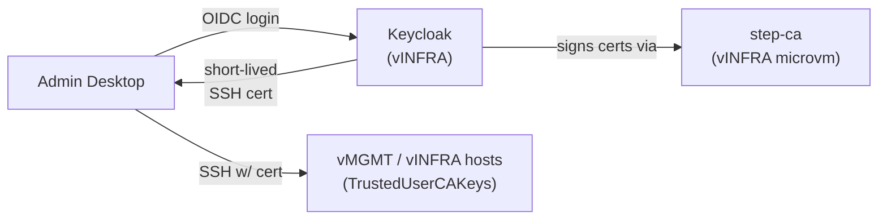
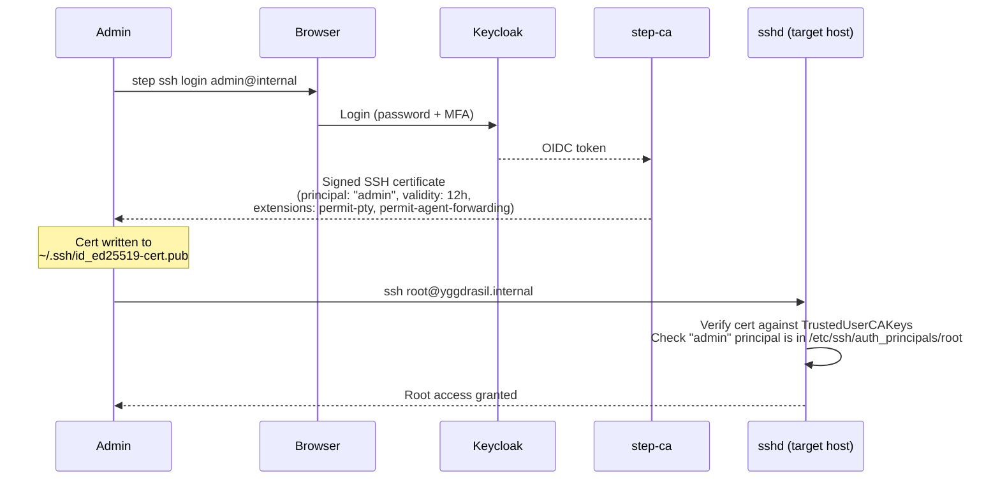
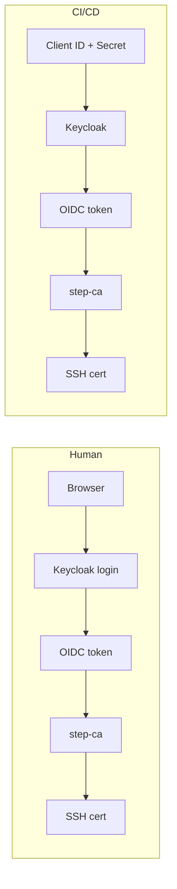
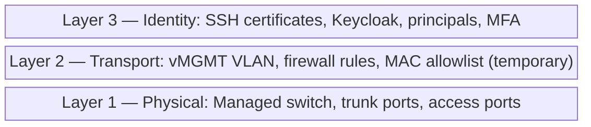

# SSH Certificates with Keycloak SSO — Future Plan

> **Status:** Future work. Not part of the current secure-mgmt-vlan plan.
> The current plan uses MAC allowlisting as the vMGMT admission gate.
> This document captures the intended replacement.

## Motivation

MAC allowlisting has two problems:

1. **Not a real security boundary.** MAC addresses are trivially spoofable —
   any device on the LAN can claim a known MAC.
2. **Tied to hardware, not identity.** Building a new desktop (or swapping a NIC)
   means losing access until the new MAC is manually added to the allowlist.

SSH certificates fix both: they prove *who you are* cryptographically, independent
of what hardware you're using.

## Architecture overview



### Components

1. **Keycloak** — runs on a **dedicated vINFRA microvm** (see the
   [Keycloak OIDC plan](./keycloak-oauth-oidc-plan.md) for hosting details).
   Acts as the OIDC provider. Users authenticate with username + password + MFA
   (TOTP/WebAuthn). The `step-ca` client is registered in the `homelab` realm.

2. **SSH Certificate Authority (step-ca)** — runs as a **dedicated microvm on
   vINFRA** (not vMGMT — vMGMT becomes the locked-down networking gear zone
   after the zone split). step-ca (Smallstep) is purpose-built for SSH
   certificates with native OIDC provisioner support. It holds the root CA key
   material and issues both user and host certificates.

   step-ca is infrastructure — it's in the same category as DNS, NTP, and routing.
   It belongs on vINFRA because everything above it (OAuth login, user
   certificates, host identity) depends on it, and Keycloak (which step-ca's OIDC
   provisioner validates against) is also on vINFRA — keeping them intra-zone. A
   dedicated microvm provides isolation for the CA key material while keeping it
   lightweight and within the existing NixOS orchestration model.

   > **Note:** step-ca is not a hard boot dependency for any host. Hosts load
   > certificates from disk at boot. step-ca only needs to be reachable for
   > certificate issuance and renewal — infrequent, out-of-band operations.

3. **Admin desktop** — runs `step ssh login` (or equivalent), which:
   - Opens a browser to Keycloak for authentication
   - On success, receives a signed SSH certificate (short-lived, e.g. 12h)
   - Writes the cert to `~/.ssh/id_ed25519-cert.pub`
   - Normal `ssh` commands then present the cert automatically

4. **Target hosts** — NixOS hosts on vMGMT/vINFRA configure:
   ```nix
   services.openssh = {
     extraConfig = ''
       TrustedUserCAKeys /etc/ssh/ca.pub
       AuthorizedPrincipalsFile /etc/ssh/auth_principals/%u
     '';
   };
   ```
   They trust the CA's public key, not individual user keys. No
   `authorized_keys` management needed.

   **Principals vs Unix users:** `admin` and `deploy` are certificate principal
   names, not Unix user accounts. All admin SSH sessions log in as **root** —
   this is the pragmatic choice for NixOS, where nearly every management
   operation (`nixos-rebuild switch`, deploy-rs, sops-nix activation) requires
   root. A separate admin user that immediately `sudo`s to root adds an extra
   step without adding a security boundary.

   The certificate principal provides the audit/identity layer that a separate
   Unix user would normally provide: sshd logs which principal authenticated,
   and the cert itself records who obtained it (via Keycloak) and when. The
   principals file for root lists which roles are allowed:
   ```
   # /etc/ssh/auth_principals/root
   admin          — human admin via Keycloak OIDC login
   deploy         — CI/CD via client_credentials grant (on deploy targets only)
   ```

## Authentication flow



## Relationship to the vMGMT VLAN plan

The vMGMT VLAN topology from the current plan stays **exactly the same**. The
change is purely about the admission gate:

| Aspect                   | Current (MAC)         | Future (SSH cert)           |
|--------------------------|-----------------------|-----------------------------|
| Network topology         | vMGMT VLAN            | vMGMT VLAN (unchanged)      |
| Who can reach mgmt ports | MAC-allowlisted hosts | Any host on vMGMT*          |
| Authentication           | SSH key (static)      | SSH certificate (short-lived)|
| Identity binding         | Hardware (NIC MAC)    | User (Keycloak account)     |
| MFA                      | None                  | Keycloak-enforced           |
| Revocation               | Remove MAC from list  | Revoke in Keycloak / short cert TTL |

\* vMGMT admission could also move from MAC allowlisting to 802.1X (RADIUS
backed by Keycloak), but that's a separate enhancement.

### What NOT to over-invest in now

Because the MAC allowlist is temporary, the current plan should:

- Keep MAC rules in **one place** (a single list in the router config) — don't
  scatter MAC checks across multiple firewall rules or host configs
- **Not build tooling** around MAC management (no scripts to add/remove MACs)
- **Not add MAC-based identity** to other systems (e.g. don't use MAC to
  determine DNS names or NFS access)

This keeps the eventual swap to certificates minimal: replace one router
firewall rule with "allow vMGMT subnet" and deploy TrustedUserCAKeys to hosts.

## CI/CD integration

CI/CD servers need non-interactive access — no human to open a browser. OAuth2's
**client credentials grant** handles this: machine-to-machine auth, no browser.

### Flow



1. Register the CI/CD server as a **Keycloak service account** (a client with
   `client_credentials` grant enabled). This gives it a client ID + secret.
2. step-ca validates the token the same way — same issuer, same signature
   verification. It doesn't care whether the token came from a browser redirect
   or a client credentials call.
3. The pipeline requests a fresh cert at job start:

```bash
# Authenticate to Keycloak (no browser)
TOKEN=$(curl -s -X POST https://auth.mutantmell.net/auth/realms/homelab/protocol/openid-connect/token \
  -d grant_type=client_credentials \
  -d client_id=cicd-deploy \
  -d client_secret="$CICD_CLIENT_SECRET" \
  | jq -r .access_token)

# Exchange token for short-lived SSH certificate
step ssh certificate cicd@internal /tmp/cicd_key \
  --provisioner keycloak --token "$TOKEN" \
  --not-after=1h

# Deploy using the cert (logs in as root, principal "deploy" in cert)
ssh -i /tmp/cicd_key root@target-host.internal "deploy-image.sh $IMAGE_TAG"
```

### Principals and least privilege

CI/CD certs get a narrow principal (e.g. `deploy`), not `admin`. Both log in
as root, but the principals file on each host controls *which* principals are
accepted:

```
# /etc/ssh/auth_principals/root  (on all managed hosts)
admin

# /etc/ssh/auth_principals/root  (on deploy targets only — append deploy)
admin
deploy
```

Even if CI/CD credentials are compromised, the `deploy` principal is only
accepted on hosts that explicitly list it. Hosts that only list `admin` will
reject the CI/CD certificate entirely.

### Comparison with static deploy keys

| Aspect          | Static deploy key             | Certificate (client credentials)                    |
|-----------------|-------------------------------|-----------------------------------------------------|
| Lifetime        | Permanent until rotated       | Short-lived (30min–1h per job)                      |
| Scope           | Any host trusting the key     | Principal-scoped (`deploy`, not `admin`)             |
| Revocation      | Remove from every host        | Disable service account in Keycloak (one place)      |
| Secret storage  | Private key on disk           | Client secret (or Vault-injected per-job)            |
| Audit trail     | "A key was used"              | "cicd-server authed at 14:02, cert for `deploy`, 1h"|

### Where to store the client secret

The Keycloak client secret is the one static credential. Options:

- **Environment variable** in CI/CD server config (encrypted at rest) — simplest
- **Vault OIDC auth** — CI/CD authenticates to Vault, which authenticates to
  Keycloak. Useful if Vault is already deployed.
- **Keycloak `client_jwt` authentication** — CI/CD uses a signed JWT assertion
  instead of a shared secret, avoiding a static secret entirely. Best option
  if the CI/CD platform supports it.

## Host certificates

User certificates (above) handle humans and CI authenticating *to* hosts. Host
certificates handle the other direction — clients verifying they're connecting to
the *right* host without TOFU (trust on first use).

### Problem with TOFU

The first time you SSH to a host, you get a fingerprint prompt. Most people accept
without verifying. Worse, rebuilding a NixOS host from scratch generates new host
keys, causing `WARNING: REMOTE HOST IDENTIFICATION HAS CHANGED` on every client
until they manually clean `known_hosts`.

### How host certificates work

The SSH CA signs each host's public key, producing a host certificate. sshd presents
this certificate to connecting clients. Clients trust the CA rather than individual
host fingerprints.

**Host-side** — sshd presents the certificate:
```nix
services.openssh.extraConfig = ''
  HostCertificate /etc/ssh/ssh_host_ed25519_key-cert.pub
'';
```

**Client-side** — one line in `~/.ssh/known_hosts` replaces all per-host entries:
```
@cert-authority *.internal.mutantmell.net,*.internal ssh-ed25519 AAAA...CA_PUBLIC_KEY...
```

No TOFU prompt, no per-host `known_hosts` entries needed.

### Compatibility with sops-nix

Host certificates do **not** replace host keys — they augment them. The host still
has its private key at `/etc/ssh/ssh_host_ed25519_key`. The certificate is just the
host's *public* key signed by the CA, stored alongside it.

The sops-nix decryption flow is unchanged:

1. Host boots with its SSH host key (as today)
2. sops-nix converts the private key via `ssh-to-age` to derive an age key
3. Secrets are decrypted using the age key (as today)
4. sshd starts and presents the host certificate to clients (new)

No circular dependency: the host certificate is a public artifact (signed public key).
It doesn't need sops encryption and can be deployed via NixOS configuration, committed
to the repo, or fetched from step-ca at provisioning time.

### Certificate lifecycle

Unlike user certificates (short-lived, 12h), host certificates can be long-lived.
The host's identity is stable.

| Approach | Cert lifetime | Complexity | Best for |
|----------|--------------|------------|----------|
| Sign once at provisioning | 1–5 years | Minimal | Small fleet, infrequent rebuilds |
| Automatic renewal via systemd timer | 30–90 days | Low | Larger fleet, defense in depth |

For a home network, **signing once at provisioning** is the right starting point.
This avoids any runtime dependency on step-ca — the certificate is a static file
loaded from disk at boot, no different from a TLS root cert in `/etc/ssl`.

Key rotation (re-signing) is an infrequent, out-of-band operation: the admin runs
`step ssh certificate` from their workstation and deploys the updated cert. This
does require step-ca to be reachable, but since step-ca lives on vINFRA alongside
the hosts being signed, there is no cross-layer dependency. A systemd timer calling
`step ssh renew` is a straightforward upgrade path if desired.

### Host rebuilds

Since sops-nix already requires stable host keys (they're the decryption identity),
host keys are preserved across rebuilds. The existing certificate remains valid. If
the key does change (new machine), re-signing is a single `step ssh certificate`
command.

### NixOS module sketch

A shared module deployable to all managed NixOS hosts:

```nix
# modules/common/ssh-ca.nix
{ config, ... }:
{
  services.openssh.extraConfig = ''
    TrustedUserCAKeys /etc/ssh/user_ca.pub
    HostCertificate /etc/ssh/ssh_host_ed25519_key-cert.pub
  '';

  # CA public key for verifying user certificates (same on all hosts)
  environment.etc."ssh/user_ca.pub".source = ./keys/user_ca.pub;

  # Host certificate is per-host (signed host public key)
  environment.etc."ssh/ssh_host_ed25519_key-cert.pub".source =
    ./host-certs/${config.networking.hostName}-cert.pub;
}
```

### OpenWRT devices

OpenWRT's default SSH server (dropbear) has **no SSH certificate support**. OpenSSH
can be installed on OpenWRT but adds overhead on constrained devices.

For OpenWRT devices (APs, managed switch), the approach is:

| Concern | NixOS hosts | OpenWRT devices |
|---------|-------------|-----------------|
| Host identity | Host certificate (CA-signed) | Traditional host key (TOFU) |
| User auth | SSH user certificate | SSH authorized_keys (public key) |
| Management access | Via vMGMT, cert-verified both directions | Via vMGMT, key-based, firewall-restricted |

This split is architecturally sound. OpenWRT devices are the *lowest* layer — they
*are* the network infrastructure. They're already trusted implicitly (they route all
traffic) and are secured by:

- Being on vMGMT only (not reachable from other VLANs)
- Traditional SSH key auth (admin's public key in `authorized_keys`)
- Physical/network topology (they are the network boundary)
- Host-level nftables restricting SSH to the router only

The certificate infrastructure protects everything *above* them. If OpenWRT devices
are later replaced with NixOS-based routing, they gain full certificate support
naturally.

## Design philosophy: layered independence

The network layer (VLANs, firewall rules) and identity layer (SSH certificates,
Keycloak) are designed to operate **independently**:



Each layer provides value on its own:

- **Network isolation alone** (current plan) already prevents lateral movement —
  a compromised IoT device can't reach management interfaces regardless of
  what authentication is configured.
- **SSH certificates alone** would prevent unauthorized access even if someone
  gained network access to vMGMT — they still can't authenticate without a
  valid certificate.
- **Together**, they provide defense in depth: you need to be on the right
  network *and* have the right identity.

This means:

- The VLAN plan can be implemented and provide immediate security value with
  no OAuth infrastructure
- Keycloak + certificates can be added later without rearchitecting the network
- Either layer can be upgraded independently (e.g. replace MAC allowlist with
  802.1X, or swap step-ca for Vault, without touching the other layer)
- A failure in one layer (e.g. Keycloak goes down) doesn't cascade — the
  network layer still restricts access, and emergency break-glass SSH keys
  can bypass the certificate requirement if needed

## Implementation sketch (for when this becomes active)

### Phase 1: Deploy Keycloak
- Covered by the [Keycloak OIDC plan](./keycloak-oauth-oidc-plan.md) (Phase 1):
  dedicated vINFRA microvm with Keycloak, PostgreSQL, nginx
- Configure `homelab` realm, register `step-ca` client, users, MFA policies
- Accessible at `auth.mutantmell.net` (split-horizon DNS resolves to vINFRA)

### Phase 2: Deploy step-ca as a vINFRA microvm
- Provision a dedicated microvm on an existing NixOS host (e.g. vanaheim or
  muspelheim), on the vINFRA network
- Generate SSH CA keypair (user CA + host CA — can be the same keypair or
  separate for least-privilege)
- Configure OIDC provisioner pointing at Keycloak
- Configure provisioner to map Keycloak groups → SSH principals
- Persistent storage for CA database and root key material
- step-ca is infrastructure: treat with same care as DNS/NTP (backed up,
  stable host key, minimal attack surface)

### Phase 3: Sign host certificates
- For each NixOS host on vMGMT/vINFRA: sign its `ssh_host_ed25519_key.pub`
  with the CA, producing a host certificate
- Deploy host certificates via `modules/common/ssh-ca.nix` (shared module
  adding `HostCertificate` and `TrustedUserCAKeys` to sshd config)
- Configure admin `~/.ssh/known_hosts` with
  `@cert-authority *.internal.mutantmell.net,*.internal` to trust the CA for
  host verification
- OpenWRT devices: no change (continue using traditional TOFU/key-based auth)

### Phase 4: Configure user certificate auth on target hosts
- `TrustedUserCAKeys /etc/ssh/ca.pub` on all vMGMT/vINFRA NixOS hosts
  (already in the shared `ssh-ca.nix` module from Phase 3)
- `AuthorizedPrincipalsFile` to control which principals can log in where
- Verify both directions work: client trusts host cert, host trusts user cert

### Phase 5: Client setup
- Install `step` CLI on admin machines
- `step ssh login` for interactive use
- Optionally: PAM integration so certificate is refreshed on desktop login

### Phase 6: Remove MAC allowlist
- Update router firewall: vMGMT no longer filters by MAC
- Security now comes from: network isolation (VLAN) + identity (certificate)
