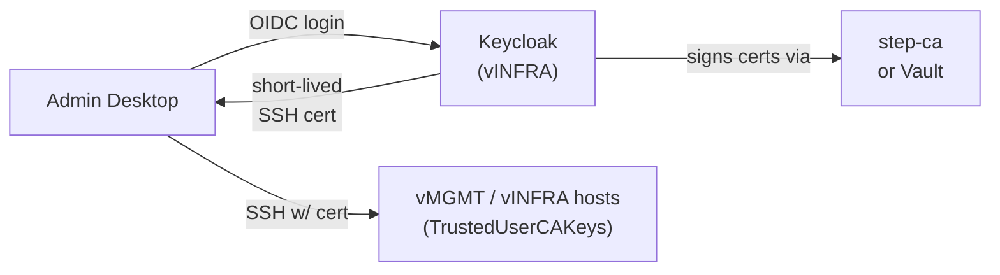
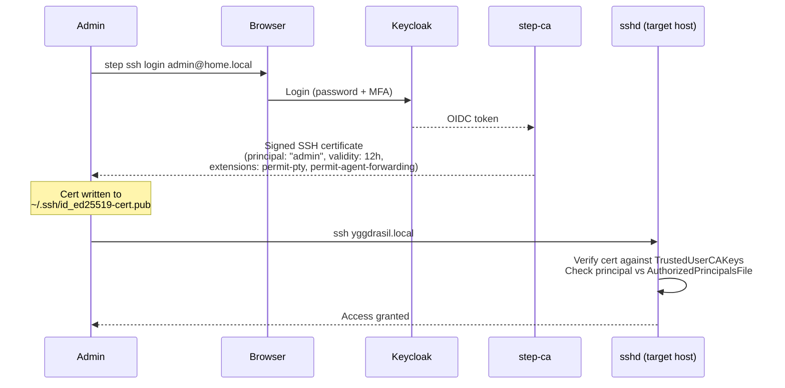
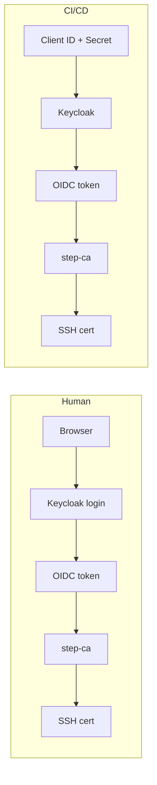
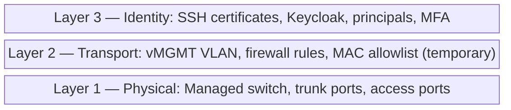

# SSH Certificates with Keycloak SSO — Future Plan

> **Status:** Future work. Not part of the current secure-mgmt-vlan plan.
> The current plan uses MAC allowlisting as the vMGMT admission gate.
> This document captures the intended replacement.

## Motivation

MAC allowlisting has two problems:

1. **Not a real security boundary.** MAC addresses are trivially spoofable —
   any device on the LAN can claim a known MAC.
2. **Tied to hardware, not identity.** Building a new desktop (or swapping a NIC)
   means losing access until the new MAC is manually added to the allowlist.

SSH certificates fix both: they prove *who you are* cryptographically, independent
of what hardware you're using.

## Architecture overview



### Components

1. **Keycloak** — runs on a vINFRA host (e.g. alfheim alongside DNS, or a
   dedicated VM). Acts as the OIDC provider. Users authenticate with
   username + password + MFA (TOTP/WebAuthn).

2. **SSH Certificate Authority** — either:
   - **step-ca** (Smallstep): purpose-built for SSH certificates, has native
     OIDC provisioner support. `step ssh certificate` handles the full flow.
   - **HashiCorp Vault**: SSH secrets engine can sign certificates after Vault
     authenticates the user via its OIDC auth method.

   step-ca is simpler for this use case unless Vault is already deployed.

3. **Admin desktop** — runs `step ssh login` (or equivalent), which:
   - Opens a browser to Keycloak for authentication
   - On success, receives a signed SSH certificate (short-lived, e.g. 12h)
   - Writes the cert to `~/.ssh/id_ed25519-cert.pub`
   - Normal `ssh` commands then present the cert automatically

4. **Target hosts** — NixOS hosts on vMGMT/vINFRA configure:
   ```nix
   services.openssh = {
     extraConfig = ''
       TrustedUserCAKeys /etc/ssh/ca.pub
       # Optional: map certificate principals to local users
       AuthorizedPrincipalsFile /etc/ssh/auth_principals/%u
     '';
   };
   ```
   They trust the CA's public key, not individual user keys. No
   `authorized_keys` management needed.

## Authentication flow



## Relationship to the vMGMT VLAN plan

The vMGMT VLAN topology from the current plan stays **exactly the same**. The
change is purely about the admission gate:

| Aspect                   | Current (MAC)         | Future (SSH cert)           |
|--------------------------|-----------------------|-----------------------------|
| Network topology         | vMGMT VLAN            | vMGMT VLAN (unchanged)      |
| Who can reach mgmt ports | MAC-allowlisted hosts | Any host on vMGMT*          |
| Authentication           | SSH key (static)      | SSH certificate (short-lived)|
| Identity binding         | Hardware (NIC MAC)    | User (Keycloak account)     |
| MFA                      | None                  | Keycloak-enforced           |
| Revocation               | Remove MAC from list  | Revoke in Keycloak / short cert TTL |

\* vMGMT admission could also move from MAC allowlisting to 802.1X (RADIUS
backed by Keycloak), but that's a separate enhancement.

### What NOT to over-invest in now

Because the MAC allowlist is temporary, the current plan should:

- Keep MAC rules in **one place** (a single list in the router config) — don't
  scatter MAC checks across multiple firewall rules or host configs
- **Not build tooling** around MAC management (no scripts to add/remove MACs)
- **Not add MAC-based identity** to other systems (e.g. don't use MAC to
  determine DNS names or NFS access)

This keeps the eventual swap to certificates minimal: replace one router
firewall rule with "allow vMGMT subnet" and deploy TrustedUserCAKeys to hosts.

## CI/CD integration

CI/CD servers need non-interactive access — no human to open a browser. OAuth2's
**client credentials grant** handles this: machine-to-machine auth, no browser.

### Flow



1. Register the CI/CD server as a **Keycloak service account** (a client with
   `client_credentials` grant enabled). This gives it a client ID + secret.
2. step-ca validates the token the same way — same issuer, same signature
   verification. It doesn't care whether the token came from a browser redirect
   or a client credentials call.
3. The pipeline requests a fresh cert at job start:

```bash
# Authenticate to Keycloak (no browser)
TOKEN=$(curl -s -X POST https://auth.home.local/realms/home/protocol/openid-connect/token \
  -d grant_type=client_credentials \
  -d client_id=cicd-server \
  -d client_secret="$CICD_CLIENT_SECRET" \
  | jq -r .access_token)

# Exchange token for short-lived SSH certificate
step ssh certificate cicd@home.local /tmp/cicd_key \
  --provisioner keycloak --token "$TOKEN" \
  --not-after=1h

# Deploy using the cert
ssh -i /tmp/cicd_key deploy@target-host.local "deploy-image.sh $IMAGE_TAG"
```

### Principals and least privilege

CI/CD certs get a narrow principal (e.g. `deploy`), not `admin`. Target hosts
control this via `AuthorizedPrincipalsFile`:

```
# /etc/ssh/auth_principals/deploy  (the deploy user account)
deploy
cicd

# /etc/ssh/auth_principals/admin  (the admin user account)
admin
```

Even if CI/CD credentials are compromised, the cert can only act as `deploy`.

### Comparison with static deploy keys

| Aspect          | Static deploy key             | Certificate (client credentials)                    |
|-----------------|-------------------------------|-----------------------------------------------------|
| Lifetime        | Permanent until rotated       | Short-lived (30min–1h per job)                      |
| Scope           | Any host trusting the key     | Principal-scoped (`deploy`, not `admin`)             |
| Revocation      | Remove from every host        | Disable service account in Keycloak (one place)      |
| Secret storage  | Private key on disk           | Client secret (or Vault-injected per-job)            |
| Audit trail     | "A key was used"              | "cicd-server authed at 14:02, cert for `deploy`, 1h"|

### Where to store the client secret

The Keycloak client secret is the one static credential. Options:

- **Environment variable** in CI/CD server config (encrypted at rest) — simplest
- **Vault OIDC auth** — CI/CD authenticates to Vault, which authenticates to
  Keycloak. Useful if Vault is already deployed.
- **Keycloak `client_jwt` authentication** — CI/CD uses a signed JWT assertion
  instead of a shared secret, avoiding a static secret entirely. Best option
  if the CI/CD platform supports it.

## Design philosophy: layered independence

The network layer (VLANs, firewall rules) and identity layer (SSH certificates,
Keycloak) are designed to operate **independently**:



Each layer provides value on its own:

- **Network isolation alone** (current plan) already prevents lateral movement —
  a compromised IoT device can't reach management interfaces regardless of
  what authentication is configured.
- **SSH certificates alone** would prevent unauthorized access even if someone
  gained network access to vMGMT — they still can't authenticate without a
  valid certificate.
- **Together**, they provide defense in depth: you need to be on the right
  network *and* have the right identity.

This means:

- The VLAN plan can be implemented and provide immediate security value with
  no OAuth infrastructure
- Keycloak + certificates can be added later without rearchitecting the network
- Either layer can be upgraded independently (e.g. replace MAC allowlist with
  802.1X, or swap step-ca for Vault, without touching the other layer)
- A failure in one layer (e.g. Keycloak goes down) doesn't cascade — the
  network layer still restricts access, and emergency break-glass SSH keys
  can bypass the certificate requirement if needed

## Implementation sketch (for when this becomes active)

### Phase 1: Deploy Keycloak
- NixOS module: `services.keycloak`
- Run on a vINFRA host (alfheim or dedicated VM)
- Configure realm, users, MFA policies
- Expose on internal DNS: `auth.home.local`

### Phase 2: Deploy step-ca with OIDC provisioner
- NixOS service: step-ca with OIDC provisioner pointing at Keycloak
- Generate SSH CA keypair; distribute `ca.pub` to all managed hosts
- Configure provisioner to map Keycloak groups → SSH principals

### Phase 3: Configure target hosts
- `TrustedUserCAKeys /etc/ssh/ca.pub` on all vMGMT/vINFRA hosts
- `AuthorizedPrincipalsFile` to control which principals can log in where
- This can be a shared NixOS module: `modules/common/ssh-ca.nix`

### Phase 4: Client setup
- Install `step` CLI on admin machines
- `step ssh login` for interactive use
- Optionally: PAM integration so certificate is refreshed on desktop login

### Phase 5: Remove MAC allowlist
- Update router firewall: vMGMT no longer filters by MAC
- Security now comes from: network isolation (VLAN) + identity (certificate)
